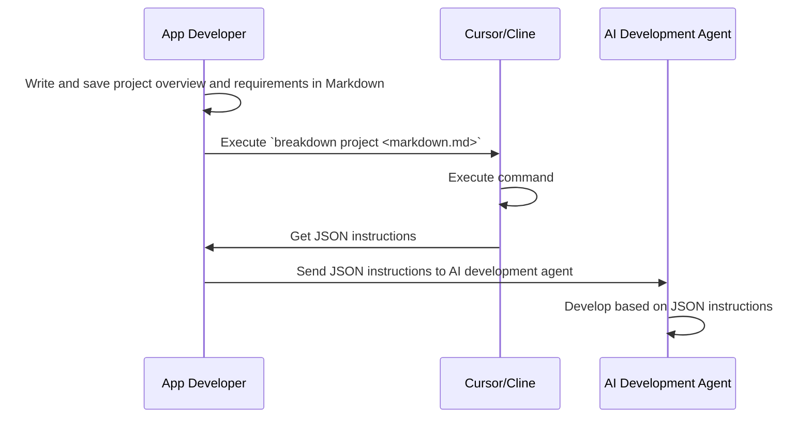
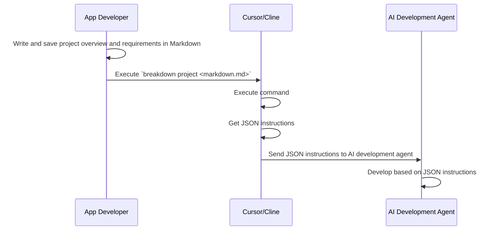
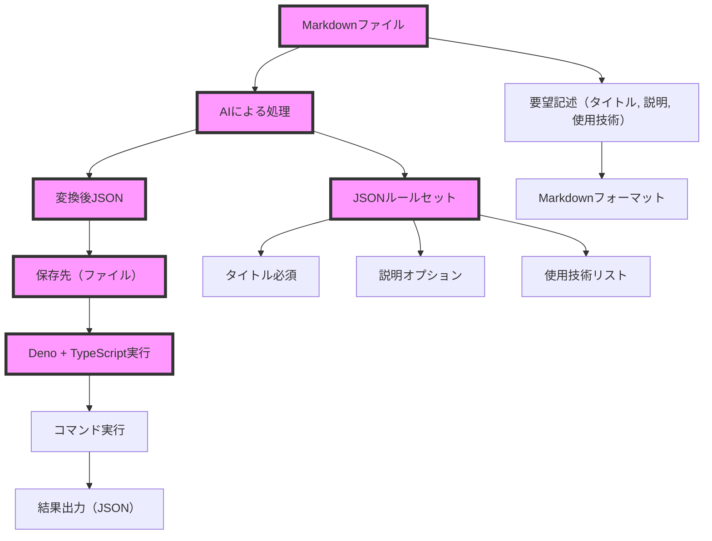
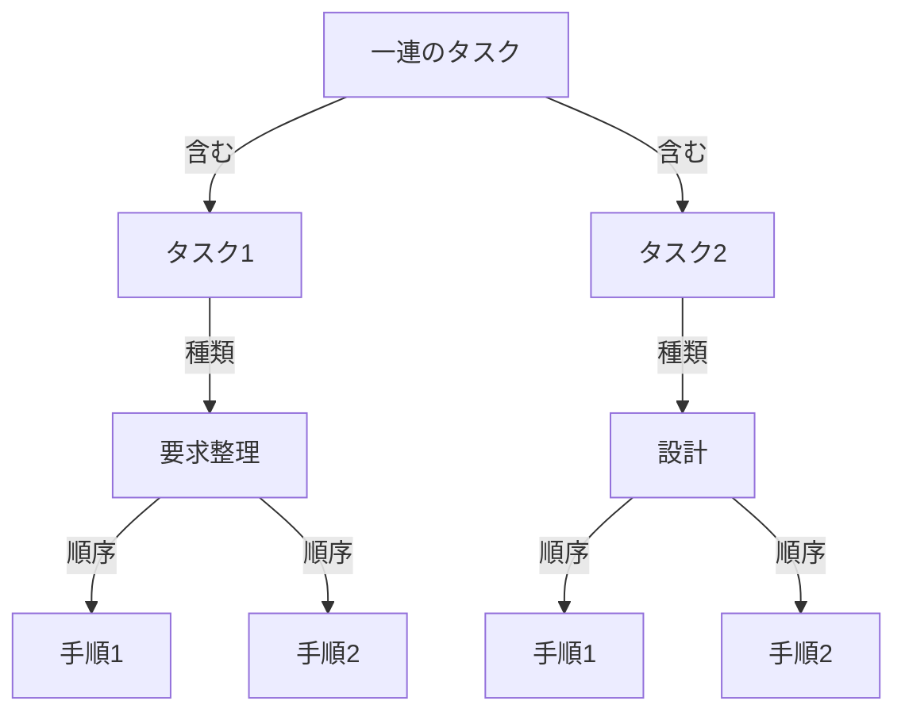
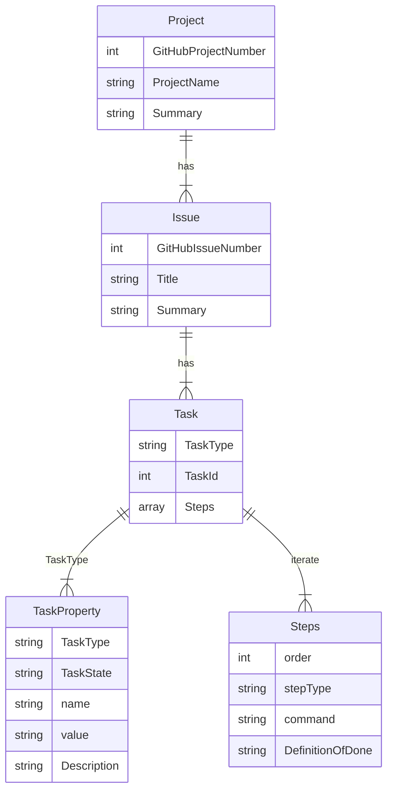
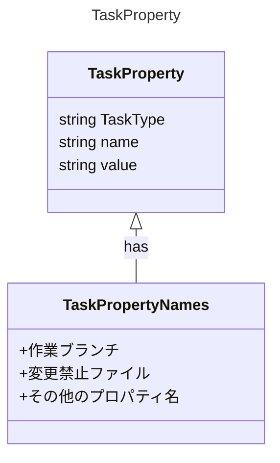
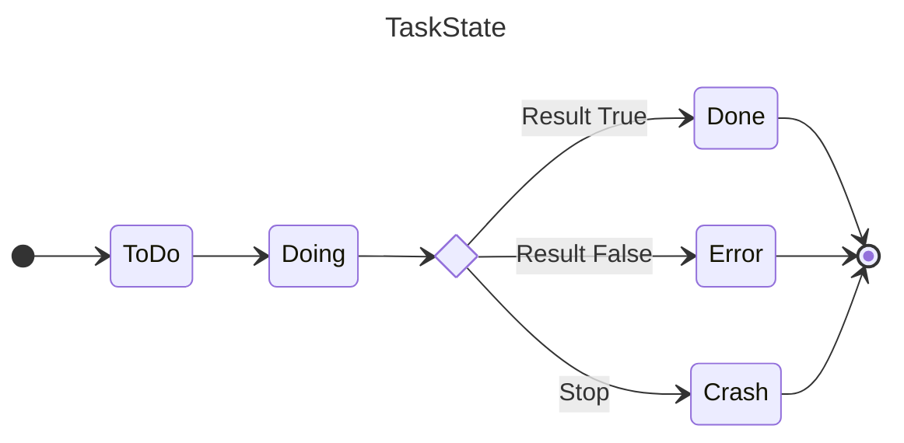

# あらすじ
qiita で書いた [Roo Codeで仕様書を書き起こし、Cursor Composer(Yolo)で構築する](https://qiita.com/tettuan/items/d2ec0de9dd02617d1a50) を、もっと汎用的にしたいと思って着手した。

最初はCursorでコードを書き、Clineがドキュメントを担うイメージだった。一方、最近は安いAPIを使ってCline一本で行けるような気がするので、頑張ってみる。

要求事項を細分化でき、一連のタスクを制御できれば、AIコーディングがリトライしながら仕上げるだろうという肌感。
そこで、`breakdown to issue` という簡単なコマンドをAIが利用できる状況作りを目指す。

# シンプルな目標
以下のように、AI開発を二重化する。Cursor/Cline自体で行うことを、

1. ドキュメント作成自体をAIに実施してもらい、
2. 実装もAIに実施してもらう

の2軸で考える。（スタートだけ自分でやる。それ以外はAIに任せる。）

図にすると、こうなる。



今後、IDE/Editorが進化すると、こうなることを予測。



この図の状態を目指すにあたり、AIがタスク処理しやすい方法を考えてみた。
実行よりも、ドキュメント化を頑張る部分にフォーカスを当てている。

## 基本概念
上述のシーケンス図の前に、考えていたことがある。
これが基本概念となっている。

概念のなかでも、
以下の図の中央にある「ルールセット」に当たるセクションが中心にある。

理由はタスク処理にある。
タスクはいくつかのパターンに類型化できるから、類型化すると思考範囲を減らせると考えた。
実際、思考を減らすためにルールがあると境界線が明確になり、楽になる。むしろルールがないと、範囲に対して制御が効かず、タスクが膨れ上がるデメリットがある。結果、ルールあったほうがいいだろうと考えた。



## タスク処理
何かを実行するとき、その作業はタスクとなる。

タスクは入れ子になっている。かつ、タスクには粒度がある。入れ子と粒度は同じようなことなのでややこしいが、

- 粒度は、要求から要件、要件から仕様、仕様から設計・・・と進むに従い、詳細化が求められる部分。粒度分解のなかにもタスクは存在する。
- 入れ子は、タスクのなかにサブタスクが存在する構造を指す。

つまり、あらゆる実行対象が分割されて細分化されたものがタスクなので、タスクといっても様々である。
よって、単一タスクを管理するのは、簡単なようで難しい。

タスクは単一の場合もあるが、ほとんどは一連のタスクになっていて、前と次があり、スタートと完了がある。
以下のようにタスク１、タスク２ともできるし、手順１、手順２ともできる。



そこで、単一タスクを管理するのではなく、一連のタスクを管理することを目指した。
その際に、粒度と入れ子を取り扱う必要があるため、まずは粒度を階層として考えた。

## 最も単純化した階層
では、どうやって階層化するか？と考えたとき、ソフトウェアの管理で著名なサービス２つを参照してみた。

タスク管理に至るまでの階層を最も単純化したものが、プロジェクト、課題、タスクで、GitHubはそうなっている。

GitHubは、ProjectからIssue、Issueのなかにチェックリストという形で想定している。
https://docs.github.com/ja/issues/planning-and-tracking-with-projects/learning-about-projects/about-projects

JIRAの場合も、EpicからStory、タスク、サブタスクとなっている。ThemeやInitiativeなどの概念もあるが、"Example of epics in an initiative:"の図をみても、Epic、Story/Task、Subtaskとなっているので、この3階層がメインだろう。
https://www.atlassian.com/agile/project-management/epics-stories-themes

どうやら、これは汎用性ありそう。というわけで、基本概念はGitHubに合わせる。



AIのためには、Stepsを設ける。1つずつ段階的に処理するので、イテレーションを定義してあげる。
Stepsがタスクの入れ子構造をつくる。また、再帰的な設計が可能になる。

# Attributes and Properties
タスクの関係は整理できた。では各タスクの内容をどうするか。

まずは属性を設定していく。ここはAI開発に特化した属性にする。主な例として、ブランチ戦略に従ったブランチ名やスコープの設定が入る。

このタスクを処理するときには、どういう条件があるのか、という話。

属性に近いもので、状態もある。
これは進行に応じて変わるステート管理も含まれる。stateとpropertyをさらに分けてもいいのだが、AttributesとPropertiesも区別が曖昧になりやすいし、さらにStateを分けるとPropertyとは？となったので、いったん保留。

WAI-AREA でも論点になっているが、明確な区別をしづらいのだろうと思う。
https://www.w3.org/TR/wai-aria-1.0/states_and_properties

ひとまず概念的には以下のようにする。

- **attribute** : 初期属性(branch name, descriptionなど初期値から変わらないもの)
- **property** : 可変属性(checked, selected, filledなど変わりうる値)
  - **state** : 変化そのもの（start, progress, doing, endなど変化を表すもの）

設計上は、現時点で厳格に分ける必要性を感じないので、propertyに統一する。

## TaskProperties


## TaskState
進行状態。これはリトライを考えていくなかでブラッシュアップされる予定。



# まとめ
こういった一連のタスク化処理を、

```
breakdown to issue -i <project_summary.json> -o <issue-dir>
```

のように実行するだけで生成してくれるコマンドがあれば、あとはAI側がうまくやってくれるのではないか、と考えている。もちろんブレイクダウンそのものも、AIに行なってもらう。

実現した場合の流れが、以下のシーケンス図となる。


まだ手元で部分的にしか動かないので実験的だけど、
[GitHubリポジトリ](https://github.com/tettuan/breakdown/)
で、個人開発でやっていく。
（これも週末のAI開発だけでやる。）
