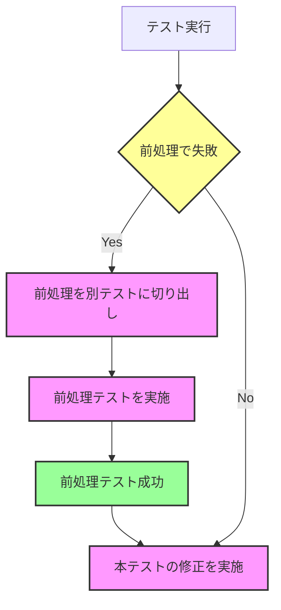
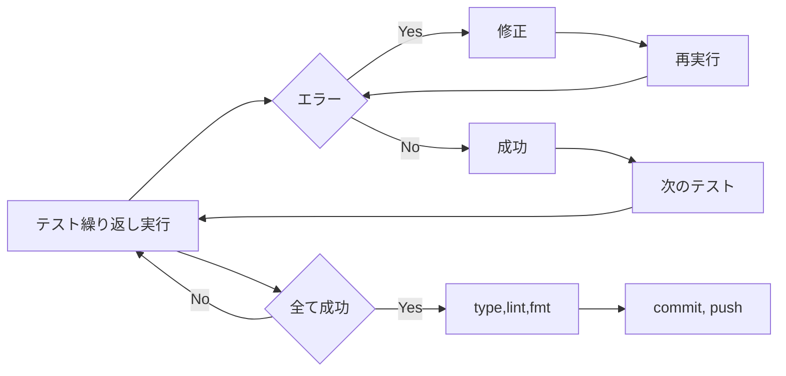

# はじめに：100%ピュアAI開発への挑戦

この記事では、「100%ピュアAI開発（造語）」という試みを通じて得られた学びや気づきを、20のプラクティスとしてご紹介します。100%ピュアAI開発とは、**開発者が一切コーディングを行わず、ルールや仕様書、そしてAI
Agentへの指示のみで開発を進める**という、少し挑戦的なアプローチです。

私自身は、普段は要求整理や要件定義といった業務に馴染みがあり、非エンジニアという立場です。しかし、過去には多くのシステム開発プロジェクトに関わってきた経験があり、コーディング自体は趣味として楽しんできました。

## AI開発への期待：コーディングからの解放

AI技術の進化には目覚ましいものがあり、これからのソフトウェア開発において、コーディング作業の多くをAIに任せられるようになるのではないかと大きな期待を寄せています。「何か作りたい」というアイデアが浮かんでも、それを実現するためのコーディングに十分な時間を割けない、という経験は誰にでもあるのではないでしょうか。AI開発は、そんな状況を打破する可能性を秘めていると感じています。

## 時間の制約を超える開発スタイル

AI開発の大きな魅力の一つは、**時間の効率的な活用**です。本業の合間や、日常生活のちょっとしたスキマ時間、例えば朝の準備中や休息時間などを利用して、開発を進めることができます。私自身、例えば歯磨きをしている間にAIにタスクを実行させ、戻ってきたら結果を確認して次の指示を出す、といったことで開発を進めました。週末は電車の移動時間にMacを起動させておけば作業が進みます。デスクに向かうのは、時間をかけて仕様を整理するときだけでよく、プライベートを犠牲にすることなく週末開発を行っていました。これは、従来のようにまとまった時間を確保して集中してコーディングする必要があった開発スタイルとは大きく異なります。

# AI開発における課題

期待に胸を膨らませて始めたAI開発ですが、実際に進めていく中で、いくつかの課題に直面しました。

## 立ち上げ時の検討事項

まず、開発を始めるにあたり、以下の3つの点を検討する必要がありました。

1. **Agentの選定**: Cursor、GitHub Copilot、Roo
   Code、Devinなど、様々なAI開発ツールが存在します。それぞれのツールの特徴、機能、そしてコスト（月額固定なのか、従量課金なのか）を比較検討し、自分の開発スタイルや目的に合ったものを選ぶ必要がありました。
2. **コスト**:
   あくまで趣味の範囲で始めることを前提としていたため、どの程度の費用を許容できるか、予算を設定する必要がありました。月額固定料金のサービスは安心感がありますが、従量課金の場合は、意図しないコスト超過に注意が必要です。
3. **開発対象**:
   どのようなものを作るかによって、AI開発の向き不向きがあります。UIを伴うフロントエンドアプリケーションなのか、それともバックエンドのサービスなのか。開発の複雑さと、選択したAI
   Agentの得意分野を考慮して、最初のプロジェクトを選ぶことが重要でした。

## 開発中に直面した課題

実際に開発を進める中で、特に以下のような課題に直面しました。

1. **Agentの暴走**:
   特に複雑な実装を依頼した場合や、仕様書の記述が曖昧な場合に、AI
   Agentがこちらの意図とは異なる方向に実装を進めてしまうことがありました。これは、AIがコンテキストを十分に理解できていない場合に起こりやすいようです。
2. **過剰実装**: DRY (Don't Repeat Yourself)
   原則が守られず、同じような機能が異なる場所で独自に実装されてしまうことがありました。これはコードの不整合を招き、後の修正を困難にする要因となります。
3. **設計の曖昧さ**:
   システムの機能分割や境界線の設定において、設計段階で曖昧さが残っていると、AIはその曖昧さを独自の解釈で補完しようとします。その結果、開発者の意図とは異なる実装になってしまうことがありました。

# 開発物の紹介：「Breakdown」ツール

今回、これらの課題に取り組みながら開発したのが「Breakdown」というツールです。これはDenoで開発し、パッケージレジストリであるJSRに公開します。

実はこのツール、元々作りたかったものではありませんでした。AI開発をより効率的に進めるために、**要件の分割やタスク管理を支援する**目的で開発した、いわば「AI開発のためのAI開発ツール」です。プロンプト、JSONスキーマ、そしてYAML形式の設定ファイルを用いて、人間が書いた要件定義自体をAIに通すことで、よりAIが理解しやすい形に最適化することを目指しています。

比較的シンプルな構成であり、AI開発の実験台として適切なサイズ感だと判断しました。また、OSSとして公開することで、AI
Agentが参照・学習しやすくし、AI開発プロセス自体の改善に繋げることも意図しています。

```sh
breakdown to project requirements.md -o ./projects
```

まだ完成こそしていませんが、混沌とした期間を乗り越え、円滑な開発進捗が得られる状態になりました。

# 実践から得られた20のベタープラクティス

ここからは、Breakdownツールの開発を通じて試行錯誤し、現時点で効果的だと感じている20のプラクティスをご紹介します。現時点で、非常に円滑に自動開発が進んでおり、成果に繋がったポイントをあげています。これらが常に最善の方法とは限りませんが、AI開発を進める上でのヒントになれば幸いです。

## 1. 設計の分割：AIの混乱を防ぐために

一つのツールの中に、設定ファイルの読み込み、コマンドライン引数の解析、プロンプトテンプレート内の変数置換など、複数の異なる関心事を詰め込もうとすると、AIの解釈が追いつかなくなることがあります。抽象度が高くなりすぎるためです。

この問題に対処するため、**関連性の低い機能は積極的に別のリポジトリに分割**しました。例えば、設定管理(`breakdownconfig`)、ログ管理(`breakdownlogger`)、パラメータ解析(`breakdownparams`)、プロンプト生成(`breakdownprompt`)、スキーマ定義(`breakdownschema`)といった具合です。これらを独立したライブラリとしてJSRに公開し、本体の`breakdown`ツールからは外部依存として利用するようにしました。

これにより、各ライブラリは変更が容易でなくなり、本体ツールはより安定してコア機能の開発に集中できるようになりました。これは、AIが勝手に内部実装を変更してしまうことを防ぐ効果もありました。

ただし、プライベートなリポジトリで同様の分割を実現する方法については、今後の検討課題として残っています。

## 2. 仕様書の分割：AIが理解しやすい単位で

仕様書となるMarkdownファイルも、適切に分割することがAIの理解を助けます。

まず、**言語ごとにファイルを分ける**ことを試しました。`index.ja.md`（日本語）と`index.md`（英語）のようにです。AI
Agentによっては英語の方が指示の精度が高い場合があるため、最初から英語で記述することも有効な選択肢です。

次に、`index.md`から**機能や要件ごとにファイルを分割**していきます。例えば、設定ファイルに関する仕様は`config.md`、ログ出力に関する仕様は`logger.md`のようにです。ファイル名を英語にしておくと、AIへの指示（例：「Update
`config.md` based on the new
requirement」）と命名規則が一致し、コードベースの検索も容易になるというメリットがありました。

## 3. Chat指示の汎用化と保存：スキマ時間の有効活用

AI
Agentとの対話（Chat）で繰り返し行う指示は、汎用的なテンプレートとして作成し、保存しておくと有効だと考えました。これにより、毎回指示を考える手間が省け、コピー＆ペーストで素早く指示を出せるようになります。

この方法は、**スキマ時間を最大限に活用する**上で非常に有効でした。例えば、朝の準備中に「テストを実行して、失敗したら修正して」という定型指示を投入し、あとはAIに任せておく、といった具合です。もし連続リクエスト制限などでAIが停止していても、「resume」と指示するだけです。Chatが長くなりすぎてAIの応答がおかしくなってきたら、"New
chat"を開始して再度同じ指示を投入します。

これらの定型指示は、開発の進捗や直面している課題に応じて変化します。そのため、Cursorの`Rules`機能（永続的なルールを記述）よりもライフサイクルは短くなります。開発フェーズ（テスト実装フェーズ、バグ修正フェーズ、リファクタリングフェーズなど）に応じて、適切な指示テンプレートを使い分けるのが効果的でした。

## 4. Debug Loggerの単体化：解釈の統一と状態把握

開発初期には、テストコードごとに個別のLoggerインスタンスを生成してデバッグメッセージを出力していました。しかし、これではログの形式や出力レベルが統一されず、AIがログメッセージを正しく解釈できない問題が発生しました。

そこで、**テスト環境専用のデバッグ用Loggerライブラリ (`breakdownlogger`)
を作成**し、すべてのテストコードから利用するようにAIに指示しました。READMEにも記載の通り、このLoggerはテストシナリオのデバッグに最適化されており、**アプリケーションコードでの利用は想定していません**。これはDRY原則にも合致します。

特に意識したのは、READMEのガイドライン（Strategic
Checkpoints）に従い、関数の呼び出し前後、パラメータ処理の前後、返り値ハンドリングの前後など、**処理の重要な節目で状態を示すデバッグメッセージ**を挿入することです。これにより、AI
(Cursor) がプログラムの実行状態をより正確に把握しやすくなると感じました。

```typescript
// breakdownlogger の利用例 (テストコード内を想定)
import { BreakdownLogger, LogLevel } from "jsr:@tettuan/breakdownlogger@0.1.0"; // JSRからインポート

const logger = new BreakdownLogger();
// 必要に応じてテスト実行時に環境変数 LOG_LEVEL=debug を設定するか、コード内で設定
// logger.setLogLevel(LogLevel.DEBUG);

logger.debug("Starting configuration loading process...");
try {
  const config = loadConfig();
  // デフォルトはINFOレベルだが、デバッグ時にはより詳細な情報を出す想定
  logger.debug("Configuration loaded successfully.", {
    configPath: config.path,
  });
  // ... process ...
  logger.info("Processing completed successfully."); // 通常のINFOレベルログ
} catch (error) {
  logger.error("Failed to load or process configuration.", error);
}
```

このLoggerは、後述するローカルCIスクリプト(`local_ci.sh`)とも連携させています。通常は`deno test ...`でテストを実行し、エラーが発生した場合は`LOG_LEVEL=debug deno test ...`のように環境変数を設定して再実行することで、詳細なデバッグログが出力されるようにしました。ログメッセージはファイルに保存するのではなく、標準出力（STDOUT）に出力します。これは、CursorがChatインターフェース上でログメッセージを直接認識できるようにするためです。

実例： 

## 5. テストの階層的分割と順列化：テスト駆動開発の基盤

ローカルでのCI環境として`local_ci.sh`というシェルスクリプトを作成しました。当初はGitHub
Actionsのワークフローをローカルで再現する目的でしたが、徐々にその役割は変化していきました。

AI開発では、仕様書だけでは伝えきれない細かな挙動や期待値を、テストコードによって補完する
**テスト駆動開発（TDD）** のアプローチが有効だと感じています。

まずテストを記述しますが、そのテストが依存している別の機能（例えば設定ファイルの読み込み）が失敗すると、テスト本来の目的とは異なる理由で失敗してしまい、問題の切り分けが困難になります。

この問題を解決するため、**テストを依存関係に基づいて階層化し、実行順序（順列）を定義**しました。

- **階層化**: アプリケーションの構造に合わせてテストをグルーピングします。
  - `0_foundation`:
    環境変数、基本的なファイルI/Oなど、他のすべての機能の基盤となる部分。
  - `1_core`: アプリケーションの中心的なロジック。
  - `2_integration`: 複数のコンポーネントを組み合わせた結合テスト。
- **順列化**: 各階層内で、さらに依存関係の強い順にテストを並べます。
  - `0_env`: 環境変数の設定・検証。
  - `1_config`: 設定ファイルの読み込み・検証（`0_env`に依存）。
  - `2_logger`: ログ出力のテスト（`1_config`に依存する可能性あり）。

```sh
tests/
├── README.md
├── 0_foundation/
│   ├── 0_env/
│   │   ├── init_test.ts
│   │   └── setup_test.ts
│   ├── 1_config/
│   │   └── config_test.ts
:
├── 1_core/
│   ├── 0_path/
│   │   ├── path_test.ts
```

この階層分けと順列化のルール自体も仕様として定義し、AIにテストファイルの配置や命名規則を指示しました。

## 6. CIスクリプトによる段階的チェック：エラー発生時の即時停止

CIプロセスが複雑化すると、どの段階で問題が発生したのか特定が難しくなることがあります。`local_ci.sh`
スクリプトでは、この問題に対処するため、**まずテストを1つずつ順番に実行し、いずれかのテストが失敗した場合は、その時点でスクリプトの実行を停止する**ようにしました。型チェックやLinterの実行は、すべてのテストが成功した後にのみ行うようにしています。

これは、テスト駆動開発（TDD）の観点から、まずは機能の動作を確認し、その後でコードの品質を向上させるというアプローチを取っているためです。テストが失敗した時点で即座に停止することで、AI開発者は、その失敗したテストの修正に集中できます。

```bash
#!/bin/bash
# スクリプト冒頭で設定。コマンドが失敗したら即座に終了する
set -euo pipefail

# デバッグモードの設定
DEBUG=${DEBUG:-false}

# テスト実行関数
run_test() {
  local test_file=$1
  echo "Running test: $test_file"
  
  if [[ "$DEBUG" == "true" ]]; then
    # デバッグモードの場合、詳細なログを有効にして実行
    LOG_LEVEL=debug deno test -A "$test_file"
  else
    # 通常のテスト実行
    deno test -A "$test_file"
  fi
}

# テストファイルを1つずつ順番に実行
find tests -name '*_test.ts' | sort | while read test_file; do
  # 通常モードでテスト実行
  if ! run_test "$test_file"; then
    echo "Test failed. Retrying in debug mode..."
    # テスト失敗時はデバッグモードで再実行
    DEBUG=true run_test "$test_file"
    # デバッグモードでも失敗した場合は停止
    exit 1
  fi
done
```

この方式により、**いずれかのテストが失敗した時点でスクリプトが停止**するため、開発者（あるいはAI）は、まずその失敗したテストを修正することに集中できます。結果的に、修正すべき範囲（スコープ）が限定されるため、AIも問題点を特定しやすくなるというメリットがありました。


## 7. 前処理エラーの別テスト化：テストの責務を明確に

テスト駆動開発を進める中で、テストが失敗する原因が、そのテストが本来検証したいロジックではなく、**その前処理段階のエラー**であるケースが多くありました。依存関係のあるテストほど、この問題は顕著になります。

例えば、

- 設定ファイルを読み込むテスト (`config_test.ts`)
  が、設定ファイルそのものが存在しないために失敗する。
- 特定のディレクトリが存在することを確認するテスト (`directory_check_test.ts`)
  が、その前提となる設定読み込み (`config`) で失敗する。

このように、失敗の原因がテスト対象の責務範囲外である場合は、**その前処理自体を検証する独立したテストを追加**します。例えば、「設定ファイルが存在することを確認するテスト
(`config_existence_test.ts`)」を追加し、`config_test.ts`よりも先に実行されるように順列を調整します。

後工程のテスト（例：`config_test.ts`）は、前工程のテスト（例：`config_existence_test.ts`）が成功することを前提として実装するようにしました。これにより、各テストの責務が明確になり、失敗時の原因究明が容易になると考えました。



## 8. Cursorへの集中：Agentを絞るメリット

開発当初は、Cursorと他のAI開発ツール（Roo
Code）を併用することも検討しました。しかし、**Agentごとに得意なことや対話の「クセ」のようなものが異なる**ため、複数のAgentを使い分けるのは思った以上に難しいと感じました。指示の出し方や期待する応答が変わってしまうため、開発プロセスが複雑になりがちです。

そこで、Cursorの将来的な進化に期待し、**当面はCursorに集中する**ことに決めました。Cursorを選んだ主な理由は以下の通りです。

- **月額固定料金**: 予算管理がしやすい。
- **"Slow"モードでも実行可能**:
  無料枠や低速モードでも、時間はかかりますが処理を完遂してくれる。（最近はSlowモードに遭遇することは稀になりました）
- **スキマ時間での開発スタイルとの親和性**:
  前述の通り、細切れの時間で開発を進めるスタイルに適していました。

結果として、一つのツールに習熟することで、より効果的な指示の出し方やトラブルシューティングの方法を早期に確立できたと感じています。

## 9. Rulesの分割：コンテキストに応じた指示の細分化

Cursorの`Rules`機能は非常に強力ですが、一つの巨大なルールファイルにすべての指示を詰め込むと、管理が煩雑になり、AIの解釈にも影響を与える可能性があります。Cursor自体の機能進化を見ても、ルールをより細かく管理する方向性がうかがえます。

そこで、**特定のファイルやディレクトリ構成に特化したルールは、積極的にファイルを分割**して定義するようにしました。これにより、AIへの指示がより具体的かつ明確になります。

例えば、テストファイルの配置に関するルールを以下のように分割しました。

- `*_test.ts` (ルートレベルのルール): `tests/`
  ディレクトリ直下にテストファイルを配置する、基本的なテスト規約など。
- `tests/*_test.ts` (testsディレクトリ直下のルール):
  基底となるテストクラスや、テストユーティリティ関数に関する指示。
- `tests/**/*_test.ts` (testsサブディレクトリ下のルール):
  前述した階層化（foundation, core,
  integrationなど）に基づいた、特定の機能領域のテストに関する指示。

このようにルールを細分化することで、AIは編集中のファイルパスに応じて、より関連性の高い、具体的な指示をコンテキストとして読み込むことができるようになります。

## 10. ユースケースの明示と使用例の追加：AIの迷いをなくす

特にライブラリを開発している場合、「ライブラリ自身の開発」と「ライブラリが外部からどのように使われるか」という二つの視点が混在しがちです。これはAIにとっても混乱の元となります。

そこで、**ライブラリが実際にどのように使われるのか、具体的なユースケースと実行例を明確に示す**ことが重要だと考えました。

- `README.md`: 簡単なインストール方法と基本的な実行例を記載。
- `usage.ja.md` / `usage.md`: より詳細な使い方、オプションの説明などを記載。
- `examples/*.ts`: 実際に動作するサンプルコードを提供。

このように、具体的な使用例を提示することで、AIはライブラリの責務範囲やインターフェースをより正確に理解し、「ライブラリ開発モード」と「ライブラリ利用モード」を区別しやすくなります。結果として、AIが実装の方向性を見失うことを防ぐ効果がありました。

## 11. New chat発動のタイミング：コンテキストのリセット

AI
AgentとのChatが長くなると、過去の対話履歴がコンテキストとして積み重なり、応答が不安定になったり、意図しない方向に進んだりする（暴走する）ことがあります。一方で、Chatが短すぎると、読み込ませた重要なコンテキスト（ファイルの内容や過去の指示）が失われてしまいます。

**適切なタイミングで"New
chat"を開始し、コンテキストをリセットする**ことが、安定した開発を進める上で重要だと感じました。私の場合、以下の状況で"New
chat"を発動するようにしました。

- **`local_ci.sh`のループ指示が効かなくなった時**:
  例えば、「テストが失敗したらデバッグモードで再実行して修正」というループ指示を出しているにも関わらず、AIがループから外れて無関係な応答を始めた場合。これは、AIが現在のタスクコンテキストを見失った兆候と判断します。
- **Linterエラー修正後に「完成」と言い出した時**:
  すべてのテストが完了していないにも関わらず、Linterのエラーを修正しただけで「開発が完了した」とAIが誤解した場合。これもタスクの全体像を見失っている証拠です。
- **修正指示のループから外れた時**:
  特定のバグ修正を指示しているのに、AIが関係のないリファクタリングを始めたり、別の問題を指摘し始めたりした場合。これも指示が正しく伝わっていない、あるいはコンテキストが混乱している可能性が高いです。

汎用的なループ処理（テスト実行→修正→再実行など）を指示していると、AIがそのループから逸脱したかどうかが分かりやすく、"New
chat"を発動するタイミングを判断しやすくなります。

## 12. local_ci.shのループ化：テスト駆動開発の自動化

前述のローカルCIスクリプト (`local_ci.sh`)
を、**テストがすべて成功するまで修正と再実行を繰り返すループ構造**にしました。



この方式により、**いずれかのテストが失敗した時点でスクリプトが停止**します。開発者は（あるいはAIは）、まずその失敗したテストを修正することに集中できます。結果的に、修正すべき範囲（スコープ）が限定されるため、AIも問題点を特定しやすくなるというメリットがありました。

なお、local にて `deno test -A`（全テスト実行）を使用することはなくなりました。

## 13. コミット指示：品質ゲートとしてのGit管理

AIが自動でコードを生成・修正していく中で、いつ、どのような基準でGitにコミットするかが重要になります。品質の低いコードや、テストが通らない状態のコードがコミットされるのを防ぐ必要があります。

そこで、**コミット、プッシュ、マージ、そしてライブラリの公開（publish）それぞれに明確な基準**を設定しました。

- **commit**: 関連する単体のテストがすべて成功した場合のみ許可。
- **push**: `local_ci.sh` が最後まで（すべてのテストが）成功した場合のみ許可。
- **merge**:
  （今回は一人開発のため省略しましたが）コードレビューが完了し、GitHub
  ActionsなどのCIが成功した場合。
- **publish**: マージ後、リリースに必要なすべてのチェックが完了した場合。

コミット作業自体もAIに指示しますが、テスト実行やコード修正を行っているChatとは**別の新しいChat**で行うようにしました。これは、コード修正のコンテキストが残っていると、AIがコミットメッセージの生成だけでなく、追加のコード修正を始めてしまう可能性があるためです。

新しいChatで、「`git diff`を確認し、変更内容に基づいて適切なコミットメッセージを生成し、コミットしてください。ただし、テスト
(`local_ci.sh`)
が失敗する場合はコミットしないでください」といった指示を出します。

## 14. 仕様の曖昧さを洗い出す：AIに分析させる

開発作業がうまく進まなくなった、あるいはAIの挙動がおかしいと感じた場合は、立ち止まって**現在の問題点をAI自身に分析させる**ことが有効でした。

その際、単に「問題点は何ですか？」と聞くだけでなく、「現在の実装と仕様書を比較し、以下の点を`tmp/analysis.md`ファイルに出力してください」のように、**具体的な出力先と分析観点**を指示します。

洗い出すべき観点の例：

- 仕様書の中で記述が曖昧な箇所
- 仕様書には明記されておらず、AIが独自の解釈で補完した可能性のある箇所
- 複数の仕様書間、あるいは仕様書と実装の間で矛盾している箇所

AIに具体的なファイル (`tmp/analysis.md`)
を生成させることで、抽象的な議論に終始するのを防ぎ、問題点を明確に把握しやすくなります。洗い出された問題点は、検討の上で洗練させ、最終的に仕様書に追記・修正します。特に、「〜は実装**しない**」といった要件や、過去にAIが誤解しやすかった点を明記しておくことが、後の手戻りを減らす上で効果的でした。

## 15. 仕様書を読み込むタイミングを増やす：情報の参照性を高める

AI開発ツールは、プロジェクトのすべてのファイルを常に読み込んでいるわけではありません。必要な情報を適切なタイミングで参照できるように、**情報間の参照性を高める**工夫が有効だと感じました。

- **相互リンク**:
  仕様書ファイルから関連する他の仕様書ファイルへ、Markdownのリンク
  (`[関連仕様](./related_spec.md)`) を積極的に貼ります。
- **起点ファイル**:
  `index.md`や`README.md`など、あまり変更されないファイルを起点とし、そこから各詳細仕様へ辿れるような構造にします。
- **ファイル名**: 仕様ファイル名は、その内容を表す分かりやすい英語にします（例:
  `configuration.md`, `error_handling.md`）。これにより、AIへの指示（「Read
  error handling specification.」）が容易になります。
- **他ドキュメントからの参照**:
  Cursorの`Rules`、`local_ci.sh`内のコメント、AIへの指示プロンプト、テストコード内のコメントなど、様々な場所から関連する仕様書ファイルへの参照（ファイルパスやファイル名）を記載します。「この機能については`feature_x.md`を参照してください」といった具合です。

仕様書ファイルを直接フルパスで示すのではなく、起点となるファイルからの相対パスや、分かりやすいファイル名で示すことで、将来的なファイル構成の変更にもある程度対応できるようにします。

このように、様々な角度から仕様書への参照パスを用意しておくことで、AIが必要な情報を見つけ出し、コンテキストとして読み込む可能性を高めることができます。

## 16. 仕様との乖離を見逃さない：AIの「拡大解釈」をチェック

AIは時として、指示されていないにも関わらず、良かれと思って追加の機能を実装したり、既存の機能を変更したりすることがあります（拡大解釈）。これが問題を引き起こすこともあるため、**仕様書に書かれていない実装が行われていないか**を定期的にチェックすることが重要だと判断しました。

- **AIの発言に注目**:
  Chatの履歴の中で、AIが「〜というファイルがありますが、これは空です」や指示した覚えのない「`parser`がエラーを出していますが…」のような、ギャップを感じる発言を見つけたら、注意が必要です。これは、仕様外の実装が存在する兆候かもしれません。
- **別Chatでの調査**:
  疑問を感じたら、現在のChatとは別に新しいChatを開始し、「現在のコードベース全体を分析し、仕様書（`spec/*.md`）に記載されていない機能やファイルがないか調査してください」といった指示を出します。
- **リファクタリングによる削除**:
  仕様外の実装が見つかった場合、単に「削除してください」という指示だけでは、関連するコードが残ってしまうことがあります。「仕様書`spec.md`に基づいて、仕様書に記載のない機能に関するコードを**すべて**削除してください」のように、より強い指示を出すことが有効でした。これは、仕様書からシステムを再現できるという自信がある場合にのみ可能なアプローチです。

リアルタイムですべての変更を監視するのは困難ですが、定期的なチェックやChat履歴の確認を通じて、仕様との乖離を早期に発見し、修正することが、プロジェクトを健全に保つ上で重要でした。

## 17. ベストプラクティスを明言する：AIの迷いを減らす

AIは一般的なプログラミングのベストプラクティスを学習していますが、プロジェクト固有のルールや、特定の技術（例：Deno）に関する推奨事項については、明示的に指示しないと迷いが生じることがあります。

例えば、import文の書き方一つをとっても、以下のような揺らぎが発生しがちでした。

- `import ... from "jsr:@scope/package@^1.0.0"` (JSR) と
  `import ... from "https://deno.land/x/package@v1.0.0/mod.ts"` (deno.land/x)
  の混在。
- `import ... from "@/utils/mod.ts"` (`@`によるエイリアス) と
  `import ... from "./utils/mod.ts"` (相対パス) の混在。
- `deps.ts`ファイルや`import_map.json`を使うべきか、直接URLでインポートすべきか。

このようなAIの「迷い」は、無駄な試行錯誤（＝AIの計算コストと時間）を生み出す原因になります。

そこで、Denoの公式ドキュメントやコミュニティの推奨事項、あるいはプロジェクト内で定めた規約（例：テスト駆動開発の進め方、TypeScriptのコーディング規約など）を**明確に仕様書や`Rules`に記載**し、「常にこの形式でimportしてください」「テストはこの手順で作成してください」のように、AIに迷わせない指示を出すことが重要だと考えました。

実際に定義してみると、初歩的な試行錯誤はなくなります。エラー発生時に import
記述ばかり修正することがあれば、試してみる価値があります。

## 18. ベストプラクティスと仕様の矛盾を想定する：解決ルールの明文化

ベストプラクティスを指示したとしても、それがプロジェクト固有の要件や制約と矛盾する場合があります。

例えば、

- **仕様**: 「設定ファイルはローカルの相対パスで指定できるようにする」
- **ベストプラクティス**: 「ファイルパスの扱いはURL API
  (`new URL('./config.json', import.meta.url)`) を使うべき」

これにより相対パスの扱いが意図通りにいかなくなります。

他には、

- **一般的な指摘**:
  AIは常に「パフォーマンス改善」や「セキュリティ強化」を提案してくるが、それが今回のプロジェクトにとっては過剰実装となる。

このような矛盾が発生すると、AIはどちらを優先すべきか判断できず、修正の無限ループに陥ってしまうことがあります。一方、最初から「仕様を優先」「ベストプラクティスを優先」といった単純な優先度ルールを設定すると、AIが誤った判断をして不要な実装を許容してしまう可能性もあります。

この問題に対しては、**矛盾が発生しうる箇所をあらかじめ想定し、具体的な解決ルールを仕様書に明記**しておくことが有効でした。

例：「ファイルパスの扱いについては、URL
APIを使用する。ただし、仕様書に記載された場合は、仕様書の通り相対パスでの指定を許可する」のように、具体的なケースにおける例外ルールを定めます。

## 19. lint, fmtの後回し：実装安定後のコード整形

Denoには標準でcode
formatterとlinterが組み込まれており、これらはコードの品質を保つ上で非常に重要だと考えられていますが、AI開発の過程で、**実装がまだ不安定な段階でlinterやformatterのエラー修正を指示するのは非効率**だと感じました。

AIはエラーを検知するとすぐに修正しようとしますが、根本的なロジックが固まっていない段階での表面的な修正は、後のリファクタリングで無駄になることが多いです。また、linter/formatterの修正にAIのリソースが割かれてしまい、本来の実装が進まないこともありました。

そこで、**linterとformatterの実行は、機能実装とテストがある程度完了するまで意図的に後回し**にする方針を取りました。`local_ci.sh`のループ処理からも、最終段階まではlinter/formatterのチェックを除外し、「すべてのテストが成功したら、最後に`deno lint`と`deno fmt`を実行して問題を修正してください」という指示を出すようにしました。

## 20. 自動変更の禁止を決める：仕様書の保護

AI開発プロセスを正しく導くための根幹となるファイル、すなわち**仕様書（Markdownファイル）や、AIへの指示を記述したファイル（CursorRulesから直接参照する指示）、`local_ci.sh`のような制御スクリプト**は、AIに勝手に編集されないように保護することが重要だと判断しました。

これは、ライブラリを物理的に別リポジトリに分割した（プラクティス1）のと同じ考え方です。

- **Cursor Rulesでの制限**:
  Cursorの`Rules`機能を使って、「`*.md`ファイルは編集しないでください」「`scripts/`ディレクトリ以下のファイルは編集しないでください」といったルールを記述します。
- **実装と無関係な定義の隔離**:
  JSONスキーマ定義ファイルなど、アプリケーションの実行ロジックとは直接関係ないが、仕様定義として重要なファイルは、専用のディレクトリ（例：`schema/`）に隔離し、編集禁止ルールを適用します。

もちろん、仕様変更が必要な場合は、開発者が明示的にAIに指示してこれらのファイルを編集させることは可能です。重要なのは、AIが**自動的に、意図せず**これらのファイルを変更してしまうことを防ぐことだと考えました。

# まとめ：AI開発を成功させるために

これら20のプラクティスを通じて、100%ピュアAI開発をうまく進めるための要点は、以下のようにまとめられると考えています。

1. **分解**:
   開発対象全体を、AIが理解できる程度に小さなタスクや機能に段階的に分解していく。
2. **理解**:
   分解された個々のタスクが、プロジェクト全体の設計や目的にどう関連しているのかをAIに理解させる。
3. **限定**:
   AIが一度に扱う実装範囲（スコープ）を、仕様書や指示によって明確に限定する。
4. **制御**:
   AIが参照する情報量（ファイル、コード、仕様）を適切にコントロールし、コンテキスト過多による混乱を防ぐ。
5. **誘導**:
   限定された情報の中でも、AIの実装が全体の設計思想や意図から逸脱しないように方向付けする。
6. **検知**:
   もし実装が意図からズレた場合に、それを早期に検知し、補正できる仕組み（テスト、分析、レビュー）を持つ。

AI開発は、まるで自律走行する車両のように、自ら進路を見出しながら動いていく存在です。解釈を広げていくことも、新しい要素を加えていくことも、AIの自然な振る舞いの一つです。
しかし、そのようなAIの特性を活かしながらも、私たちが意図した範囲内で行動してもらうためには、適切な制約条件を設け、枠組みを作っていく必要があります。まるで自動運転システムが車線を認識し、安全に目的地へと導くように、AIの可能性を最大限に引き出しつつ、望ましい方向へと導いていくことが大切です。
このコントロールを効果的に行うためには、外堀を埋めて不要な方向への拡散を防ぎ、目指すべき方向性を明確に示すことが重要だと考えています。

# 今後の課題

今回の試みは、いくつかの前提条件や制約の上で成り立っています。今後のAI開発においては、以下のような点を考慮していく必要があると考えています。

## ex. 一人開発を前提とした進め方

当初はGitのブランチ戦略（featureブランチを切って開発するなど）を取り入れようとしました。しかし、AI
Agentとの対話履歴がブランチごとに分散してしまったり、AIがブランチの切り替えをうまく認識できなかったりと、管理が煩雑になりました。また、今回は基本的に一人での開発だったため、最終的にはブランチ戦略を完全に捨て、メインブランチのみで開発を進める形に落ち着きました。

複数人での並行開発を行う場合には、ブランチ戦略は不可欠です。その際に、AI開発とブランチ運用をどう両立させるかは、今後の課題です。

## ex. Cursor Rulesのコミット是非

Cursorの`Rules`ファイルには、プロジェクト固有の指示やノウハウが詰まっています。プライベートなリポジトリで一人開発を行う場合、これらの`.rules`ファイルをGitリポジトリにコミットして管理することも有効だと感じました。

しかし、公開リポジトリの場合やチーム開発の場合、`Rules`ファイルに含める情報が、各個人の開発スタイルに依存することになりえます。どのような情報を`Rules`に記述し、それをどのように管理・共有するのがベストなのかは、引き続き検討が必要だと考えています。

---

今後、コーディングの大半をAIが行うと言われているため、より大きく、より複雑なソフトウェアが開発される時代になっていくと思います。
この記事が、同じようにAI開発を進めようとしている方の参考になれば幸いです。

---

この記事は、原案を元にCursor/Gemini-2.5-proで書いています。
