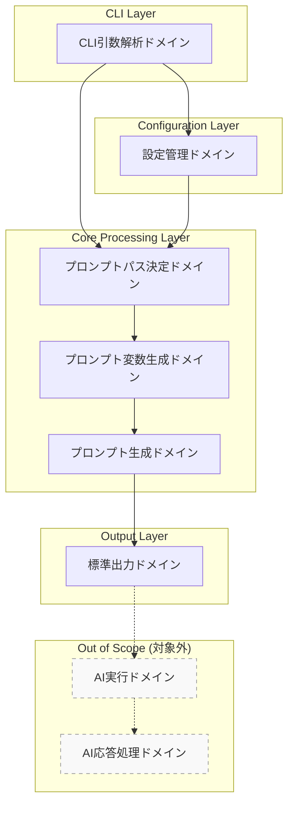
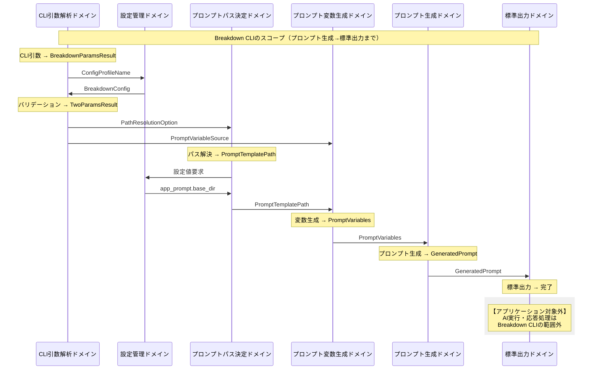
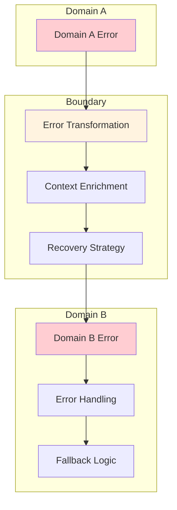

# あらすじ

AI開発における「コード品質の安定化」について考える際に、私が辿り着いた解決法を紹介します。主に Agentic Coding 向けです。

**Claude Code Company**という並列開発環境を構築してから、開発効率は劇的に向上しました。しかし同時に、AIが生成する乱雑なコードによって、プロジェクト全体が混乱に陥る問題も浮上しました。

この問題の核心は、「AIは優秀だが、設計思想が一貫しない」という点にあると仮定しました。

要は、AIコーディングには「設計の軸」が必要だということです。そして、その軸として**ドメイン駆動設計**と**全域性**、**テスト駆動**の組み合わせが非常に有効であることがわかりました。

この記事では、実際に私が運用している手法を整理し、ドメイン定義の具体例を載せました。

# はじめに

現代のAI開発環境は、驚くほど高速にコードを生成できます。私自身、[Claude Code Company](20250615-5dc8b1eac82b55)を構築してから、Claude MAX($200)の上限にすぐ達してしまうほど開発効率が高まりました。大きな要件の場合、セッション開始からLimitに達するまで、停止することなく稼働し続けます。

しかし、この高速開発には重大な副作用があります。AIが生成するコードは、個別に見ると優秀でも、全体として見ると一貫性を欠く場合が多いのです。

そこで、ドメイン設計の確立プロセスを取り入れました。

## 私の現在の開発フロー

現在私が実践している開発フローは以下の通りです：

- **予約実行**：スケジューラーでLimit解除時間を指定し、不在時でも起動
- **要件事前作成**：その時の課題に応じて、次に実行する要件を準備しておく
- **CLIプロンプト**: CLiの中で動的にプロンプトを呼び出す
- **設計軸の確立**：ドメイン駆動設計と全域性を用いて、一貫した概念を作る

設計は、特に「[AI 時代のコード品質戦略 - バグに強いコードを型でデザインする](https://zenn.dev/dinii/articles/totality-is-all-you-need)」と「[全域関数を使いこなせば異常系のテストコードが減るかもしれない仮説](https://zenn.dev/loglass/articles/76674f0eddfa8a)」からヒントを得て、ドメイン駆動設計に全域性を加味したものです。

今回は、この設計軸について記載しています。

# AI開発における課題の根源

## コード品質の分散問題

AIコーディングにおける最大の課題は、**品質の分散**です。

従来の開発では、一人の開発者が一貫した思想でコードを書く場合、多少の品質のばらつきはあっても、基本的な設計思想は保たれていました。しかし、AIが関与する開発では、一人の開発者が手がけていても、AIの担当領域で一貫性が失われがちです。

具体的には以下のような問題が発生します：

- **抽象度の高い設計**が、解釈の違いによってブレる
- **誤った型定義**や**冗長な重複コード**が量産される
- **コード内部の「誤り比重」** が大きくなり、洗練されたシンプルなコードが埋もれる

## テストの迂回路問題

さらに深刻なのが、**テストの迂回路問題**です。

AIが自動生成したテストは、抽象度が高いと「何をどうテストすべきか」が明確でなくなります。その結果：

- **全件をテストする**と、テスト量が膨大になる
- **誤ったコードのテスト**が量産されると、リファクタが困難になる
- **主題と末節のテスト**に濃淡がつかず、重要な部分を見失う

こうしたテストをpassさせるべく強制すると、迂回経路を探し始めます。
単品を作って終わりなら問題にならずとも、継続的な開発では、必ず負担になります。


### 余談：誤り比重

「誤り比重」と書きましたが、「誤り」と呼ぶべきか、一度考えました。
永遠にAIへ任せ続けると、どこかでブレークスルーし、人間が思いもしない形に昇華する可能性もあります。
ただ、開発の目的は、研究開発的にアルゴリズムのブレークスルーを行いたいわけではなく、決まった要件に基づいて安定コードを生み出してもらうことです。不要なコードは誤りだとし、混在して比重が変わることを「誤り比重」と表現しました。

誤り比重とは、造語です。同一目的を達成するためのコードに対し、誤っているコードが含まれる度合いを指して、比重としました。目的達成に必要なコード量が純水、混合物が増えて比重が変わるイメージです。


# 解決策：4つの軸による収束手法

私が実践している解決策は、**4つの軸**を組み合わせた収束手法です。リファクタを重ねて一定水準へ収斂させることができます。粒度分離が進むかのように、徐々にぶれなくなり、固まっていきます。（蒸留が進みます）

## 1. ドメイン駆動設計の追求

### なぜドメイン駆動設計なのか

ドメイン駆動設計は、**領域**と**一貫性**を扱っています。この点がAI開発と相性が良いのです。

AI生成によってアプリケーションが崩れるのは、実は**ドメイン定義が足りない**からです。重要かつ論理性の高い概念は、本来ドメインにおいて重要なはずです。その重要な概念の実装が崩れるということは、つまりドメイン定義が不十分だということです。

### 実践的なアプローチ

ドメイン駆動設計で重要なのは、以下の2点です：

- **一貫した重要な概念**を、どこでも共通で用いるユビキタス言語で定義する
- **ユビキタス言語**が通用する範囲を定義する（境界づけられたコンテキスト）

この2点だけでも、混乱が激減します。

作業的には、**最初の中核部分を見つけること**が非常に労力のかかる部分です。「見えているようでいて、見えていない状態」が続くためです。「これだ」と見えるまで追求しきることで、ブレない設計の軸が確立されます。

### 定義の評価

ドメイン定義された文章を読んだ時、「しっくりくる」と感じるかどうかです。
ドメインに詳しくないと、あまりピンと来ないかもしれません。ドメインに詳しくなると、「そう、こうやって表現すればよかったんだ」と、しっくりきます。
「これは定義できた」と感じたとき、微妙な言い回しのひとつひとつが、無駄なく、的確に、言い表されていることでしょう。


## 2. 全域性の追求

### 全域関数の真の価値

全域関数は、単体では通用しません。論理性よりも羅列や列挙が優先されやすいからです。

ところが、**ドメイン駆動設計によって、全域性が成り立つ**ようになります。論理が一貫すると、全体を表現した型が定義できるからです。抽象度の高い概念で型定義が全域化すると、論理的な抜け漏れがなくなります。

### AIとの相性

部分関数の構成では、さまざまなパターンを考慮するAIにおいて、不具合に遭遇する確率が上がります。
実際はエッジケースだとしても、テストは平等な回数で実行されます。コードの解釈時にはユースケース実行回数の情報がありません。
私は、この実行回数情報の欠落が、部分関数とAIが組み合わさった時の大きな課題であろうと仮定しています。

解決には、抜け漏れのない「全域」を表す必要性が生じます。具体で列挙すると際限がないため、パターンマッチングや論理性で境界を作り全域をカバーします。

ドメイン定義がなされると、境界線が明確になります。つまり全域性を表現できるようになります。

## 3. テスト駆動による仕様の固定

### 設計指向のテスト駆動

厳密に「まずテストから」作るテスト駆動である必要はありませんが、テストを「こう検証すべき」という方向から構築することが重要です。

実装とテストを作りつつ、ドメイン設計から仕様化し、仕様に基づいてテストパターンを網羅し、テストが通るように構築していきます。

### 単体テストの戦略的活用

特に重要なのは、**設計、構造、ユニットテストを単体でテストしておく**ことです。複合化する前に、ドメイン設計した状態をテストで固めておく意味があります。

これにより、AI生成コードが設計思想から逸脱していないかを、継続的に検証できます。

## 4. 物量でカバーする並列戦略 (Claude Code Company)

### Claude Code Companyによる高速イテレーション

**Claude Code Company**で並列稼働し、リファクタや実装を短時間で終わらせることで、試行錯誤のコストを大幅に削減できます。

ドメイン定義が間違えていたら、さらに深掘りをして定義し直し、やり直す。この高速なイテレーションが可能になることで、より精度の高いドメイン設計に到達できます。

### コアドメインの蒸留（収斂）

再定義したドメインがクリアになるほど、コアドメインがブレない概念用語となっていきます。これがユビキタス言語として明確さを持つようになり、ドメイン内での影響力（カバレッジであり、芯を通す一貫性である）を持つようになります。

私は、物理的には蒸留より分級をイメージしており、分離された重要な概念がいくつかの概念に収斂していくイメージを持っています。
この分級のためにの「ふるい」に掛ける行為に、並列稼働を使っています。

# 手法の相乗効果

これら4つの軸は、個別に機能するだけでなく、相乗効果を生み出します。

**ドメイン駆動設計**が概念の軸を提供し、**全域性**が実装の完全性を保証し、**テスト駆動**が仕様の固定を行い、**物量作戦**が高速な改善サイクルを実現します。

この組み合わせにより、AIが生成するコードは「収斂」していきます。つまり、品質が一定の水準に向かって安定化し、プロジェクト全体としての一貫性が保たれるようになります。

一方で、この手法にも限界があります。初期のドメイン定義に時間がかかること、並列稼働による高速開発が必須であることなどです。しかし、AI開発の規模が大きくなるほど、この初期投資の価値は高まるでしょう。

次に、具体的なドメイン定義の例を通じて、この手法がどのように機能するかを見ていきましょう。

# 実例-1

以下のドメイン定義は、GitHub Copilot のClaude Sonnet 4 で出力しました。Claude Code Companyで材料を出し尽くし、仕上げ部分をGitHub Copilotで行いました。
（Claude MAXがLimit制限に掛かっている間の作業・・です）

ちなみに、出力はAIが出力した「そのまま」です。
バチっと出ています。シーケンス図も意図通り、データ変換フローも意図通りです。
（その代わり、ドメイン領域が狭めに出ていると感じます。）

----

ここから実例-1

----

## ドメイン境界線とデータフロー

### プロローグ：ドメイン境界の全体像

Breakdown CLIは、3つの主要ドメインと複数の支援ドメインから構成される複雑なシステムです。このドキュメントでは、**ドメイン境界線**と**データの変換フロー**を体系的に整理し、バリューオブジェクトとユニオン型によるドメイン駆動設計を明確に表現します。

### 第1章：ドメイン境界の全体アーキテクチャ

#### 主要ドメインの構成

```typescript
// ドメインの階層構造
type BreakdownDomain = 
  | "cli-parsing"           // CLI引数解析ドメイン
  | "config-management"     // 設定管理ドメイン
  | "prompt-path-resolution" // プロンプトパス決定ドメイン
  | "prompt-variable-generation" // プロンプト変数生成ドメイン
  | "prompt-generation"     // プロンプト生成ドメイン（最終出力）
  | "stdout-output";        // 標準出力ドメイン（標準出力まで）

// 注意：以下のドメインはアプリケーションの対象外
// | "prompt-execution"      // AIへのプロンプト実行（対象外）
// | "ai-response-processing" // AI応答の処理（対象外）
// 
// Breakdown CLIのスコープ：
// プロンプトを作成し、標準出力するまでがアプリケーションの責務範囲
```

#### ドメイン境界の定義



### 第2章：バリューオブジェクト設計

#### コアバリューオブジェクト

```typescript
// =============================================================================
// Domain Value Objects - ドメイン固有の値オブジェクト
// =============================================================================

/**
 * DirectiveType - 処理方向を表すバリューオブジェクト
 */
type DirectiveType = {
  readonly value: string;
  readonly profile: ConfigProfileName;
  readonly validatedByPattern: boolean;
  
  // ドメイン操作
  isValidForProfile(profile: ConfigProfileName): boolean;
  
  // パス解決専用ドメイン操作
  getPromptDirectory(baseDir: string, layer: LayerType): string;
  getSchemaDirectory(baseDir: string, layer: LayerType): string;
  isValidForResourcePath(): boolean;
  
  // 型安全な比較
  equals(other: DirectiveType): boolean;
  toString(): string;
}

/**
 * LayerType - 階層を表すバリューオブジェクト
 */
type LayerType = {
  readonly value: string;
  readonly validatedByPattern: boolean;
  
  // ドメイン操作
  isValidForDirective(directive: DirectiveType): boolean;
  
  // パス解決専用ドメイン操作
  getPromptFilename(fromLayerType: string, adaptation?: string): string;
  getSchemaFilename(): string;
  isValidForResourcePath(): boolean;
  
  // 型安全な比較
  equals(other: LayerType): boolean;
  toString(): string;
}

/**
 * ConfigProfileName - 設定プロファイル名を表すバリューオブジェクト
 */
type ConfigProfileName = {
  readonly value: string;
  readonly isDefault: boolean;
  readonly prefix: string | null;
  
  // ドメイン操作
  getConfigPath(): string;
  getDirectiveTypes(): readonly DirectiveType[];
  getLayerTypes(): readonly LayerType[];
  
  // 型安全な比較
  equals(other: ConfigProfileName): boolean;
  toString(): string;
}

/**
 * PromptTemplatePath - プロンプトテンプレートパスを表すバリューオブジェクト
 */
type PromptTemplatePath = {
  readonly fullPath: string;
  readonly status: PathResolutionStatus;
  readonly metadata: PathResolutionMetadata;
  
  // ドメイン操作
  exists(): boolean;
  getDirectory(): string;
  getFilename(): string;
  toString(): string;
}

/**
 * PromptVariables - プロンプト変数を表すバリューオブジェクト
 */
type PromptVariables = {
  readonly inputContent: string;
  readonly inputFilePath?: string;
  readonly outputFilePath?: string;
  readonly schemaContent: string;
  readonly promptFilePath: string;
  readonly inputSource: InputSource;
  readonly uv: Record<string, string>;
  
  // ドメイン操作
  hasInputFile(): boolean;
  hasCustomVariables(): boolean;
  getVariableKeys(): string[];
  toPromptParams(): PromptParams;
}
```

#### 支援バリューオブジェクト

```typescript
/**
 * TwoParams - 2パラメータ処理のバリューオブジェクト
 */
type TwoParams = {
  readonly directive: DirectiveType;
  readonly layer: LayerType;
  readonly profile: ConfigProfileName;
  
  // ドメイン操作
  toCommand(): BreakdownCommand;
  validate(): Result<void, TwoParamsValidationError>;
  getPromptPath(fromLayerType?: string, adaptation?: string): PromptPath;
  getSchemaPath(): SchemaPath;
  equals(other: TwoParams): boolean;
}

/**
 * BreakdownConfig - 設定を表すバリューオブジェクト
 */
type BreakdownConfig = {
  readonly profileName: ConfigProfileName;
  readonly app_prompt: PromptConfig;
  readonly app_schema: SchemaConfig;
  readonly customConfig: CustomConfig;
  
  // ドメイン操作
  getPromptBaseDirectory(): string;
  getSchemaBaseDirectory(): string;
  getPatternConfig(): PatternConfig;
  isValidTwoParams(directive: string, layer: string): boolean;
}
```

### 第3章：ユニオン型設計

#### コマンド解析結果のユニオン型

```typescript
// =============================================================================
// Union Types - ドメインの選択肢を表現
// =============================================================================

/**
 * BreakdownParamsResult - CLI解析結果のユニオン型
 */
type BreakdownParamsResult = 
  | { type: "zero"; data: ZeroParamsResult }
  | { type: "one"; data: OneParamsResult }
  | { type: "two"; data: TwoParamsResult };

/**
 * ZeroParamsResult - システム情報表示のユニオン型
 */
type ZeroParamsResult = 
  | { kind: "help"; options: SystemOptions }
  | { kind: "version"; options: SystemOptions };

/**
 * OneParamsResult - 管理操作のユニオン型
 */
type OneParamsResult = 
  | { kind: "init"; options: ManagementOptions }
  | { kind: "copy"; options: ManagementOptions }
  | { kind: "delete"; options: ManagementOptions };

/**
 * TwoParamsResult - プロンプト生成のユニオン型
 */
type TwoParamsResult = {
  kind: "prompt-generation";
  params: TwoParams;
  options: PromptVariableSource;
};
```

#### パス解決結果のユニオン型

```typescript
/**
 * PathResolutionResult - パス解決結果のユニオン型
 */
type PathResolutionResult = 
  | { status: "found"; path: PromptTemplatePath }
  | { status: "fallback"; path: PromptTemplatePath; reason: string }
  | { status: "error"; error: PathResolutionError };

/**
 * PathResolutionStatus - パス解決状態のユニオン型
 */
type PathResolutionStatus = 
  | "Found"
  | "Fallback"
  | "Error";

/**
 * InputSource - 入力源のユニオン型
 */
type InputSource = 
  | "file"
  | "stdin"
  | "both";
```

#### エラーのユニオン型

```typescript
/**
 * BreakdownError - システム全体のエラーのユニオン型
 */
type BreakdownError = 
  | { domain: "cli-parsing"; error: CLIParsingError }
  | { domain: "config-management"; error: ConfigError }
  | { domain: "prompt-path-resolution"; error: PathResolutionError }
  | { domain: "prompt-variable-generation"; error: VariableGenerationError }
  | { domain: "prompt-generation"; error: PromptGenerationError }
  | { domain: "stdout-output"; error: OutputError };

// 注意：以下のエラー型はアプリケーションの対象外
// | { domain: "prompt-execution"; error: PromptExecutionError }
// | { domain: "ai-response-processing"; error: ResponseProcessingError }

/**
 * PathResolutionError - パス解決エラーのユニオン型
 */
type PathResolutionError = 
  | { kind: "InvalidParameterCombination"; directive: string; layer: string }
  | { kind: "BaseDirectoryNotFound"; baseDir: string }
  | { kind: "TemplateFileNotFound"; templatePath: string }
  | { kind: "FallbackExhausted"; attemptedPaths: string[] };

/**
 * VariableGenerationError - 変数生成エラーのユニオン型
 */
type VariableGenerationError = 
  | { kind: "FileNotFound"; filePath: string }
  | { kind: "FileReadError"; filePath: string; reason: string }
  | { kind: "STDINTimeout"; timeoutMs: number }
  | { kind: "InvalidCustomVariable"; key: string; value: string };
```

### 第4章：ドメイン間データフロー

#### 完全なデータフロー図



#### 段階的データ変換フロー



### 第5章：ドメイン境界の詳細仕様

#### 1. CLI引数解析ドメイン → 設定管理ドメイン

```typescript
// 境界インターフェース
interface CLIToConfigBoundary {
  // 入力
  configProfileName: ConfigProfileName;
  
  // 出力
  breakdownConfig: BreakdownConfig;
  
  // 契約
  loadConfig(profileName: ConfigProfileName): Result<BreakdownConfig, ConfigError>;
}

// データ変換
const transformCLIToConfig = (args: string[]): ConfigProfileName => {
  const configOption = extractConfigOption(args);
  return ConfigProfileName.create(configOption ?? "breakdown");
};
```

#### 2. 設定管理ドメイン → プロンプトパス決定ドメイン

```typescript
// 境界インターフェース
interface ConfigToPathBoundary {
  // 入力
  pathResolutionOption: PathResolutionOption;
  breakdownConfig: BreakdownConfig;
  
  // 出力
  promptTemplatePath: PromptTemplatePath;
  
  // 契約
  resolvePath(
    option: PathResolutionOption, 
    config: BreakdownConfig
  ): Result<PromptTemplatePath, PathResolutionError>;
}

// データ変換
const transformConfigToPath = (
  twoParams: TwoParams,
  config: BreakdownConfig
): PathResolutionOption => {
  return {
    adaptation: twoParams.options.adaptation,
    baseDirectory: config.app_prompt.base_dir,
    directive: twoParams.params.directive,
    layer: twoParams.params.layer
  };
};
```

#### 3. プロンプトパス決定ドメイン → プロンプト変数生成ドメイン

```typescript
// 境界インターフェース
interface PathToVariablesBoundary {
  // 入力
  promptTemplatePath: PromptTemplatePath;
  promptVariableSource: PromptVariableSource;
  
  // 出力
  promptVariables: PromptVariables;
  
  // 契約
  generateVariables(
    templatePath: PromptTemplatePath,
    source: PromptVariableSource
  ): Result<PromptVariables, VariableGenerationError>;
}

// データ変換
const transformPathToVariables = (
  templatePath: PromptTemplatePath,
  source: PromptVariableSource
): PromptVariables => {
  return {
    inputContent: source.fromFile ? readFile(source.fromFile) : source.stdinContent ?? "",
    inputFilePath: source.fromFile ? resolve(source.fromFile) : undefined,
    outputFilePath: source.destinationFile ? resolve(source.destinationFile) : undefined,
    schemaContent: source.useSchema ? readSchemaFile(templatePath) : "",
    promptFilePath: templatePath.fullPath,
    inputSource: determineInputSource(source),
    uv: source.customVariables ?? {}
  };
};
```

#### 4. プロンプト変数生成ドメイン → プロンプト生成ドメイン

```typescript
// 境界インターフェース
interface VariablesToPromptBoundary {
  // 入力
  promptVariables: PromptVariables;
  
  // 出力
  generatedPrompt: GeneratedPrompt;
  
  // 契約
  generatePrompt(
    variables: PromptVariables
  ): Result<GeneratedPrompt, PromptGenerationError>;
}

// データ変換
const transformVariablesToPrompt = (
  variables: PromptVariables
): PromptParams => {
  return {
    template_file: variables.promptFilePath,
    variables: {
      inputContent: variables.inputContent,
      inputFilePath: variables.inputFilePath ?? "",
      outputFilePath: variables.outputFilePath ?? "",
      schemaContent: variables.schemaContent,
      inputSource: variables.inputSource,
      ...variables.uv
    }
  };
};
```

#### 5. プロンプト生成ドメイン → 標準出力ドメイン

```typescript
// 境界インターフェース
interface PromptToOutputBoundary {
  // 入力
  generatedPrompt: GeneratedPrompt;
  
  // 出力
  outputResult: StandardOutputResult;
  
  // 契約
  outputToStdout(
    prompt: GeneratedPrompt
  ): Result<StandardOutputResult, OutputError>;
}

// データ変換
const transformPromptToOutput = (
  prompt: GeneratedPrompt
): StandardOutputData => {
  return {
    content: prompt.content,
    metadata: prompt.metadata,
    timestamp: new Date().toISOString()
  };
};
```

#### 注意：アプリケーションスコープ外のドメイン

```typescript
// 以下のドメインはBreakdown CLIの対象外
// 
// interface PromptExecutionBoundary {
//   // AI実行サービス（Claude, GPT等）へのプロンプト送信
//   executeWithAI(prompt: GeneratedPrompt): Result<AIResponse, AIError>;
// }
// 
// interface ResponseProcessingBoundary {
//   // AI応答の処理・整形
//   processResponse(response: AIResponse): Result<ProcessedResult, ProcessingError>;
// }
// 
// Breakdown CLIの責務範囲：
// ユーザー入力 → プロンプト生成 → 標準出力 まで
```

### 第6章：エラーハンドリングの境界設計

#### ドメイン間エラー伝播

```typescript
// エラー伝播の型安全な設計
type DomainErrorPropagation = {
  // 各ドメインのエラーを上位に伝播
  propagate<T extends BreakdownError>(error: T): BreakdownError;
  
  // エラー回復戦略
  recover<T extends BreakdownError>(error: T): RecoveryAction;
  
  // エラー情報の豊富化
  enrich<T extends BreakdownError>(error: T, context: ErrorContext): T;
};

// 回復戦略のユニオン型
type RecoveryAction = 
  | { kind: "retry"; maxAttempts: number }
  | { kind: "fallback"; alternativePath: string }
  | { kind: "user-intervention"; message: string }
  | { kind: "abort"; reason: string };
```

#### 境界でのエラー変換



### 第7章：境界の実装パターン

#### 1. Smart Constructor パターン

```typescript
// 境界での型安全な生成
namespace DirectiveType {
  export function create(
    value: string,
    profile: ConfigProfileName
  ): Result<DirectiveType, InvalidDirectiveError> {
    // バリデーション
    if (!isValidDirective(value, profile)) {
      return Result.error({
        kind: "InvalidDirective",
        value,
        profile,
        validDirectives: getValidDirectives(profile)
      });
    }
    
    // 成功時の生成
    return Result.ok({
      value,
      profile,
      validatedByPattern: true,
      isValidForProfile: (p) => p.equals(profile),
      getPromptDirectory: (baseDir, layer) => `${baseDir}/${value}/${layer.value}`,
      equals: (other) => other.value === value && other.profile.equals(profile),
      toString: () => value
    });
  }
}
```

#### 2. Factory パターン

```typescript
// 境界での複雑な生成処理
class PromptVariablesFactory {
  create(
    templatePath: PromptTemplatePath,
    source: PromptVariableSource,
    config: BreakdownConfig
  ): Result<PromptVariables, VariableGenerationError> {
    try {
      // 段階的な変換
      const inputProcessing = this.processInput(source);
      const pathResolution = this.resolvePaths(source, config);
      const schemaProcessing = this.processSchema(templatePath, source);
      const variableIntegration = this.integrateVariables(
        inputProcessing,
        pathResolution,
        schemaProcessing,
        source
      );
      
      return Result.ok(variableIntegration);
    } catch (error) {
      return Result.error(this.convertError(error));
    }
  }
}
```

#### 3. Strategy パターン

```typescript
// 境界での処理戦略の選択
interface PathResolutionStrategy {
  resolve(
    option: PathResolutionOption,
    config: BreakdownConfig
  ): Result<PromptTemplatePath, PathResolutionError>;
}

class StandardPathResolutionStrategy implements PathResolutionStrategy {
  resolve(
    option: PathResolutionOption,
    config: BreakdownConfig
  ): Result<PromptTemplatePath, PathResolutionError> {
    // 標準的なパス解決ロジック
    const basePath = config.app_prompt.base_dir;
    const directoryPath = `${basePath}/${option.directive.value}/${option.layer.value}`;
    const fileName = this.buildFileName(option);
    const fullPath = `${directoryPath}/${fileName}`;
    
    return this.validatePath(fullPath);
  }
}
```

### エピローグ：境界の価値

このドメイン境界設計により、Breakdown CLIは以下の価値を実現します：

#### 1. 明確なアプリケーションスコープ
- **範囲の明確化**: プロンプト生成から標準出力まで
- **責務の限定**: AI実行・応答処理は対象外
- **境界の明示**: 何を行い、何を行わないかの明確化

#### 2. 型安全性の確保
- バリューオブジェクトによる不変性
- ユニオン型による状態の明確化
- Smart Constructorによる生成時バリデーション

#### 3. 責務の明確化
- 各ドメインの単一責任
- 境界での明確なデータ変換
- エラー処理の局所化

#### 4. 拡張性の実現
- 新しいドメインの追加容易性
- 既存境界への影響最小化
- 設定による動的な挙動変更

#### 5. 保守性の向上
- ドメイン固有の用語による理解促進
- 境界での変換ロジックの集約
- テスト可能な設計

#### 6. 統合の容易性
- 標準出力による他ツールとの連携
- パイプライン処理への組み込み
- 外部システムとの疎結合


----

ここまで実例-1

----


# 実例-2

以下のドメイン定義も、GitHub Copilot のClaude Sonnet 4 で出力しました。

定義を作成する前に、AIが生成したコードを材料として使いました。「実例-1」との違いは、AIが生成した重複コードを重要性分析に活用した点です。

最初の中核部分を見つけるために、非常に労力がかかりました。
「最初から見えているようでいて、実は見えていない状態」が続くため、納得の定義がAI出力されるまで、労力を要しました。
代わりに、中核ドメイン定義から、総合的なドメイン定義に広げていくことは難しくありませんでした。

この実例-2も、AI出力そのままです。処理フローや関係性の表現も的確です。（一部省略して掲載）

----

ここから実例-2

----


## layerTypeとDirectiveType

### ドメインストーリー - CLIからファイルシステムへの変換

#### 具体例で理解する処理の流れ

ユーザーがコマンドラインで `breakdown to issue` を実行したとき、システムは以下の処理を行います：

1. **CLI引数の受信**: `["to", "issue"]`
2. **設定読み込み**: ProfileNameに基づくBreakdownConfig取得
3. **パターンマッチング**: 設定のパターンで引数をバリデーション
4. **ドメインオブジェクト生成**: 検証済みのTwoParams作成
5. **ファイルパス解決**: プロンプトテンプレートとスキーマファイルの特定
6. **実行**: `prompts/to/issue/f_issue.md` と `schemas/to/issue/base.schema.json` を使用

この一連の流れにおいて、**DirectiveType（"to"）とLayerType（"issue"）** は、単なる文字列から**型安全で信頼性の高いドメイン値**へと変換され、最終的に**ファイルシステム上の具体的なリソース**を特定する役割を担います。

#### なぜ「2つのパラメータ」なのか

Breakdownにおいて、**処理方向（DirectiveType）** と **階層（LayerType）** の組み合わせは、AI開発支援の中核的な概念です：

- **DirectiveType**: 「何をするか」（to=変換, summary=要約, defect=欠陥検出）
- **LayerType**: 「どのレベルで」（project=プロジェクト全体, issue=課題単位, task=タスク単位）

この2つの軸が交差することで、具体的な処理内容が決定され、適切なプロンプトテンプレートとスキーマファイルが特定されます。

### 中核概念 - TwoParams

#### ドメインオブジェクトとしてのTwoParams

TwoParamsは、CLIのargsがBreakdownConfigとBreakdownParamsを経由して得られる2つの単一値（DirectiveTypeとLayerType）の組み合わせを表すドメイン型です。両者ともパターンマッチングによってバリデートされ、アプリケーションライフサイクル全体で一貫して使用される不変の値です。

#### 型定義 - ドメインの表現

```typescript
// =============================================================================
// TwoParams - 2パラメータ処理のドメイン型
// =============================================================================

/**
 * TwoParams - DirectiveTypeとLayerTypeの組み合わせを表すドメイン型
 * 
 * ドメイン概念:
 * - Breakdownコマンドの中核的な処理単位
 * - 処理方向（DirectiveType）と階層（LayerType）の組み合わせ
 * - プロンプト生成とスキーマ解決のコンテキスト
 * 
 * 設計理念:
 * - CLI引数からファイルシステムリソースへの橋渡し
 * - パターンバリデーションによる信頼性保証
 * - 型安全なパス解決の実現
 */
type TwoParams = {
  readonly directive: DirectiveType;
  readonly layer: LayerType;
  readonly profile: ConfigProfileName;
  
  // ドメイン操作
  toCommand(): BreakdownCommand;
  validate(): Result<void, TwoParamsValidationError>;
  
  // パス解決機能（プロンプト・スキーマファイル）
  getPromptPath(fromLayerType?: string, adaptation?: string): PromptPath;
  getSchemaPath(): SchemaPath;
  resolvePromptFilePath(baseDir: string, fromLayerType?: string, adaptation?: string): string;
  resolveSchemaFilePath(baseDir: string): string;
  
  // 型安全な比較
  equals(other: TwoParams): boolean;
  toString(): string;
}
```

#### DirectiveTypeとLayerType - 構成要素の詳細

```typescript
/**
 * DirectiveType - 処理方向を表すドメイン型
 * 
 * 役割: 「何をするか」を決定
 * 例: "to"(変換), "summary"(要約), "defect"(欠陥検出)
 */
type DirectiveType = {
  readonly value: string;
  readonly profile: ConfigProfileName;
  readonly validatedByPattern: boolean;
  
  // ドメイン操作
  isValidForProfile(profile: ConfigProfileName): boolean;
  
  // パス解決専用ドメイン操作
  getPromptDirectory(baseDir: string, layer: LayerType): string;
  getSchemaDirectory(baseDir: string, layer: LayerType): string;
  isValidForResourcePath(): boolean;
  
  // 型安全な比較
  equals(other: DirectiveType): boolean;
  toString(): string;
}

/**
 * LayerType - 階層を表すドメイン型
 * 
 * 役割: 「どのレベルで」を決定
 * 例: "project"(プロジェクト), "issue"(課題), "task"(タスク)
 */
type LayerType = {
  readonly value: string;
  readonly validatedByPattern: boolean;
  
  // ドメイン操作
  isValidForDirective(directive: DirectiveType): boolean;
  
  // パス解決専用ドメイン操作
  getPromptFilename(fromLayerType: string, adaptation?: string): string;
  getSchemaFilename(): string;
  isValidForResourcePath(): boolean;
  
  // 型安全な比較
  equals(other: LayerType): boolean;
  toString(): string;
}

/**
 * ConfigProfileName - 設定プロファイル名を表すドメイン型
 * 
 * 役割: 設定の切り替えコンテキスト
 * 例: "breakdown"(標準), "search"(検索), "custom"(カスタム)
 */
type ConfigProfileName = {
  readonly value: string;
  readonly isDefault: boolean;
  readonly prefix: string | null;
  
  // ドメイン操作
  getConfigPath(): string;
  getDirectiveTypes(): readonly DirectiveType[];
  getLayerTypes(): readonly LayerType[];
  
  // 型安全な比較
  equals(other: ConfigProfileName): boolean;
  toString(): string;
}
```

### 信頼性の確保 - パターンベースバリデーション

#### バリデーション戦略

Breakdownでは、CLI引数をそのまま使用するのではなく、**パターンベースバリデーション**により信頼性を確保しています：

```
ProfileName → BreakdownConfig → CustomConfig.two.ParamsConfig
     ↓              ↓                      ↓
CLI args → BreakdownParams (pattern validation) → TwoParamsResult
     ↓                                                    ↓
TwoParams → DirectiveType + LayerType (pattern-validated)
```

#### なぜパターンバリデーションが必要なのか

1. **設定の柔軟性**: 環境やプロジェクトごとに異なる値を許可
2. **品質保証**: 不正な値によるエラーを事前に防止
3. **拡張性**: 新しいDirectiveTypeやLayerTypeを設定で追加可能
4. **一貫性**: ProfileNameによる設定切り替えで環境別対応

#### エラーハンドリング戦略

```typescript
/**
 * TwoParams検証エラー - パターンコンテキスト付きエラー情報
 */
type TwoParamsValidationError = 
  | { kind: "InvalidDirective"; directive: string; profile: ConfigProfileName; pattern: string; }
  | { kind: "InvalidLayer"; layer: string; pattern: string; }
  | { kind: "UnsupportedCombination"; directive: string; layer: string; profile: ConfigProfileName; }
  | { kind: "PatternNotFound"; profile: ConfigProfileName; configPath: string; }

/**
 * DirectiveType検証エラー
 */
type InvalidDirectiveError = {
  kind: "InvalidDirective";
  value: string;
  profile: ConfigProfileName;
  pattern: string;
  validDirectives: string[];
}

/**
 * LayerType検証エラー
 */
type InvalidLayerError = {
  kind: "InvalidLayer";
  value: string;
  pattern: string;
  validLayers: string[];
}
```

### 実用性の実現 - パス解決システム

#### DirectiveTypeとLayerTypeの実際の活用

バリデーション済みのDirectiveTypeとLayerTypeは、**ファイルシステム上のリソース配置と密接に関連したドメイン概念**として機能します。これらの値は、プロンプトテンプレートやスキーマファイルの**パス解決において重要なドメイン用語**として使用されます。

#### パス解決の仕組み

パス解決は以下の4つの変数の組み合わせで決定されます：

1. **設定値（base_dir）** - `app_prompt.base_dir` または `app_schema.base_dir`
2. **DirectiveType** - 処理方向（to, summary, defect など）
3. **LayerType** - 階層レベル（project, issue, task など）
4. **その他の修飾子** - fromLayerType, adaptation など

```typescript
// パス解決専用型定義
type PromptPath = {
  readonly baseDir: string;           // app_prompt.base_dir (cwd起点)
  readonly directive: DirectiveType;  // "to", "summary", "defect" など
  readonly layer: LayerType;          // "project", "issue", "task" など
  readonly fromLayer: string;         // fromLayerType
  readonly adaptation?: string;       // adaptation修飾子（オプション）
  resolve(): string;
  resolveWithAdaptation(adaptation: string): string;
}

type SchemaPath = {
  readonly baseDir: string;           // app_schema.base_dir (cwd起点)
  readonly directive: DirectiveType;  // "to", "summary", "defect" など
  readonly layer: LayerType;          // "project", "issue", "task" など
  readonly schemaFile: string;        // デフォルト: "base.schema.json"
  resolve(): string;
}
```

#### ディレクトリ構造との対応

```
TwoParams (pattern-validated) → {base_dir}/{directive}/{layer}/filename

プロジェクトルート/
├── prompts/           # app_prompt.base_dir
│   ├── to/           # DirectiveType
│   │   ├── project/  # LayerType
│   │   ├── issue/    # LayerType
│   │   └── task/     # LayerType
│   ├── summary/      # DirectiveType
│   └── defect/       # DirectiveType
└── schemas/          # app_schema.base_dir
    ├── to/           # DirectiveType
    │   ├── project/  # LayerType
    │   ├── issue/    # LayerType
    │   └── task/     # LayerType
    ├── summary/      # DirectiveType
    └── defect/       # DirectiveType
```

### アプリケーションライフサイクルでの一貫性

```
TwoParams (値オブジェクト)
├── DirectiveType (パターン検証済み単一値) - "to", "summary", "defect" など
└── LayerType (パターン検証済み単一値) - "project", "issue", "task" など

特徴：
- BreakdownConfigのパターンで検証済み
- ProfileNameによって利用可能な値が決定
- アプリケーション全体で不変
- ファイルシステムリソースへの確実なアクセス
```

このドメイン型定義により、TwoParamsがDirectiveTypeとLayerTypeの2つを持つという関係性が型安全に表現され、BreakdownConfigのパターンによるバリデーションを経た信頼性の高いドメインオブジェクトとして機能します。さらに、これらの型はプロンプトテンプレートとスキーマファイルの物理的な配置を決定する重要な役割を担い、ファイルシステム上のリソースへの確実なアクセスを可能にします。ProfileNameによるパターン切り替えにより、柔軟な設定管理とリソース配置の両方が実現されています。

----

ここまで実例-2

----


# 終わりに

いかがでしょうか。

ドメイン駆動設計と全域性を重視することによって、理解しやすく一貫した定義ができました。この定義を元にすると、テスト駆動開発のイメージも湧いてくるのではないでしょうか。

以上、AI開発における、抽象度の高い概念を扱うことができる方法として、1つの参考例になれば幸いです。

