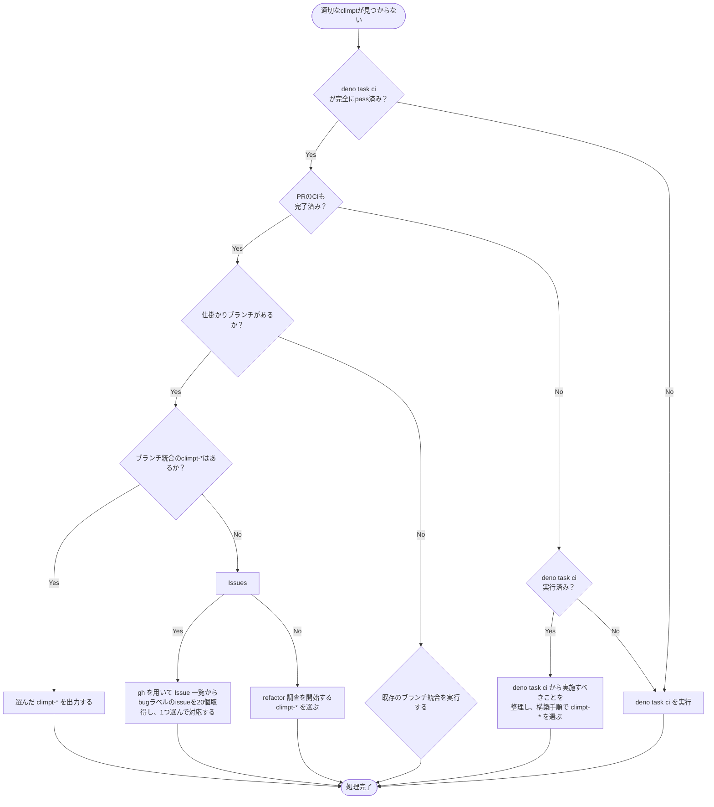

# Climpt CLI　コマンド作成指示書

この指示に従い、「出力」を行いなさい。

`.agent/climpt/registered-commands.md` に、実行可能なClimpt-*が存在する。
内容を読み、「選択に使いたい内容」に相応しい用途のものを探し出すこと。

なお、適切なClimpt-*がない場合は、「適切なclimptが見つからない場合」に基づいて決定する。

# 選択に使いたい内容

```
{input_text}
```

## 優先順位

上から順番に優先する

1. 既存ブランチでの修正作業
2. 仕掛かりブランチやstashの修正作業
3. リファクタリング
4. ブランチの統合やPRのマージ
5. 新たな機能の開発

# 構築手順

1. 「選択に使いたい内容」からメインテーマを決め、climpt-* を選ぶ
2. 「選択に使いたい内容」を input_text, input_text_file
   のいずれで指定するか決める。
3. 「option」を理解し、-iや-aでプロンプトを切り替えるか判断する。
4. uv-* オプションを用いるか決める。
5. 3つ以上の組み合わせを考えたうえで、最適な1つを「出力」する。

## option

| option             | description                                                                                |
| ------------------ | ------------------------------------------------------------------------------------------ |
| -f, --file         | ファイルのPATHを出力結果へ記述する（埋め込む）                                             |
| -i, --input        | プロンプトのファイル種類を入力に沿ったものへ切り替える(-fに合わせて選択することが望ましい) |
| -a, --adaptation   | 適合度合いの調整用。プロンプト切り替え。                                                   |
| -o , --destination | 出力ファイル先のPATHを出力結果へ記述する（埋め込む）                                       |
| --uv-*             | ユーザー定義変数。プロンプト内の {uv-*} を置換                                             |

なお、オプションの値は "=" 結合である。(not "-o tmp/outfile", but
"-o=tmp/outfile")

## 適切なclimptが見つからない場合

以下のフローチャートに従って判断する：



### パターン分類

- **パターンA**: `deno task ci` 完全pass + PR作成完了
- **パターンB**: `deno task ci` が未完了または失敗
- **パターンC**: パターンA + Issue件数0件

# 出力

推奨する実行コマンドと実行指示のみを出力する。

## 出力形式

以下の形式でbash実行する：

```bash
`climpt-<chosen> <command> <list> --option=if-selected`
```
