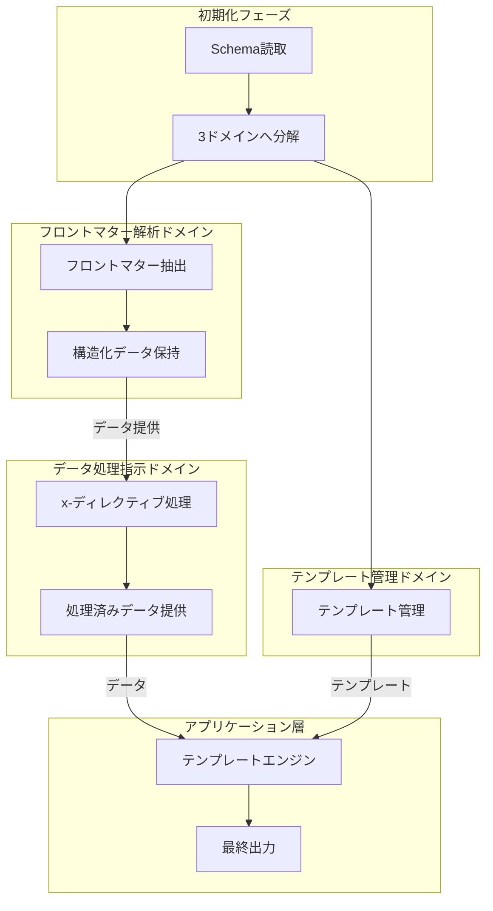

# Architecture Documentation

このディレクトリには、frontmatter-to-schemaプロジェクトの中核となるアーキテクチャ文書が含まれています。

## アーキテクチャの基本原則

requirements.ja.mdとflow.ja.mdに基づき、システムは以下の3つの独立したドメインに分離されています：

1. **フロントマター解析ドメイン**: Markdownファイルからのデータ抽出
2. **テンプレート管理ドメイン**: 出力テンプレートの管理と提供
3. **データ処理指示ドメイン**: フロントマターデータの加工と提供

## Core Documents

### ドメイン分離とデータフロー

- **[schema-responsibility-separation.md](./schema-responsibility-separation.md)**:
  Schemaドメインにおける3つのサブドメインの責務分離
- **[template-schema-domain-handoff.md](./template-schema-domain-handoff.md)**:
  テンプレート管理ドメインとSchemaドメイン間のインターフェース定義
- **[list-container-vs-list-items-separation.md](./list-container-vs-list-items-separation.md)**:
  リストコンテナとリストアイテムの明確な分離原則

### テンプレート処理システム

- **[template-processing-specification.md](./template-processing-specification.md)**:
  テンプレート処理システムの完全仕様（中間表現層を含む）
- **[template-context-specification.md](./template-context-specification.md)**:
  配列展開時の正確な変数解決のためのスコープ管理システム
- **[template-output-subdomain-separation.md](./template-output-subdomain-separation.md)**:
  テンプレート出力サブドメインの分離アーキテクチャ

### ディレクティブと変換処理

- **[schema-directives-specification.md](./schema-directives-specification.md)**:
  x-ディレクティブの処理仕様（処理順序と依存関係）
- **[x-template-items-specification.md](./x-template-items-specification.md)**:
  x-template-items機能の仕様（配列要素展開の管理）
- **[mapping-hierarchy-rules.md](./mapping-hierarchy-rules.md)**:
  {@items}処理におけるマッピング階層ルール

### 実装ロードマップ

- **[template-variable-resolution-roadmap.md](./template-variable-resolution-roadmap.md)**:
  変数解決システムの段階的実装計画
- **[list-output-definition.md](./list-output-definition.md)**:
  リスト出力の明確な定義（何であり、何でないか）

## データフローアーキテクチャ



## 重要な設計原則

### 1. データアクセスの隠蔽

- フロントマター解析結果への直接アクセスは禁止
- すべてのデータアクセスはデータ処理指示ドメインを経由
- x-ディレクティブ処理済みのデータのみを外部に提供

### 2. 処理タイミングの明確化

#### フェーズ1: 個別ファイル処理

- 各Markdownファイルのフロントマター抽出
- デフォルトで構造を保持

#### フェーズ2: 統合処理

- 全ファイル完了後の統合
- x-ディレクティブによる変換適用

#### フェーズ3: テンプレート展開

- {@items}の展開
- 変数の置換
- 最終出力の生成

### 3. 変数解決の起点

- **x-template内の変数**: Schemaのrootが起点
- **x-template-items内の変数**: x-frontmatter-part指定階層が起点

## 中間表現層（IR）の役割

中間表現層は、ディレクティブ処理後のデータを正規化し、テンプレート変数の正確な解決を可能にします：

1. **解決する問題**: `{@items}`展開時の変数スコープの喪失
2. **ソリューション**:
   - IRによるデータ構造の正規化
   - スコープスタックによる変数解決
   - 配列要素コンテキストの保持

詳細は以下を参照：

- [IR Architecture](../domain/architecture/domain-architecture-intermediate-representation.md)
- [Template Context System](./template-context-specification.md)

## ディレクトリ構造への影響

```
docs/
├── architecture/        # アーキテクチャ文書
│   ├── README.md       # 本ファイル
│   └── *.md            # 各種仕様書
├── domain/             # ドメイン設計
│   ├── domain-boundary.md  # ドメイン境界定義
│   └── architecture/   # ドメイン別アーキテクチャ
└── flow.ja.md          # 処理フロー定義
```

## 権限と準拠

この文書は、プロジェクトの権威あるアーキテクチャ決定を表しています。
すべての開発は、ここで確立されたパターンと原則に準拠する必要があります。

特に以下の文書は必読です：

- [requirements.ja.md](../requirements.ja.md): システム要求事項
- [flow.ja.md](../flow.ja.md): 処理フロー定義
- [domain-boundary.md](../domain/domain-boundary.md): ドメイン境界設計
