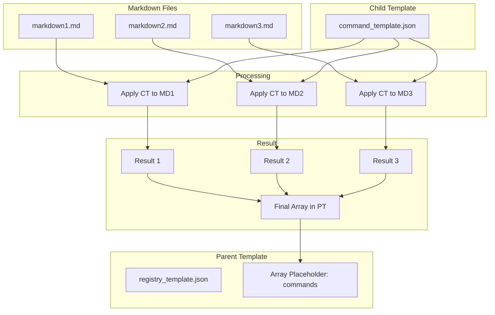

# Array Template Processing Specification

## Overview
配列処理において、テンプレートがどのように繰り返し適用されるかの仕様を定義する。

## Processing Rules

### 1. Schema Structure with x-frontmatter-part
```json
{
  "properties": {
    "commands": {
      "type": "array",
      "x-frontmatter-part": true,  // 各Markdownファイルが1要素
      "items": { 
        "$ref": "command_schema.json"  // x-template指定を持つ
      }
    }
  }
}
```

### 2. Template Application Flow



### 3. Concrete Example

#### Input Files
```yaml
# prompts/git-create.md
---
c1: git
c2: create
c3: branch
title: Create Git Branch
---

# prompts/spec-analyze.md
---
c1: spec
c2: analyze  
c3: metrics
title: Analyze Spec Metrics
---
```

#### Parent Template (registry_template.json)
```json
{
  "version": "{version}",
  "commands": [
    // Child template results will be inserted here
  ]
}
```

#### Child Template (command_template.json)
```json
{
  "c1": "{c1}",
  "c2": "{c2}",
  "c3": "{c3}",
  "title": "{title}"
}
```

#### Processing Steps

1. **Extract frontmatter** from each Markdown file
2. **Apply child template** to each frontmatter data:
   - File 1 + command_template.json → Result 1
   - File 2 + command_template.json → Result 2
3. **Collect results** into array
4. **Insert array** into parent template at placeholder location
5. **Apply parent template** variables

#### Final Output
```json
{
  "version": "1.0.0",
  "commands": [
    {
      "c1": "git",
      "c2": "create",
      "c3": "branch",
      "title": "Create Git Branch"
    },
    {
      "c1": "spec",
      "c2": "analyze",
      "c3": "metrics",
      "title": "Analyze Spec Metrics"
    }
  ]
}
```

## Important Notes

### Array Placeholder Syntax
親テンプレートでの配列プレースホルダーは以下のいずれかの形式：

```json
// Form 1: Empty array with comment
"commands": [
  // Children will be inserted here
]

// Form 2: Special placeholder
"commands": "{$array:commands}"

// Form 3: Empty array
"commands": []
```

### No Schema Structure Inference
- テンプレートに書かれていないフィールドは**出力されない**
- Schemaにフィールドがあってもテンプレートになければ**無視される**
- 配列の各要素は子テンプレートの**完全な**定義に従う

### x-frontmatter-part Behavior
`x-frontmatter-part: true`の意味：
- 各Markdownファイルのフロントマターが配列の1要素になる
- 子テンプレートが各要素に適用される
- 結果が親テンプレートの配列位置に集約される

## Implementation Pseudocode

```typescript
function processArrayWithTemplates(
  markdownFiles: File[],
  parentTemplate: Template,
  childTemplate: Template,
  schema: Schema
): Result {
  // 1. Process each markdown file
  const arrayResults = [];
  
  for (const file of markdownFiles) {
    // Extract frontmatter
    const frontmatter = extractFrontmatter(file);
    
    // Validate against schema
    const validated = validateWithSchema(frontmatter, schema);
    
    // Apply child template
    const rendered = applyTemplate(childTemplate, validated);
    
    arrayResults.push(rendered);
  }
  
  // 2. Insert array into parent template
  const parentData = {
    ...otherFields,
    [arrayFieldName]: arrayResults
  };
  
  // 3. Apply parent template
  return applyTemplate(parentTemplate, parentData);
}
```

## Common Misunderstandings

### ❌ Incorrect: "Array automatically expands"
```json
// Wrong assumption: This would output full objects
"commands": "{commands}"
```

### ✅ Correct: "Explicit child template needed"
```json
// Child template must define complete structure
{
  "c1": "{c1}",
  "c2": "{c2}",
  "c3": "{c3}"
}
```

### ❌ Incorrect: "Partial template gets completed"
```json
// This would only output c1 values, not complete objects
"{c1}"
```

### ✅ Correct: "Template defines exact output"
```json
// Full structure must be in template
{
  "c1": "{c1}",
  "c2": "{c2}",
  "c3": "{c3}",
  "title": "{title}",
  "description": "{description}"
}
```