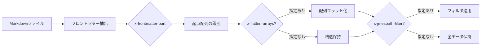
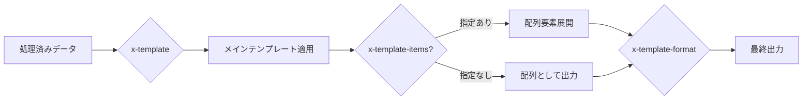
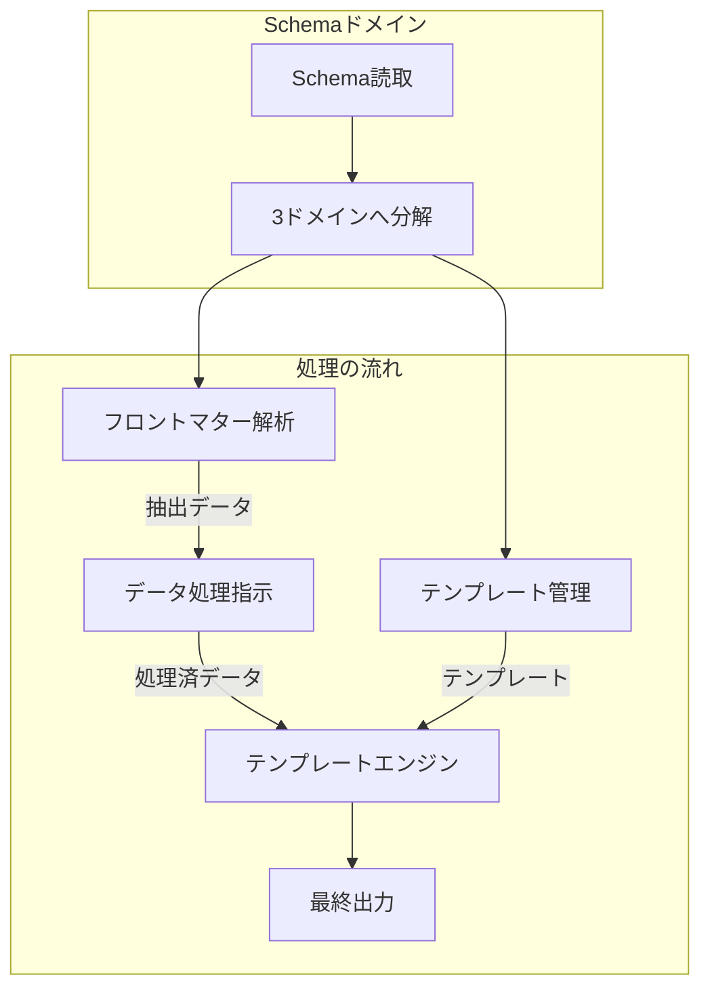

# Schema定義のディレクティブと役割

本ドキュメントは、requirements.ja.mdとflow.ja.mdに基づき、Schema定義のディレクティブ（x-*）の役割と処理ドメインを定義する。

## ドメイン別ディレクティブ分類

### 1. フロントマター解析ドメイン

**責務**: Markdownファイルからのデータ抽出

| ディレクティブ       | 役割                         | 処理タイミング     |
| -------------------- | ---------------------------- | ------------------ |
| `x-frontmatter-part` | フロントマター処理の起点指定 | 個別ファイル処理時 |

### 2. テンプレート管理ドメイン

**責務**: 出力テンプレートの管理と提供

| ディレクティブ      | 役割                             | 処理タイミング     |
| ------------------- | -------------------------------- | ------------------ |
| `x-template`        | メインコンテナテンプレート指定   | テンプレート展開時 |
| `x-template-items`  | 配列要素テンプレート指定         | テンプレート展開時 |
| `x-template-format` | 出力形式指定（json/yaml/md/xml） | テンプレート展開時 |

### 3. データ処理指示ドメイン

**責務**: フロントマターデータの加工と提供

| ディレクティブ      | 役割                           | 処理タイミング       |
| ------------------- | ------------------------------ | -------------------- |
| `x-flatten-arrays`  | 配列のフラット化（オプション） | 個別ファイル処理時   |
| `x-jmespath-filter` | JMESPath式によるフィルタリング | 個別ファイル処理時   |
| `x-derived-from`    | 他プロパティからの値集約       | 全ファイル処理完了後 |
| `x-derived-unique`  | 配列の重複除去                 | 全ファイル処理完了後 |

## 処理フローとタイミング

### フェーズ1: 個別ファイル処理



### フェーズ2: 全体統合（全ファイル処理完了後）

```mermaid
graph LR
    A[個別処理結果群] --> B[配列統合]
    B --> C{x-derived-from?}
    C -->|指定あり| D[値の集約]
    C -->|指定なし| E[元データ保持]
    D --> F{x-derived-unique?}
    F -->|指定あり| G[重複除去]
    F -->|指定なし| H[重複許容]
    G --> I[{@items}配列確定]
    H --> I
    E --> I
```

### フェーズ3: テンプレート展開



## 各ディレクティブの詳細仕様

### x-frontmatter-part

**目的**: 各Markdownファイルのフロントマター処理の起点を指定

**仕様**:

- 値: `true`（boolean）
- 適用対象: 配列プロパティのみ
- 複数指定時: 最上位かつ最初の宣言のみ有効

```json
{
  "commands": {
    "type": "array",
    "x-frontmatter-part": true,
    "items": { "$ref": "command_schema.json" }
  }
}
```

### x-flatten-arrays

**目的**: ネストした配列構造をフラット化

**仕様**:

- 値: プロパティ名（string）
- 適用: 指定時のみ（オプション）
- デフォルト: 構造を保持

**動作例**:

```yaml
# 入力
traceability: [["REQ-001", "REQ-002"], "REQ-003"]

# x-flatten-arrays: "traceability" 指定時
["REQ-001", "REQ-002", "REQ-003"]

# 指定なしの場合
[["REQ-001", "REQ-002"], "REQ-003"]
```

### x-derived-from

**目的**: 複数のプロパティから値を集約

**仕様**:

- 値: パス式（string）
- 記法: ドット記法と配列展開をサポート
- タイミング: 全ファイル処理完了後

**パス記法**:

| 記法       | 例              | 説明                           |
| ---------- | --------------- | ------------------------------ |
| ドット記法 | `id.full`       | ネストされたプロパティ         |
| 配列展開   | `items[]`       | 配列の各要素を展開             |
| 組み合わせ | `commands[].c1` | 配列展開後にプロパティアクセス |

```json
{
  "availableConfigs": {
    "type": "array",
    "x-derived-from": "commands[].c1",
    "x-derived-unique": true
  }
}
```

### x-derived-unique

**目的**: 配列の重複要素を除去

**仕様**:

- 値: `true`（boolean）
- 前提: `x-derived-from`と併用
- タイミング: `x-derived-from`の後

### x-jmespath-filter

**目的**: JMESPath式によるデータフィルタリング

**仕様**:

- 値: JMESPath式（string）
- タイミング: 個別ファイル処理時

```json
{
  "filteredCommands": {
    "x-jmespath-filter": "commands[?c1 == 'git']"
  }
}
```

### x-template

**目的**: メインコンテナのテンプレートファイル指定

**仕様**:

- 値: テンプレートファイルパス（string）
- 起点: Schemaのroot
- 変数解決: Schemaのrootが起点

```json
{
  "$schema": "http://json-schema.org/draft-07/schema#",
  "x-template": "registry_template.json",
  "properties": {}
}
```

### x-template-items

**目的**: 配列要素展開時のテンプレートファイル指定

**仕様**:

- 値: テンプレートファイルパス（string）
- 起点: `x-frontmatter-part`指定階層
- 変数解決: 配列要素が起点

```json
{
  "x-template-items": "command_template.json"
}
```

### x-template-format

**目的**: 出力形式の指定

**仕様**:

- 値: `json` | `yaml` | `md` | `xml`（string）
- デフォルト: テンプレート拡張子から推論

## 重要な制約事項

### デフォルト値に関する制約

本システムは以下の制約を遵守する：

1. **デフォルト値の非生成**: デフォルト値の生成や補完を行わない
2. **JSON Schema defaultの非使用**: `default`プロパティは無視される
3. **実データのみ処理**: 実際のフロントマターデータのみを処理対象とする
4. **null置換**: 値が存在しない場合は明示的に`null`に置換

### $refの扱い

`$ref`はJSON Schemaの標準機能として、以下の原則で扱う：

1. **構造の再利用専用**: スキーマ構造の再利用にのみ使用
2. **テンプレート処理から独立**: テンプレート処理に影響しない
3. **再帰的解決**: 再帰的な参照をサポート
4. **循環参照の防止**: 循環参照を検出して防止

## 処理順序の保証

システムは以下の処理順序を保証する：

### 依存関係のあるディレクティブ

1. `x-frontmatter-part` → すべての処理の起点
2. `x-flatten-arrays` → `x-jmespath-filter`の前
3. `x-derived-from` → `x-derived-unique`の前
4. データ処理完了 → テンプレート処理

### 並行処理可能なディレクティブ

- 異なるプロパティの`x-flatten-arrays`
- 異なるプロパティの`x-jmespath-filter`
- 複数の`x-derived-from`（依存関係がない場合）

## ドメイン間のデータフロー



## まとめ

本仕様により、各ディレクティブの責務とドメインが明確に分離される。
これにより、複雑な変換処理を宣言的に記述しつつ、各ドメインの独立性を保つことができる。
システムは、ディレクティブの処理順序を自動的に決定し、データの一方向フローを保証する。
