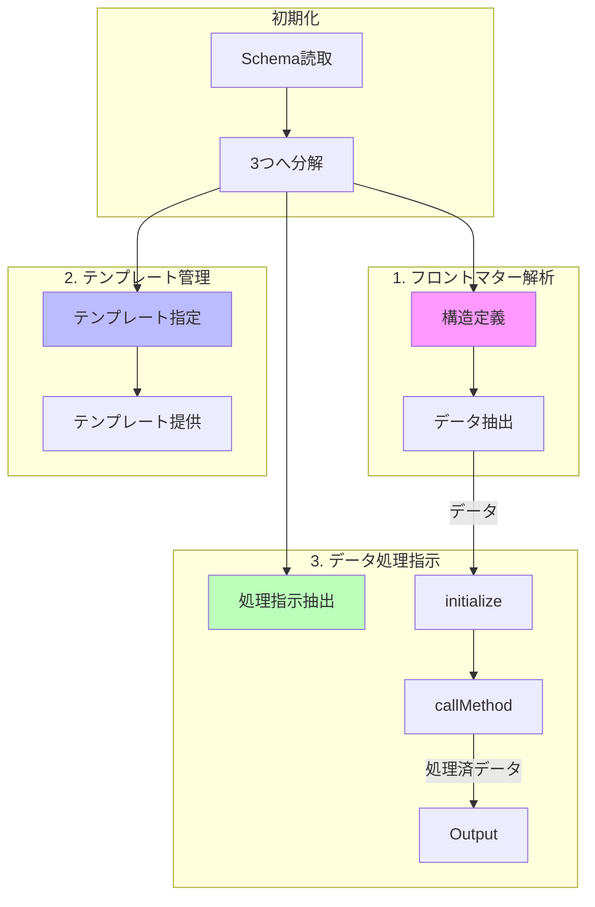

# Schema責務の分離と境界線設計

## 概要

本ドキュメントは、requirements.ja.mdとflow.ja.mdに基づき、Schemaドメインにおける3つのサブドメインの責務分離を定義する。

## アーキテクチャの原則

flow.ja.mdに基づき、Schema構造は以下の3つの独立したサブドメインに分解される：

1. **フロントマター解析構造**
2. **テンプレート指定の把握**
3. **解析結果データの処理指示**

これらは独立しており、後で統合される。

## 3つのサブドメインの詳細

### 1. フロントマター解析構造

**責務**: Markdownファイルからフロントマターデータを抽出するための構造定義

**含まれる要素**:

- 標準JSON Schema要素
  - `type`: データ型定義
  - `properties`: プロパティ構造
  - `items`: 配列要素定義
  - `required`: 必須フィールド
  - `$ref`: 構造の再利用
- 拡張ディレクティブ
  - `x-frontmatter-part`: 処理起点の配列指定

**重要な特性**:

- どのようなデータがフロントマターから抽出できたかを知っているのは、このドメインだけ
- 引数のMDファイル指定を使うのは、この境界内だけ
- `x-frontmatter-part`より上位のSchema階層は、フロントマター解析以外の形式指定に使われる

### 2. テンプレート指定の把握

**責務**: テンプレートファイルの管理と提供

**含まれる要素**:

- `x-template`: メインコンテナテンプレート
- `x-template-items`: 配列要素テンプレート
- `x-template-format`: 出力形式

**重要な特性**:

- テンプレートファイルを知る責務のみ
- テンプレートを求められたときに返す以上の役割はもたない
- 変数の置換処理は行わない（テンプレートエンジンの責務）

### 3. 解析結果データの処理指示

**責務**: フロントマターデータの操作ディレクティブ処理

**含まれる要素**:

- `x-flatten-arrays`: 配列フラット化
- `x-jmespath-filter`: フィルタリング
- `x-derived-from`: 値の集約
- `x-derived-unique`: 重複除去

**重要な特性**:

- フロントマター解析構造で得られたデータを操作する
- 入力値はフロントマター解析結果、出力は持たず、要求されたデータセットを返す
- `init(input_data_from_frontmatter)`,
  `call_method(schema_entity)`によってx-ディレクティブ処理済みの値が取得できる
- フロントマター解析構造への直接参照を隠蔽

## 境界線の定義とインターフェース

### データアクセスの隠蔽原則

flow.ja.mdに基づく重要な原則：

> 「1.フロントマター解析の構造」が直接参照されることはなく、「3.解析結果データの処理指示」によって隠蔽されている

### インターフェース設計

```typescript
// Schema分解の結果
interface SchemaDecomposition {
  // 1. フロントマター解析構造
  frontmatterStructure: {
    rootPath: string; // x-frontmatter-part指定階層
    schemaDefinition: object; // JSON Schema構造
    hasExtractFromPart: boolean;
  };

  // 2. テンプレート指定
  templateSpecification: {
    mainTemplate?: string; // x-template
    itemsTemplate?: string; // x-template-items
    outputFormat?: string; // x-template-format

    // メソッド
    getTemplateFor(type: "main" | "items"): string | undefined;
  };

  // 3. 処理指示
  processingInstructions: {
    directives: ProcessingDirective[];

    // メソッド（フロントマターデータへのアクセスを隠蔽）
    initialize(frontmatterData: unknown): void;
    callMethod(schemaPath: string): ProcessedData;
  };
}
```

### 処理フローにおける責務分離



## itemsプロパティの扱い

flow.ja.mdの明確な指示：

> Schemaにおいて type:"array"の場合に items: があるのは `[]`
> の各要素である、という意味なので、階層構造では`[]`部分に相当する

### 階層パスの解釈規則

```json
{
  "commands": {
    "type": "array",
    "x-frontmatter-part": true,
    "items": {
      "$ref": "registry_command_schema.json"
    }
  }
}
```

- 正しいパス: `commands[].c1`
- 誤ったパス: `commands.items[].c1`
- **itemsは省略される階層**

## テンプレート変数の起点

### x-templateの変数起点

- Schemaのrootが起点
- 例: `{id.full}`はrootから`id.full`を参照

### x-template-itemsの変数起点

- `x-frontmatter-part`指定階層が起点
- 例: `{id.full}`は`commands[].id.full`と同義

```json
// x-template内
{
  "version": "{version}",          // root.version
  "tools": {
    "commands": ["{@items}"]
  }
}

// x-template-items内
{
  "c1": "{c1}",                    // commands[].c1と同義
  "description": "{description}"   // commands[].descriptionと同義
}
```

## $refとテンプレート処理の独立性

requirements.ja.mdの重要な分離原則：

- `$ref`はJSON Schemaの標準機能であり、スキーマ構造の再利用にのみ使用される
- テンプレート指定は`x-template`と`x-template-items`でのみ行う
- 両者は完全に独立しており、`$ref`はテンプレート処理に影響しない

## 実装への影響

### SchemaLoader（インフラ層）

```typescript
class SchemaLoader {
  async load(path: string): Promise<SchemaDecomposition> {
    const raw = await this.readJsonFile(path);
    return this.decompose(raw);
  }

  private decompose(raw: object): SchemaDecomposition {
    return {
      frontmatterStructure: this.extractFrontmatterStructure(raw),
      templateSpecification: this.extractTemplateSpec(raw),
      processingInstructions: this.extractProcessingInstructions(raw),
    };
  }
}
```

### データ処理指示サービス（ドメイン層）

```typescript
class DataProcessingService {
  private frontmatterData: unknown;
  private directives: ProcessingDirective[];

  initialize(data: unknown): void {
    this.frontmatterData = data;
  }

  callMethod(schemaPath: string): ProcessedData {
    // x-ディレクティブ処理を適用
    const directive = this.findDirectiveFor(schemaPath);
    return this.applyDirective(directive, this.frontmatterData);
  }
}
```

## まとめ

本設計により、Schema責務が明確に3つのサブドメインに分離される：

1. **フロントマター解析構造**: データ抽出の構造定義
2. **テンプレート指定**: 出力テンプレートの管理
3. **データ処理指示**: x-ディレクティブによるデータ操作

これらは独立しており、データ処理指示がフロントマター解析への直接アクセスを隠蔽する。
この分離により、各責務が独立して進化可能となり、システムの保守性と拡張性が向上する。
