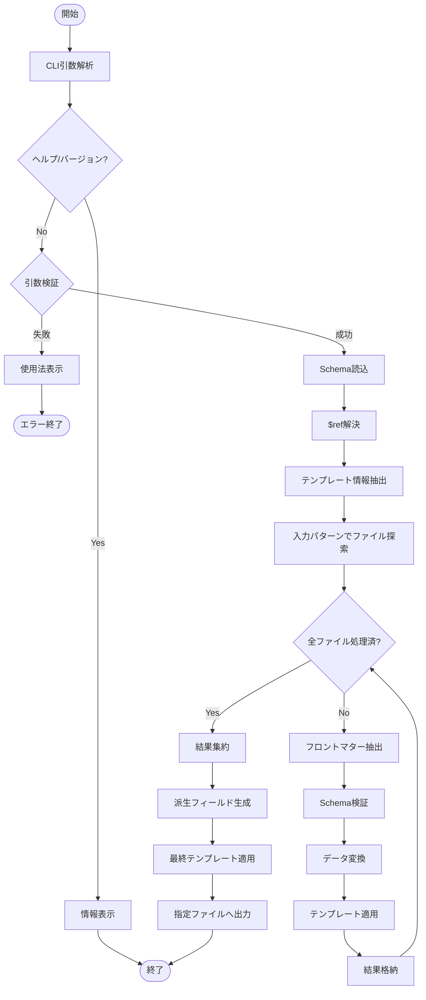
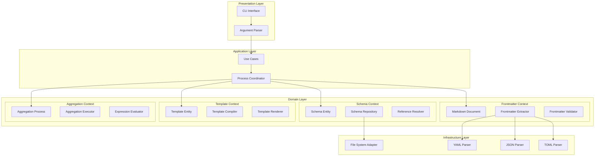
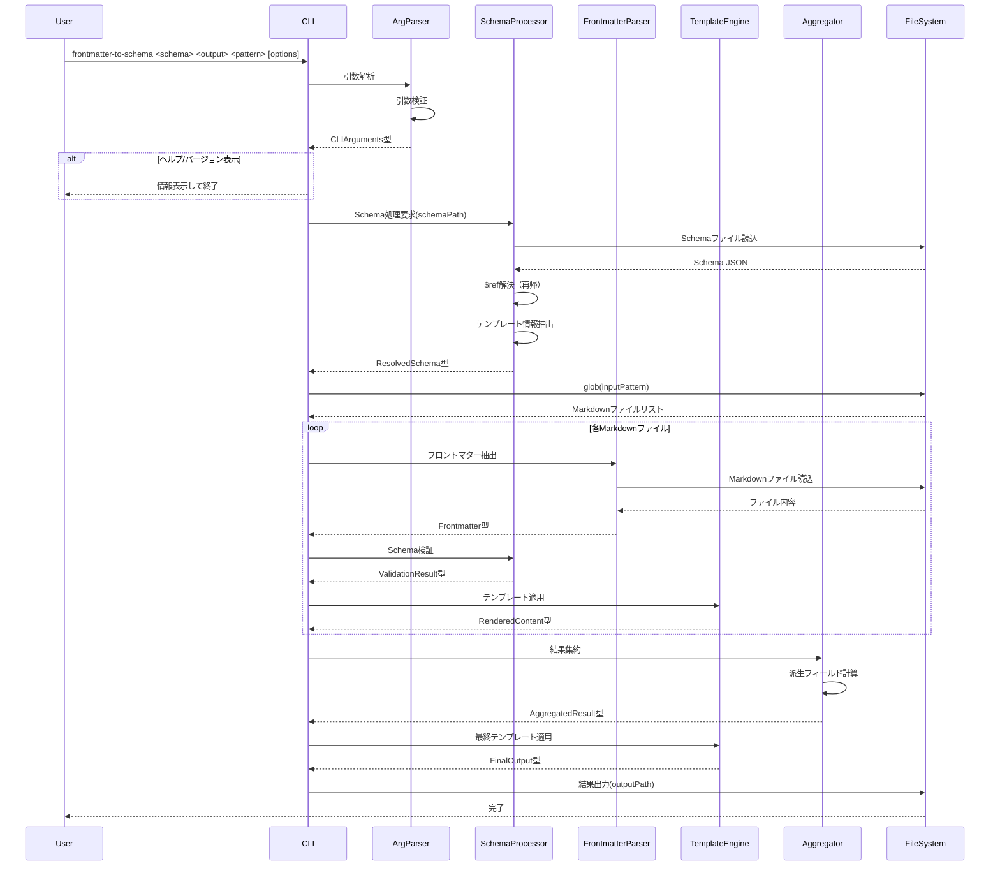
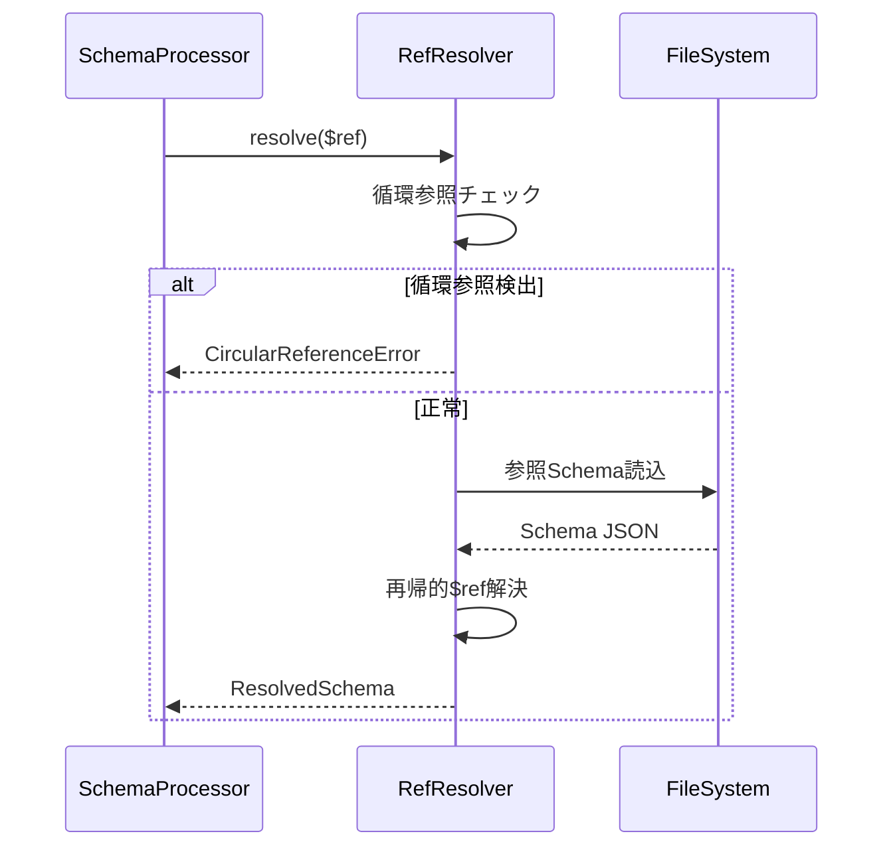
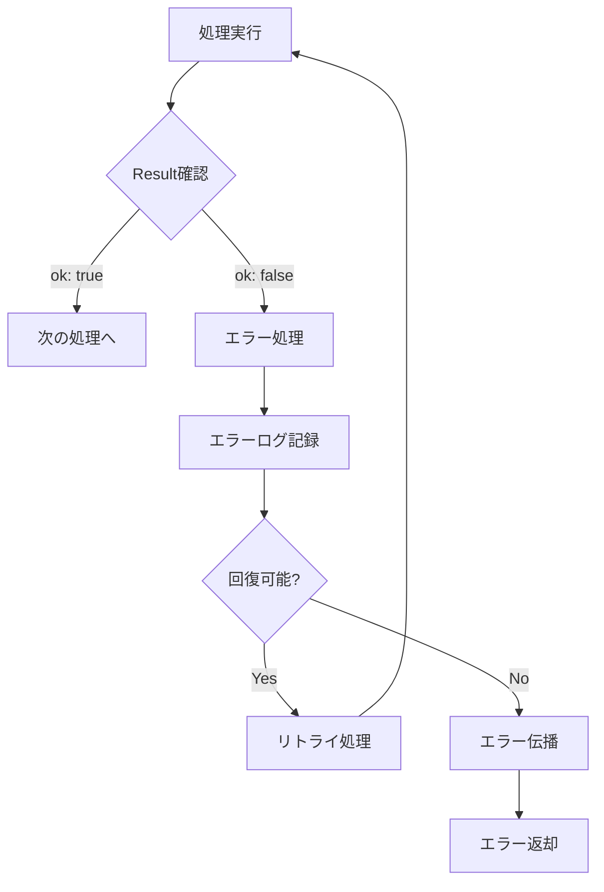

# Schema処理アーキテクチャ

## 概要

本ドキュメントは、Markdownファイルのフロントマター解析からテンプレート出力までのSchema処理プロセスを定義する。
全域性原則とハードコーディング禁止規定に従い、型安全かつ柔軟な設計を実現する。

## アーキテクチャ原則

### 1. 抽象化の原則
- SchemaはCLI引数から注入される（ハードコーディング禁止）
- 処理ロジックは特定のSchemaに依存しない汎用設計
- $ref解決は再帰的かつ動的に処理

### 2. 型安全性の原則（全域性）
- 部分関数を排除し、Result型による全域関数化
- Discriminated Unionによる状態管理
- Smart Constructorによる値の制約保証

### 3. 責務分離の原則
- Schema解析、テンプレート処理、ファイル操作は独立したドメイン
- 各層は明確なインターフェースで結合

## CLIインターフェース設計

### コマンド構造

```bash
# 基本使用法
frontmatter-to-schema <schema-file> <output-file> <input-pattern> [options]

# 実行例
frontmatter-to-schema ./schemas/registry.json ./output/registry.json ".agent/climpt/prompts/**/*.md"
frontmatter-to-schema ./schemas/books.json ./books.yml "./articles/*.md" --verbose
frontmatter-to-schema registry_schema.json registry.json "prompts/" -v

# エイリアス（短縮形）
fm2s registry_schema.json registry.json "prompts/" -v
```

### 引数定義

```typescript
// CLI引数の型定義（全域性原則適用）
class CLIArguments {
  private constructor(
    readonly schemaPath: SchemaPath,
    readonly outputPath: OutputPath,
    readonly inputPattern: InputPattern,
    readonly options: CLIOptions
  ) {}
  
  static parse(args: string[]): Result<CLIArguments, ParseError> {
    if (args.length < 3) {
      return {
        ok: false,
        error: { kind: "InsufficientArguments", required: 3, got: args.length }
      };
    }
    
    // Schema path validation
    const schemaResult = SchemaPath.create(args[0]);
    if (!schemaResult.ok) return schemaResult;
    
    // Output path validation
    const outputResult = OutputPath.create(args[1]);
    if (!outputResult.ok) return outputResult;
    
    // Input pattern validation
    const inputResult = InputPattern.create(args[2]);
    if (!inputResult.ok) return inputResult;
    
    // Options parsing
    const optionsResult = CLIOptions.parse(args.slice(3));
    if (!optionsResult.ok) return optionsResult;
    
    return {
      ok: true,
      data: new CLIArguments(
        schemaResult.data,
        outputResult.data,
        inputResult.data,
        optionsResult.data
      )
    };
  }
}

// CLIオプションの型定義
interface CLIOptions {
  readonly verbose: boolean;
  readonly help: boolean;
  readonly version: boolean;
  readonly quiet: boolean;
  readonly dryRun: boolean;
  readonly parallel: boolean;
  readonly maxWorkers?: number;
}
```

### 引数パラメータ詳細

| パラメータ | 必須 | 説明 | 例 |
|----------|------|------|-----|
| `schema-file` | ✓ | Schemaファイルパス（.json） | `registry_schema.json` |
| `output-file` | ✓ | 出力ファイルパス | `registry.json`, `books.yml` |
| `input-pattern` | ✓ | 入力ファイルパターン（glob形式） | `"**/*.md"`, `"prompts/"` |
| `--verbose, -v` | - | 詳細ログ出力 | - |
| `--help, -h` | - | ヘルプ表示 | - |
| `--version` | - | バージョン表示 | - |
| `--quiet, -q` | - | 最小限の出力 | - |
| `--dry-run` | - | 実行シミュレーション | - |
| `--parallel, -p` | - | 並列処理有効化 | - |
| `--max-workers` | - | 最大ワーカー数 | `4` |

## 処理フロー



## コンポーネント構成（DDD層構造）



## シーケンス図

### メイン処理フロー



### $ref解決プロセス



## データモデル

### 型定義（全域性原則適用）

詳細な型定義は [ドメイン設計ドキュメント](../domain/) を参照。

```typescript
// Result型による全域関数化
type Result<T, E> = 
  | { ok: true; data: T }
  | { ok: false; error: E };

// Schema処理の状態管理（Discriminated Union）
type SchemaState =
  | { kind: "Unloaded"; path: SchemaPath }
  | { kind: "Loading"; path: SchemaPath }
  | { kind: "Raw"; path: SchemaPath; content: RawSchema }
  | { kind: "Resolving"; path: SchemaPath; schema: RawSchema; refs: SchemaReference[] }
  | { kind: "Resolved"; path: SchemaPath; schema: ResolvedSchema; metadata: SchemaMetadata }
  | { kind: "Failed"; path: SchemaPath; error: SchemaError };

// Smart Constructorによる制約
class SchemaPath {
  private constructor(private readonly value: string) {}
  
  static create(path: string): Result<SchemaPath, SchemaPathError> {
    // 空文字チェック
    if (!path || path.trim().length === 0) {
      return {
        ok: false,
        error: { kind: "EmptyPath", message: "Schema path cannot be empty" }
      };
    }
    
    // 拡張子チェック
    if (!path.endsWith('.json')) {
      return { 
        ok: false, 
        error: { 
          kind: "InvalidExtension", 
          path,
          message: `Schema file must be .json, got: ${path}`
        }
      };
    }
    
    // パス正規化
    const normalized = path.replace(/\\/g, '/').replace(/\/+/g, '/');
    
    return { ok: true, data: new SchemaPath(normalized) };
  }
  
  toString(): string { return this.value; }
  
  getDirectory(): string {
    const lastSlash = this.value.lastIndexOf('/');
    return lastSlash === -1 ? '.' : this.value.substring(0, lastSlash);
  }
  
  getFileName(): string {
    const lastSlash = this.value.lastIndexOf('/');
    return lastSlash === -1 ? this.value : this.value.substring(lastSlash + 1);
  }
}

class OutputPath {
  private constructor(private readonly value: string) {}
  
  static create(path: string): Result<OutputPath, ValidationError> {
    const ext = path.split('.').pop()?.toLowerCase();
    const validExtensions = ['json', 'yml', 'yaml', 'toml'];
    
    if (!ext || !validExtensions.includes(ext)) {
      return {
        ok: false,
        error: { kind: "UnsupportedFormat", path, validExtensions }
      };
    }
    
    return { ok: true, data: new OutputPath(path) };
  }
  
  getFormat(): OutputFormat {
    const ext = this.value.split('.').pop()!.toLowerCase();
    return ext === 'yml' ? 'yaml' : ext as OutputFormat;
  }
}

class InputPattern {
  private constructor(private readonly value: string) {}
  
  static create(pattern: string): Result<InputPattern, ValidationError> {
    if (!pattern || pattern.trim().length === 0) {
      return {
        ok: false,
        error: { kind: "EmptyPattern" }
      };
    }
    
    return { ok: true, data: new InputPattern(pattern) };
  }
  
  toGlob(): string {
    // ディレクトリの場合は /**/*.md を追加
    if (!this.value.includes('*') && !this.value.includes('.md')) {
      return this.value.endsWith('/') 
        ? `${this.value}**/*.md`
        : `${this.value}/**/*.md`;
    }
    return this.value;
  }
}

// フロントマター処理の状態（Markdownドキュメントエンティティ）
type MarkdownDocumentState =
  | { kind: "Unprocessed"; path: MarkdownFilePath }
  | { kind: "Loading"; path: MarkdownFilePath }
  | { kind: "Loaded"; path: MarkdownFilePath; content: string }
  | { kind: "Extracted"; path: MarkdownFilePath; content: string; raw: RawFrontmatter }
  | { kind: "Parsed"; path: MarkdownFilePath; parsed: ParsedFrontmatter }
  | { kind: "Validated"; path: MarkdownFilePath; validated: ValidatedFrontmatter }
  | { kind: "Failed"; path: MarkdownFilePath; error: FrontmatterError };

// テンプレート処理の状態
type TemplateState =
  | { kind: "Unloaded"; path: TemplatePath }
  | { kind: "Loading"; path: TemplatePath }
  | { kind: "Loaded"; path: TemplatePath; content: string; format: TemplateFormat }
  | { kind: "Parsed"; path: TemplatePath; template: ParsedTemplate }
  | { kind: "Compiled"; path: TemplatePath; compiled: CompiledTemplate }
  | { kind: "Failed"; path: TemplatePath; error: TemplateError };

// 集約プロセスの状態
type AggregationProcessState =
  | { kind: "Initialized"; context: AggregationContext }
  | { kind: "Collecting"; context: AggregationContext; items: ValidatedData[] }
  | { kind: "Processing"; context: AggregationContext; items: ValidatedData[] }
  | { kind: "Completed"; result: AggregatedResult }
  | { kind: "Failed"; error: AggregationError };
```

## 処理詳細

### 1. Schema読込と$ref解決（Schemaドメイン）

```typescript
// SchemaReferenceResolver - ドメインサービス
class SchemaReferenceResolver {
  async resolve(
    schema: RawSchema,
    basePath: string
  ): Promise<Result<ResolvedSchema, SchemaError>> {
    // 循環参照検出
    const visited = new Set<string>();
    
    const resolveRecursive = async (
      obj: any,
      currentPath: string,
      depth: number = 0
    ): Promise<Result<any, SchemaError>> => {
      // 深さ制限
      if (depth > 100) {
        return {
          ok: false,
          error: {
            kind: "MaxDepthExceeded",
            depth,
            message: "Maximum reference resolution depth exceeded"
          }
        };
      }
      
      // プリミティブ値はそのまま返す
      if (typeof obj !== 'object' || obj === null) {
        return { ok: true, data: obj };
      }
      
      // $ref処理
      if ('$ref' in obj) {
        const refPath = obj['$ref'] as string;
        
        // 循環参照チェック
        if (visited.has(refPath)) {
          return {
            ok: false,
            error: {
              kind: "CircularReference",
              refs: Array.from(visited).concat(refPath),
              message: `Circular reference detected: ${refPath}`
            }
          };
        }
        
        visited.add(refPath);
        
        // 参照先を読み込み
        const loadResult = await this.loadReference(refPath, currentPath);
        if (!loadResult.ok) return loadResult;
        
        // 再帰的に解決
        const resolvedResult = await resolveRecursive(
          loadResult.data,
          this.getReferencePath(refPath, currentPath),
          depth + 1
        );
        
        visited.delete(refPath);
        
        return resolvedResult;
      }
      
      // 配列の処理
      if (Array.isArray(obj)) {
        const results: any[] = [];
        for (const item of obj) {
          const result = await resolveRecursive(item, currentPath, depth);
          if (!result.ok) return result;
          results.push(result.data);
        }
        return { ok: true, data: results };
      }
      
      // オブジェクトの処理
      const resolved: any = {};
      for (const [key, value] of Object.entries(obj)) {
        const result = await resolveRecursive(value, currentPath, depth);
        if (!result.ok) return result;
        resolved[key] = result.data;
      }
      
      return { ok: true, data: resolved };
    };
    
    return resolveRecursive(schema, basePath, 0);
  }
  
  // Schemaからテンプレート情報を抽出
  extractTemplateInfo(schema: ResolvedSchema): TemplateInfo {
    // x-template, x-frontmatter-part などの拡張プロパティを探索
    const templatePath = schema['x-template'];
    const frontmatterPart = schema['x-frontmatter-part'];
    const derivationRules = this.extractDerivationRules(schema);
    
    return {
      templatePath,
      frontmatterPart,
      derivationRules
    };
  }
  
  private loadReference(
    refPath: string,
    basePath: string
  ): Promise<Result<any, SchemaError>> {
    // 実装は Infrastructure層で提供
    throw new Error("Must be implemented by infrastructure layer");
  }
  
  private getReferencePath(refPath: string, basePath: string): string {
    if (refPath.startsWith('/')) {
      return refPath;
    }
    return `${basePath}/${refPath}`.replace(/\/+/g, '/');
  }
}
```

### 2. フロントマター抽出と検証（Frontmatterドメイン）

```typescript
// FrontmatterExtractor - ドメインサービス
class FrontmatterExtractor {
  extract(content: string): Result<RawFrontmatter, ExtractError> {
    // 区切り文字検出
    const delimiterResult = FrontmatterDelimiter.detect(content);
    if (!delimiterResult.ok) {
      return {
        ok: false,
        error: {
          kind: "ExtractionFailed",
          reason: "No frontmatter found",
          message: delimiterResult.error.message
        }
      };
    }
    
    const delimiter = delimiterResult.data;
    const startDelim = delimiter.getStartDelimiter();
    const endDelim = delimiter.getEndDelimiter();
    
    // フロントマター部分の抽出
    let extractedContent: string;
    
    if (delimiter.getFormat() === "json") {
      // JSON形式の場合
      const jsonMatch = content.match(/^\s*(\{[\s\S]*?\})\s*\n/);
      if (!jsonMatch) {
        return {
          ok: false,
          error: {
            kind: "ExtractionFailed",
            reason: "Invalid JSON frontmatter",
            message: "Could not extract JSON frontmatter"
          }
        };
      }
      extractedContent = jsonMatch[1];
    } else {
      // YAML/TOML形式の場合
      const lines = content.split('\n');
      let inFrontmatter = false;
      let frontmatterLines: string[] = [];
      let delimiterCount = 0;
      
      for (const line of lines) {
        if (line.trim() === startDelim) {
          if (delimiterCount === 0) {
            inFrontmatter = true;
            delimiterCount++;
            continue;
          } else if (delimiterCount === 1) {
            break;
          }
        }
        
        if (inFrontmatter) {
          frontmatterLines.push(line);
        }
      }
      
      if (frontmatterLines.length === 0) {
        return {
          ok: false,
          error: {
            kind: "ExtractionFailed",
            reason: "Empty frontmatter",
            message: "Frontmatter section is empty"
          }
        };
      }
      
      extractedContent = frontmatterLines.join('\n');
    }
    
    return RawFrontmatter.create(extractedContent, delimiter.getFormat());
  }
}

// FrontmatterValidator - ドメインサービス
class FrontmatterValidator {
  validate(
    parsed: ParsedFrontmatter,
    schema: ResolvedSchema
  ): Result<ValidationResult, ValidationError> {
    // JSON Schema validation implementation
    // This would use Ajv or similar in infrastructure layer
    throw new Error("Validator must be provided by infrastructure");
  }
}
```

### 3. 集約処理（Aggregationドメイン）

```typescript
// AggregationExecutor - ドメインサービス
class AggregationExecutor {
  constructor(
    private readonly evaluator: ExpressionEvaluator
  ) {}
  
  execute(
    process: AggregationProcess
  ): Result<AggregatedResult, AggregationError> {
    const state = process.getState();
    
    if (state.kind !== "Processing") {
      return {
        ok: false,
        error: {
          kind: "InvalidState",
          state: state.kind,
          message: `Process must be in Processing state, got: ${state.kind}`
        }
      };
    }
    
    const { context, items } = state;
    const aggregated: Record<string, unknown> = {};
    const warnings: string[] = [];
    const statistics: AggregationStatistics = {
      totalItems: items.length,
      uniqueValues: {},
      nullCount: {},
      arrayLengths: {}
    };
    
    // 各ルールを適用
    for (const rule of context.getRules()) {
      const targetField = rule.getTargetField();
      const sourceExpression = rule.getSourceExpression();
      
      // 全アイテムから値を収集
      const allValues: unknown[] = [];
      
      for (const item of items) {
        const evalResult = this.evaluator.evaluate(
          item.getData(),
          sourceExpression
        );
        
        if (evalResult.ok) {
          if (rule.shouldFlatten() && Array.isArray(evalResult.data)) {
            allValues.push(...evalResult.data.flat());
          } else {
            allValues.push(...evalResult.data);
          }
        } else {
          warnings.push(`Failed to evaluate ${sourceExpression}: ${evalResult.error.message}`);
        }
      }
      
      // フィルタリング（null/undefined除去）
      const filtered = this.filterValues(allValues, context.getOptions());
      
      // ユニーク化
      let finalValues: unknown[] = filtered;
      if (rule.isUnique()) {
        finalValues = this.uniqueValues(filtered);
        statistics.uniqueValues[targetField] = finalValues.length;
      }
      
      // 統計情報の収集
      statistics.nullCount[targetField] = allValues.filter(v => v == null).length;
      if (Array.isArray(finalValues[0])) {
        statistics.arrayLengths[targetField] = finalValues.map(v => 
          Array.isArray(v) ? v.length : 0
        );
      }
      
      aggregated[targetField] = finalValues;
    }
    
    // 結果の作成
    const metadata: AggregationMetadata = {
      processedCount: items.length,
      aggregatedAt: new Date(),
      appliedRules: context.getRules().map(r => r.getTargetField()),
      warnings: warnings.length > 0 ? warnings : undefined,
      statistics
    };
    
    return AggregatedResult.create(aggregated, metadata);
  }
  
  private filterValues(
    values: unknown[],
    options: AggregationOptions
  ): unknown[] {
    return values.filter(value => {
      if (options.skipNull && value === null) return false;
      if (options.skipUndefined && value === undefined) return false;
      return true;
    });
  }
  
  private uniqueValues(values: unknown[]): unknown[] {
    const seen = new Set<string>();
    const unique: unknown[] = [];
    
    for (const value of values) {
      const key = this.getUniqueKey(value);
      if (!seen.has(key)) {
        seen.add(key);
        unique.push(value);
      }
    }
    
    return unique;
  }
}
```

### 4. テンプレート処理（Templateドメイン）

```typescript
// TemplateCompiler - ドメインサービス
class TemplateCompiler {
  compile(parsed: ParsedTemplate): Result<CompiledTemplate, CompileError> {
    const compiledFunc = this.createRenderFunction(parsed);
    
    return {
      ok: true,
      data: {
        id: TemplateId.create(`compiled_${Date.now()}`).data as TemplateId,
        render: compiledFunc,
        variables: parsed.variables,
        outputFormat: parsed.outputFormat
      }
    };
  }
  
  private createRenderFunction(
    parsed: ParsedTemplate
  ): (data: Record<string, unknown>) => Result<string, RenderError> {
    return (data: Record<string, unknown>) => {
      let result = parsed.content;
      const warnings: string[] = [];
      
      for (const variable of parsed.variables) {
        const varPath = VariablePath.parse(`{${variable.getPath()}}`);
        if (!varPath.ok) {
          return {
            ok: false,
            error: {
              kind: "RenderFailed",
              reason: "Invalid variable path",
              variable: variable.getPath(),
              message: varPath.error.message
            }
          };
        }
        
        const valueResult = varPath.data.resolve(data);
        let value: unknown;
        
        if (!valueResult.ok) {
          if (variable.isRequired()) {
            return {
              ok: false,
              error: {
                kind: "RequiredVariableMissing",
                variable: variable.getName(),
                path: variable.getPath(),
                message: `Required variable not found: ${variable.getPath()}`
              }
            };
          }
          
          value = variable.getDefaultValue();
          warnings.push(`Using default value for ${variable.getPath()}`);
        } else {
          value = valueResult.data;
        }
        
        // 値のフォーマット
        const formatted = this.formatValue(value, parsed.outputFormat);
        
        // 変数置換
        const placeholder = `{${variable.getPath()}}`;
        result = result.replace(new RegExp(
          placeholder.replace(/[.*+?^${}()|[\]\\]/g, '\\$&'),
          'g'
        ), formatted);
      }
      
      return { ok: true, data: result };
    };
  }
  
  private formatValue(value: unknown, format: OutputFormat): string {
    if (value === null) return 'null';
    if (value === undefined) return '';
    
    switch (format) {
      case 'json':
        return typeof value === 'string' ? value : JSON.stringify(value);
      case 'yaml':
        return this.formatYAMLValue(value);
      case 'toml':
        return this.formatTOMLValue(value);
      default:
        return String(value);
    }
  }
}
```

## エラーハンドリング

### エラー型定義

```typescript
type ProcessError =
  | SchemaError
  | ValidationError
  | TemplateError
  | FileSystemError
  | AggregationError;

type SchemaError =
  | { kind: "FileNotFound"; path: string }
  | { kind: "InvalidJSON"; error: string }
  | { kind: "RefResolutionFailed"; ref: string }
  | { kind: "CircularReference"; refs: string[] };

type ValidationError =
  | { kind: "ValidationFailed"; errors: any[] }
  | { kind: "InvalidSchema"; message: string }
  | { kind: "RequiredFieldMissing"; field: string };

type TemplateError =
  | { kind: "TemplateNotFound"; path: string }
  | { kind: "VariableNotFound"; path: string }
  | { kind: "RenderingFailed"; error: string };
```

### エラー処理フロー



## CLIメインエントリーポイント

### main.ts / cli.ts 実装

```typescript
// main.ts - アプリケーションエントリーポイント
export async function main(args: string[]): Promise<void> {
  const cli = new CLI();
  try {
    await cli.run(args);
  } catch (error) {
    console.error('Error:', error);
    process.exit(1);
  }
}

// cli.ts - CLIコマンド実装
export class CLI {
  async run(args: string[]): Promise<void> {
    // 引数解析
    const parseResult = CLIArguments.parse(args);
    if (!parseResult.ok) {
      console.error(parseResult.error);
      this.showUsage();
      process.exit(1);
    }
    
    const cliArgs = parseResult.data;
    
    // ヘルプ/バージョン処理
    if (cliArgs.options.help) {
      this.showHelp();
      return;
    }
    
    if (cliArgs.options.version) {
      this.showVersion();
      return;
    }
    
    // メイン処理
    const processor = new FrontmatterProcessor(cliArgs.options);
    const result = await processor.process(
      cliArgs.schemaPath,
      cliArgs.outputPath,
      cliArgs.inputPattern
    );
    
    if (!result.ok) {
      console.error("Processing failed:", result.error);
      process.exit(1);
    }
    
    if (!cliArgs.options.quiet) {
      console.log("✅ Processing completed successfully");
    }
  }
  
  private showUsage(): void {
    console.log(`
Usage: frontmatter-to-schema <schema-file> <output-file> <input-pattern> [options]

Examples:
  frontmatter-to-schema registry.json output.json "prompts/**/*.md"
  frontmatter-to-schema schema.json result.yml "docs/" --verbose
  frontmatter-to-schema books.json books.yml "./articles/*.md" --dry-run
  
Short form:
  fm2s registry.json output.json "prompts/**/*.md"
    `);
  }
  
  private showHelp(): void {
    console.log(`
FrontMatter to Schema - Convert Markdown frontmatter to structured output

Usage: frontmatter-to-schema <schema-file> <output-file> <input-pattern> [options]
       fm2s <schema-file> <output-file> <input-pattern> [options]

Arguments:
  schema-file    Path to JSON schema file
  output-file    Output file path (.json, .yml, .yaml, .toml)
  input-pattern  Glob pattern for input Markdown files

Options:
  -v, --verbose      Enable verbose logging
  -q, --quiet        Minimal output
  -h, --help         Show this help message
  --version          Show version information
  --dry-run          Simulate execution without writing files
  -p, --parallel     Enable parallel processing
  --max-workers <n>  Maximum number of parallel workers

Examples:
  Basic usage:
    frontmatter-to-schema schema.json output.json "**/*.md"
  
  Process specific directory:
    frontmatter-to-schema registry.json registry.json "prompts/"
  
  With options:
    frontmatter-to-schema schema.json result.yml "docs/**/*.md" --verbose --parallel
    
  Using short form:
    fm2s schema.json output.json "**/*.md"
    `);
  }
}

## パフォーマンス考慮事項

### 並列処理

```typescript
class ParallelProcessor {
  async processFiles(
    files: string[],
    processor: FrontmatterProcessor
  ): Promise<Result<ValidatedData[], ProcessError>> {
    const batchSize = 10;
    const results: ValidatedData[] = [];
    
    for (let i = 0; i < files.length; i += batchSize) {
      const batch = files.slice(i, i + batchSize);
      const promises = batch.map(file => processor.processFile(file));
      
      const batchResults = await Promise.all(promises);
      
      for (const result of batchResults) {
        if (!result.ok) return result;
        results.push(result.data);
      }
    }
    
    return { ok: true, data: results };
  }
}
```

## テスト戦略

### ユニットテスト対象

1. **Schema解決**: $ref解決、循環参照検出
2. **フロントマター抽出**: YAML/TOML/JSON形式対応
3. **検証処理**: Schema適合性検証
4. **テンプレート処理**: 変数置換、フォーマット
5. **集約処理**: 派生フィールド生成

### 統合テスト対象

1. **エンドツーエンド処理**: 入力から出力まで
2. **エラー回復**: 部分的失敗からの継続
3. **大量ファイル処理**: パフォーマンス検証

## まとめ

本アーキテクチャは以下の原則を実現する：

1. **型安全性**: Result型による全域関数化、Discriminated Unionによる状態管理
2. **柔軟性**: CLI引数による Schema/出力先/入力パターンの動的指定
3. **拡張性**: 明確な責務分離による機能追加の容易性
4. **信頼性**: 包括的エラーハンドリング
5. **保守性**: ハードコーディング排除、設定ファイル不要のシンプル設計

### CLI引数による完全制御

設定ファイルを排除し、以下の3つの必須引数のみで動作：
- **Schemaファイル**: 処理の構造とルールを定義
- **出力ファイル**: 結果の保存先とフォーマット
- **入力パターン**: 処理対象のMarkdownファイル指定

これにより、多様なMarkdownフロントマターを統一的に処理し、任意のフォーマットへ変換する汎用的なシステムを実現する。