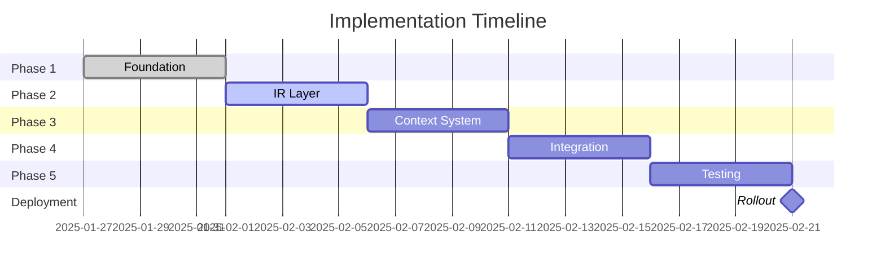

# Template Variable Resolution Implementation Roadmap

## Executive Summary

This roadmap outlines the phased implementation approach for enhancing the template variable resolution system through the introduction of an Intermediate Representation (IR) layer and scope-aware Template Context. This addresses the critical issue of variable scope loss during array expansion and deep path resolution (Issue #1071).

## Problem Statement

### Current Issues
1. **Scope Loss**: Variables like `{id.full}` within `{@items}` lose their array element context
2. **Deep Path Failures**: Hierarchical paths fail to resolve after directive processing
3. **Data Structure Mismatch**: Gap between directive output and template expectations
4. **Error Context Loss**: Failures provide insufficient debugging information

### Root Cause
The current implementation directly queries `FrontmatterData.get()` without maintaining scope context during array expansion, causing variables to be searched from the root instead of the current array element.

## Implementation Phases

### Phase 1: Foundation (Week 1)

#### Objectives
- Establish core IR data structures
- Implement basic path parsing for templates
- Create foundation for scope management

#### Deliverables

1. **Core IR Types** (`src/domain/template/models/intermediate-representation.ts`)
   ```typescript
   - IRNode algebraic data type (IRScalar, IRObject, IRArray)
   - TemplatePath with array notation support
   - TemplatePathSegment for path components
   - Smart constructors with Result types
   ```

2. **Path Parser Enhancement** (`src/domain/template/services/template-path-parser.ts`)
   ```typescript
   - Parse standard paths (property.nested.path)
   - Support array shortcuts (@items, items[])
   - Handle array indexing (items[0], items[2])
   - Validate path syntax with clear errors
   ```

3. **Basic Tests**
   ```typescript
   - Path parsing edge cases
   - IR node construction
   - Smart constructor validation
   ```

#### Success Criteria
- All IR types compile without errors
- Path parser handles all template notations
- Unit tests pass with 100% coverage

### Phase 2: Intermediate Representation Layer (Week 2)

#### Objectives
- Build IR from processed frontmatter data
- Implement IR navigation and resolution
- Create immutable data structures

#### Deliverables

1. **IR Builder** (`src/domain/template/services/intermediate-representation-builder.ts`)
   ```typescript
   - Convert FrontmatterData[] to IR
   - Handle nested objects and arrays
   - Preserve all path information
   - Merge multiple data sources
   ```

2. **IR Implementation** (`src/domain/template/services/template-intermediate-representation.ts`)
   ```typescript
   - Implement TemplateIntermediateRepresentation interface
   - Path resolution from root
   - Scope creation at any path
   - Efficient lookups using Maps
   ```

3. **Integration Tests**
   ```typescript
   - FrontmatterData to IR conversion
   - Complex nested structure handling
   - Array and object navigation
   ```

#### Success Criteria
- IR correctly represents all frontmatter structures
- Path resolution works for deep nested paths
- Memory efficient for large datasets

### Phase 3: Template Context Implementation (Week 3)

#### Objectives
- Implement scope-aware variable resolution
- Create context management system
- Support array iteration contexts

#### Deliverables

1. **Template Context** (`src/domain/template/services/template-context.ts`)
   ```typescript
   - Scope stack management
   - Fallback policy implementation
   - Array binding tracking
   - Variable resolution with scope chain
   ```

2. **Template Scope** (`src/domain/template/services/template-scope.ts`)
   ```typescript
   - Current cursor tracking
   - Relative path resolution
   - Parent scope fallback
   - Breadcrumb maintenance
   ```

3. **Context Factory** (`src/domain/template/services/template-context-factory.ts`)
   ```typescript
   - Create contexts from IR
   - Configuration management
   - Scope initialization
   - Validation and error handling
   ```

4. **Array Context** (`src/domain/template/services/array-context.ts`)
   ```typescript
   - Array iteration support
   - Element context creation
   - Iteration metadata ($index, $first, $last)
   - Nested array handling
   ```

#### Success Criteria
- Contexts maintain proper scope during navigation
- Array iterations have isolated scopes
- Fallback chain works correctly
- Iteration metadata accessible

### Phase 4: Integration (Week 4)

#### Objectives
- Wire IR and Context into existing pipeline
- Update template resolver to use new system
- Maintain backward compatibility

#### Deliverables

1. **Pipeline Integration** (`src/application/services/pipeline-orchestrator.ts`)
   ```typescript
   - Add IR building step after directive processing
   - Create context before template rendering
   - Pass context to rendering service
   ```

2. **Template Variable Resolver Update** (`src/domain/template/services/template-variable-resolver.ts`)
   ```typescript
   - Inject TemplateContext dependency
   - Use context.resolve() instead of FrontmatterData.get()
   - Maintain existing public interface
   - Add comprehensive logging
   ```

3. **Output Rendering Service Update** (`src/application/services/output-rendering-service.ts`)
   ```typescript
   - Accept IR and context
   - Pass context to variable resolver
   - Handle {@items} with array context
   ```

4. **Backward Compatibility Layer**
   ```typescript
   - Feature flag for gradual rollout
   - Adapter for old resolution if needed
   - Migration utilities
   ```

#### Success Criteria
- Existing tests continue to pass
- New resolution works with all templates
- No performance degradation
- Smooth migration path

### Phase 5: Testing and Validation (Week 5)

#### Objectives
- Comprehensive testing of new system
- Performance validation
- Bug fixes and refinements

#### Deliverables

1. **Unit Tests**
   ```typescript
   - TemplatePath parsing variations
   - IR builder edge cases
   - Context resolution scenarios
   - Scope fallback chains
   ```

2. **Integration Tests**
   ```typescript
   - x-flatten-arrays with deep paths
   - Nested array expansions
   - Complex template scenarios
   - examples/3.docs validation
   ```

3. **Property-Based Tests**
   ```typescript
   - Random JSON to IR conversion
   - Resolution invariants
   - Scope consistency
   ```

4. **Performance Tests**
   ```typescript
   - Large dataset benchmarks
   - Memory usage profiling
   - Resolution speed metrics
   ```

5. **Regression Tests**
   ```typescript
   - All existing templates work
   - No breaking changes
   - Backward compatibility verified
   ```

#### Success Criteria
- 100% test coverage for new code
- All examples/3.docs tests pass
- Performance within 10% of baseline
- No memory leaks detected

## Risk Mitigation

### Technical Risks

1. **Performance Impact**
   - **Risk**: IR adds overhead
   - **Mitigation**: Lazy evaluation, caching, benchmarks

2. **Memory Usage**
   - **Risk**: IR duplicates data
   - **Mitigation**: Structural sharing, streaming for large arrays

3. **Breaking Changes**
   - **Risk**: Existing templates fail
   - **Mitigation**: Feature flag, compatibility layer, extensive testing

### Implementation Risks

1. **Complexity**
   - **Risk**: System becomes harder to maintain
   - **Mitigation**: Clear documentation, simple interfaces, SOLID principles

2. **Scope Creep**
   - **Risk**: Adding unplanned features
   - **Mitigation**: Strict phase boundaries, clear success criteria

3. **Integration Issues**
   - **Risk**: Conflicts with existing code
   - **Mitigation**: Incremental integration, comprehensive tests

## Success Metrics

### Functional Metrics
- ✅ `{id.full}` resolves correctly in `{@items}`
- ✅ Deep paths work after directive processing
- ✅ All existing tests pass
- ✅ examples/3.docs produces correct output

### Performance Metrics
- ⚡ Resolution time < 10ms for typical templates
- 💾 Memory overhead < 20% for large datasets
- 🔄 No performance regression in existing workflows

### Quality Metrics
- 📊 Test coverage > 90% for new code
- 🐛 Zero critical bugs in production
- 📝 Complete documentation for all components
- 🎯 All unit tests pass without mocking

## Timeline



## Dependencies

### External Dependencies
- No new external libraries required
- Uses existing Result type system
- Compatible with current Deno runtime

### Internal Dependencies
- Requires stable FrontmatterData interface
- Depends on DirectiveProcessor output format
- Needs OutputRenderingService cooperation

## Rollout Strategy

### Phase 1: Canary (Week 6)
- Enable for internal testing
- Monitor performance metrics
- Gather feedback

### Phase 2: Beta (Week 7)
- Enable for select templates
- Document migration guide
- Fix identified issues

### Phase 3: General Availability (Week 8)
- Enable by default
- Deprecate old resolution
- Complete migration documentation

## Long-term Vision

### Future Enhancements
1. **Plugin System**: Custom resolvers and transformers
2. **Advanced Queries**: JSONPath, XPath support
3. **Performance**: Parallel processing, incremental updates
4. **Developer Tools**: IR visualizer, debugger integration

### Architecture Evolution
- Move toward fully functional pipeline
- Explore streaming for large datasets
- Consider WebAssembly for performance-critical paths

## Conclusion

This roadmap provides a structured approach to solving the template variable resolution issues while maintaining system stability and performance. The phased implementation allows for incremental validation and reduces risk while delivering value at each stage.

## References

- [Issue #1071](https://github.com/tettuan/frontmatter-to-schema/issues/1071)
- [IR Architecture](../domain/architecture/domain-architecture-intermediate-representation.md)
- [Template Context Specification](./template-context-specification.md)
- [Test Strategy](../tests/template-ir-test-strategy.md)