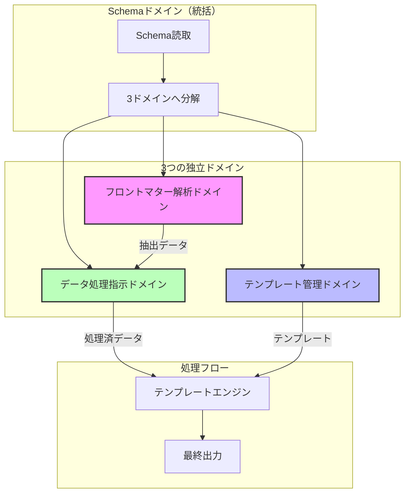

# ドメイン駆動設計アーキテクチャ

## 概要

本ドキュメントは、requirements.ja.mdとflow.ja.mdに基づくドメイン駆動設計のアーキテクチャを定義する。

## 中核ドメインの構成

システムは3つの独立したドメインと、それらを統括するSchemaドメインから構成される：



## 各ドメインの責務と境界

### 1. フロントマター解析ドメイン

**中核責務**: Markdownファイルからフロントマターデータを抽出

```typescript
interface FrontmatterDomain {
  // 集約ルート
  class FrontmatterExtractor {
    extract(files: MarkdownFile[]): Result<ExtractedData[], ExtractError>
  }

  // 中核処理
  processFile(file: MarkdownFile): ExtractedData {
    // 1. フロントマター部分の抽出
    // 2. YAMLパース
    // 3. x-frontmatter-part指定階層の識別
    // 4. 構造化データとして保持
  }
}
```

**境界線**:

- 入力: Markdownファイルのパス群
- 出力: 構造化された抽出データ
- **重要**: 外部からの直接アクセスは禁止

### 2. テンプレート管理ドメイン

**中核責務**: 出力テンプレートの管理と提供

```typescript
interface TemplateDomain {
  // 集約ルート
  class TemplateManager {
    loadTemplate(directive: TemplateDirective): Result<Template, TemplateError>
  }

  // 中核データ
  interface TemplateDirective {
    mainTemplate?: string      // x-template
    itemsTemplate?: string     // x-template-items
    format?: string           // x-template-format
  }
}
```

**境界線**:

- 入力: テンプレート指定ディレクティブ
- 出力: テンプレートファイルとメタデータ
- **重要**: テンプレート変数の置換は行わない

### 3. データ処理指示ドメイン

**中核責務**: フロントマターデータの加工と提供（隠蔽層）

```typescript
interface DataProcessingDomain {
  // 集約ルート
  class DataProcessor {
    // フロントマターデータを受け取る
    initialize(extractedData: ExtractedData[]): void

    // Schema階層要求に応じて処理済データを返す
    callMethod(schemaPath: string): ProcessedData
  }

  // ディレクティブ処理
  processDirectives(data: unknown, directives: Directive[]): ProcessedData {
    // x-flatten-arrays
    // x-jmespath-filter
    // x-derived-from
    // x-derived-unique
  }
}
```

**境界線**:

- 入力: フロントマター解析結果（隠蔽）
- 出力: x-ディレクティブ処理済みデータ
- **重要**: フロントマター解析への直接アクセスを隠蔽

## データフローと処理タイミング

### フェーズ1: 初期化

```typescript
class SchemaOrchestrator {
  async initialize(schemaPath: string): Promise<DomainContext> {
    // 1. Schema読取
    const schema = await this.loader.load(schemaPath);

    // 2. 3ドメインへ分解
    return {
      frontmatter: this.extractFrontmatterStructure(schema),
      template: this.extractTemplateSpecification(schema),
      dataProcessing: this.extractProcessingInstructions(schema),
    };
  }
}
```

### フェーズ2: 個別ファイル処理

```typescript
class FileProcessor {
  async processFile(
    file: MarkdownFile,
    context: DomainContext,
  ): Promise<FileData> {
    // 1. フロントマター抽出（フロントマター解析ドメイン）
    const extracted = await context.frontmatter.extract(file);

    // 2. 個別ファイルのディレクティブ処理（データ処理指示ドメイン）
    // - x-flatten-arrays（指定時のみ）
    // - x-jmespath-filter
    return context.dataProcessing.processIndividual(extracted);
  }
}
```

### フェーズ3: 統合処理

```typescript
class IntegrationProcessor {
  async integrate(
    fileDataList: FileData[],
    context: DomainContext,
  ): Promise<IntegratedData> {
    // 1. x-frontmatter-part配列の統合
    const merged = this.mergeArrays(fileDataList);

    // 2. 統合ディレクティブ処理（データ処理指示ドメイン）
    // - x-derived-from
    // - x-derived-unique
    return context.dataProcessing.processAggregated(merged);
  }
}
```

### フェーズ4: テンプレート展開

```typescript
class TemplateEngine {
  async render(data: IntegratedData, context: DomainContext): Promise<Output> {
    // 1. テンプレート取得（テンプレート管理ドメイン）
    const template = await context.template.getTemplate();

    // 2. データ取得（データ処理指示ドメイン経由）
    const processedData = context.dataProcessing.getProcessedData();

    // 3. 変数置換と{@items}展開
    return this.renderWithData(template, processedData);
  }
}
```

## 重要な設計原則

### 1. データアクセスの隠蔽

flow.ja.mdの原則：

> 「1.フロントマター解析の構造」が直接参照されることはなく、「3.解析結果データの処理指示」によって隠蔽されている

### 2. 処理の独立性

- 各ドメインは他のドメインの実装詳細に依存しない
- インターフェースを通じてのみ相互作用
- 処理順序は宣言的に決定

### 3. 変数解決の起点

- **x-template内**: Schemaのrootが起点
- **x-template-items内**: x-frontmatter-part指定階層が起点

## 全体性（Totality）の実現

各ドメインはResult型で全体性を保証：

```typescript
type Result<T, E> = { ok: true; data: T } | { ok: false; error: E };

// すべてのドメイン操作はResult型を返す
interface DomainOperation<I, O, E> {
  execute(input: I): Result<O, E>;
}
```

## エラー境界

各ドメインは独自のエラー型を定義：

```typescript
// フロントマター解析ドメインのエラー
type FrontmatterError =
  | { kind: "FileNotFound"; path: string }
  | { kind: "InvalidYaml"; content: string }
  | { kind: "MissingFrontmatter"; file: string };

// テンプレート管理ドメインのエラー
type TemplateError =
  | { kind: "TemplateNotFound"; name: string }
  | { kind: "InvalidFormat"; format: string }
  | { kind: "MissingVariable"; variable: string };

// データ処理指示ドメインのエラー
type ProcessingError =
  | { kind: "InvalidDirective"; directive: string }
  | { kind: "PathNotFound"; path: string }
  | { kind: "ProcessingFailed"; reason: string };
```

## まとめ

本アーキテクチャにより、以下を実現：

1. **明確な責務分離**: 3つの独立したドメインによる責務の明確化
2. **データフローの制御**: データ処理指示ドメインによる隠蔽層
3. **宣言的な処理**: x-ディレクティブによる処理の自動化
4. **全体性の保証**: Result型による完全なエラーハンドリング
5. **拡張可能性**: 各ドメインの独立進化が可能
