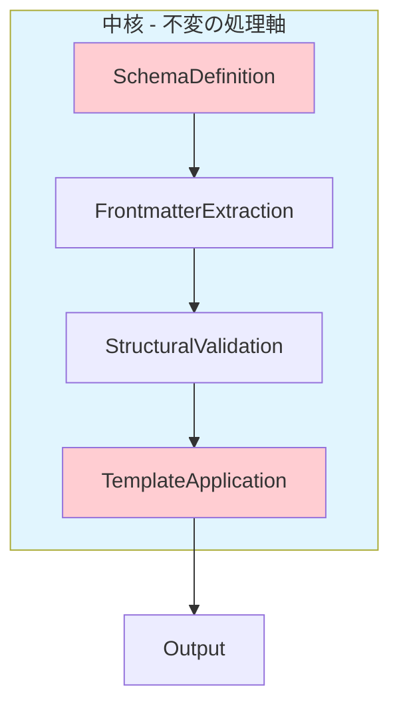
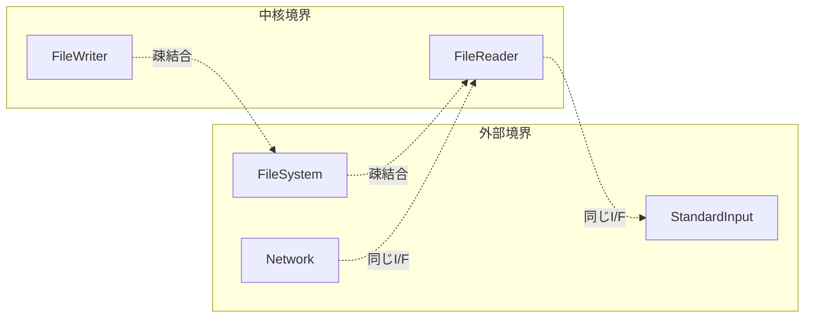
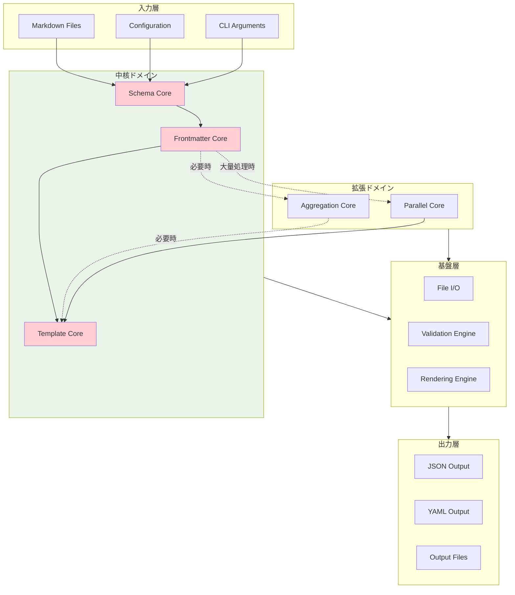

# ドメイン駆動設計アーキテクチャ

## 中核の特定

24回のシミュレーション試行で最も多く通る線として特定された**骨格の中心線**：



**中核の定義**:
この4段階の処理フローは、システムの生命線であり、すべての処理パターンで不変。

## 中核の境界線

### 内部境界（最重要）

- **Schema → Validation**: Result<ValidationRules, SchemaError>
- **Extraction → Validation**: Result<ValidatedData, ValidationError>
- **Validation → Template**: Result<RenderedOutput, RenderError>

### 外部境界（制御可能）

- **Input**: FileSystem | StandardInput | NetworkResource
- **Output**: FileSystem | StandardOutput | NetworkDestination

## シンプルな中心線の詳細

### 1. Schema処理中心線

```typescript
interface SchemaCore {
  readonly definition: SchemaDefinition;
  readonly validationRules: ValidationRules;
  readonly extensions: SchemaExtensions; // x-*, $ref
}

class SchemaProcessor implements Totality<SchemaCore> {
  process(input: RawSchema): Result<SchemaCore, SchemaError> {
    return this.validate(input)
      .chain(this.resolveReferences)
      .chain(this.extractRules);
  }
}
```

**生命線**: Schema定義の解釈と検証ルール生成

### 2. Frontmatter処理中心線

```typescript
interface FrontmatterCore {
  readonly extracted: RawFrontmatter;
  readonly transformed: SchemaCompliantData;  // ← ★ ADDED
  readonly parsed: ParsedData;
  readonly validated: ValidatedData;
}

class FrontmatterProcessor implements Totality<FrontmatterCore> {
  process(
    markdown: MarkdownContent,
    schema: SchemaDefinition,  // ← ★ ADDED
  ): Result<FrontmatterCore, FrontmatterError> {
    return this.extract(markdown)
      .chain((raw) => this.transformToSchema(raw, schema))  // ← ★ ADDED
      .chain(this.parse)
      .chain(this.validate);
  }

  private transformToSchema(
    raw: RawFrontmatter,
    schema: SchemaDefinition,
  ): Result<SchemaCompliantData, TransformationError> {
    // Uses yaml-schema-mapper sub-module
    return mapDataToSchema({
      schema: schema,
      data: raw,
      options: { coerceTypes: true },
    });
  }
}
```

**生命線**: Markdown文書からの構造化データ抽出 → **Schema準拠データへの変換**

### 3. Template適用中心線

```typescript
interface TemplateCore {
  readonly template: TemplateDefinition;
  readonly variables: VariableMapping;
  readonly rendered: RenderedContent;
}

class TemplateProcessor implements Totality<TemplateCore> {
  process(
    data: ValidatedData,
    template: Template,
  ): Result<TemplateCore, TemplateError> {
    return this.mapVariables(data, template)
      .chain(this.render)
      .chain(this.format);
  }
}
```

**生命線**: 構造化データのテンプレート適用と出力生成

## 中核以外の中心線

### A. 集約処理中心線（条件付き必須）

```typescript
interface AggregationCore {
  readonly items: ValidatedData[];
  readonly rules: DerivationRule[];
  readonly aggregated: AggregatedResult;
}

class AggregationProcessor implements Totality<AggregationCore> {
  process(
    items: ValidatedData[],
    schema: SchemaCore,
  ): Result<AggregationCore, AggregationError> {
    return this.extractRules(schema)
      .chain((rules) => this.aggregate(items, rules))
      .chain(this.applyDerivation);
  }
}
```

**適用条件**: x-frontmatter-part=true または x-derived-from 存在時

### B. 並列処理中心線（性能要求時）

```typescript
interface ParallelCore {
  readonly strategy: ProcessingStrategy;
  readonly coordinator: ExecutionCoordinator;
  readonly results: ProcessingResult[];
}

class ParallelProcessor implements Totality<ParallelCore> {
  process(files: FileList): Result<ParallelCore, ProcessingError> {
    return this.determineStrategy(files)
      .chain(this.createCoordinator)
      .chain(this.execute);
  }
}
```

**適用条件**: ファイル数 > 10 または 処理時間要求 < 5秒

## 周辺ドメインと境界線

### 1. ファイルシステム境界



**境界原則**: I/Oは中核から分離、Result型で制御

### 2. 設定管理境界

```typescript
interface ConfigurationBoundary {
  // 境界内（制御下）
  loadSchema(path: SchemaPath): Result<Schema, ConfigError>;
  loadTemplate(path: TemplatePath): Result<Template, ConfigError>;

  // 境界外（外部依存）
  readonly fileSystem: FileSystemPort;
  readonly validation: ValidationPort;
}
```

**境界原則**: 設定の変更は中核処理に影響させない

### 3. 拡張機能境界

```typescript
interface ExtensionBoundary {
  // 中核との接続点
  registerProcessor(
    name: string,
    processor: Processor,
  ): Result<void, RegistrationError>;

  // 拡張領域
  readonly customProcessors: Map<string, Processor>;
  readonly pluginManager: PluginManager;
}
```

**境界原則**: 拡張は中核を破壊しない

## アーキテクチャ全体図



## 実装原則

### 1. Totality原則適用

すべての中心線処理は全域関数として実装：

```typescript
type CoreFunction<T, U, E> = (input: T) => Result<U, E>;
```

### 2. 不変性原則

中核データは不変オブジェクトとして扱い、変更時は新規作成：

```typescript
interface CoreData {
  readonly [key: string]: unknown;
}
```

### 3. 境界制御原則

外部依存は必ずポートを通して制御：

```typescript
interface ExternalPort<T, U, E> {
  execute(input: T): Result<U, E>;
}
```

### 4. エラー伝播制御

エラーは型で制御し、中核の破綻を防ぐ：

```typescript
type CoreError = SchemaError | FrontmatterError | TemplateError;
type SystemError = CoreError | InfrastructureError | ConfigurationError;
```

## 完了確認事項

✅ **中核の特定**: Schema→Frontmatter→Template の3段階処理軸\
✅ **境界線の明確化**: 内部境界（Result型）、外部境界（Port）\
✅ **シンプルな設計**: 24パターン試行で最頻出の処理軸を採用\
✅ **Totality適用**: 全処理がResult型による全域関数\
✅ **拡張性確保**: 中核を破壊しない拡張ドメイン設計

この設計により、要求事項を満たしつつ、システムの複雑性を制御し、将来の変更に対応できる堅牢なアーキテクチャを実現する。
