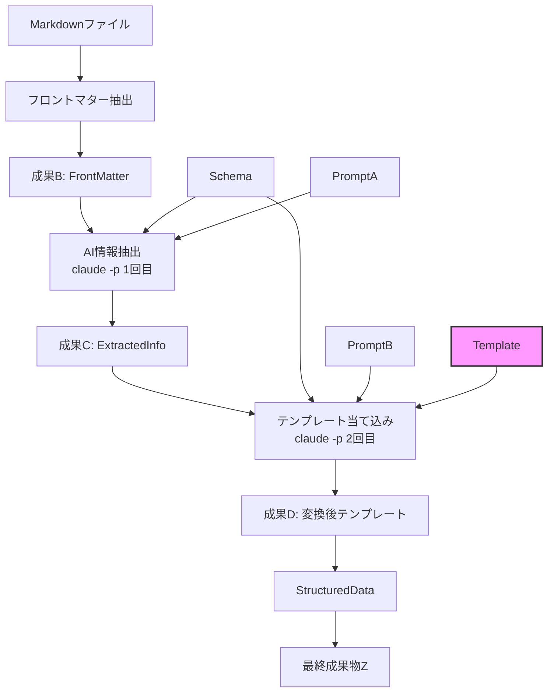
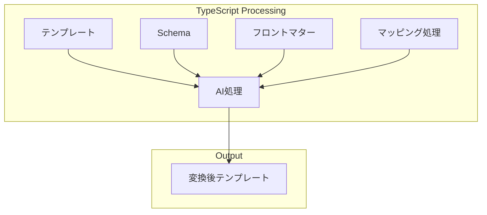

# TypeScript処理アーキテクチャ - Schema一致とテンプレート変換

## 概要

TypeScriptによる構造化された段階的処理で、フロントマターからSchemaへの一致とテンプレート変換を行う設計。外部AI処理ではなく、決定論的で予測可能な変換処理を実装。

## 1. TypeScript処理オーケストレーター

### 1.1 型定義

```typescript
// ========================================
// TypeScript-based Schema Matching and Template Processing
// ========================================

/** TypeScript処理オーケストレーター */
export class TypeScriptProcessingOrchestrator {
  constructor(
    private readonly frontmatterExtractor: FrontMatterExtractor,
    private readonly schemaExpander: SchemaExpander,
    private readonly mapper: SchemaMapper,
    private readonly templateProcessor: TemplateProcessor,
  ) {}

  /**
   * 第1段階: フロントマター抽出・解析
   */
  async extractAndParse(
    markdown: string,
  ): Promise<Result<ParsedFrontMatter, ExtractionError>> {
    // フロントマター部分を抽出
    const extractionResult = this.frontmatterExtractor.extract(markdown);
    if (!extractionResult.ok) {
      return extractionResult;
    }

    // YAMLとして解析
    const parseResult = this.frontmatterExtractor.parseYAML(
      extractionResult.data.content
    );
    if (!parseResult.ok) {
      return {
        ok: false,
        error: {
          kind: "ParseError",
          message: `YAML parsing failed: ${parseResult.error.message}`,
        },
      };
    }

    return {
      ok: true,
      data: {
        parsed: parseResult.data,
        original: extractionResult.data.content,
        metadata: {
          extractedAt: new Date(),
          lineRange: extractionResult.data.lineRange,
        }
      }
    };
  }

    if (!analysisResult.ok) {
      return {
        ok: false,
        error: {
          kind: "AIAnalysisError",
          message: analysisResult.error.message,
        },
      };
    }

    // 結果をパースして成果Cを生成
    try {
      const parsed = JSON.parse(analysisResult.data);
      const metadata: ExtractionMetadata = {
        extractedAt: new Date(),
        promptUsed: "PromptA",
        schemaVersion: schema.getVersion(),
      };

      return ExtractedInfo.create(parsed, metadata);
    } catch (e) {
      return {
        ok: false,
        error: {
          kind: "ParseError",
          message: `Failed to parse AI response: ${e}`,
        },
      };
    }
  }

  /**
   * 第2段階: テンプレート当て込み（成果C → 成果D）
   * AIが抽出情報をテンプレートに埋め込む
   */
  async applyTemplate(
    extractedInfo: ExtractedInfo,
    schema: AnalysisSchema,
    template: Template,
  ): Promise<Result<TemplateResult, AnalysisError>> {
    // プロンプトBをレンダリング - テンプレート当て込み指示
    const renderResult = this.promptB.render({
      EXTRACTED_DATA: JSON.stringify(extractedInfo.getData()),
      SCHEMA: JSON.stringify(schema.getSchema()),
      TEMPLATE: template.getContent(),
    });

  /**
   * 第2段階: Schema展開とマッピング
   */
  async expandAndMap(
    parsedFrontMatter: ParsedFrontMatter,
    schema: JSONSchema,
  ): Promise<Result<SchemaMapping, MappingError>> {
    // Schema を階層展開
    const expansionResult = this.schemaExpander.expand(schema);
    if (!expansionResult.ok) {
      return {
        ok: false,
        error: {
          kind: "SchemaExpansionError", 
          message: expansionResult.error.message,
        },
      };
    }

    // フロントマターとSchemaの対応付け
    const mappingResult = this.mapper.map(
      parsedFrontMatter.parsed,
      expansionResult.data,
      {
        similarityThreshold: 0.8,
        enforceTypeChecking: true,
        warnOnMissing: true,
      }
    );

    if (!mappingResult.ok) {
      return {
        ok: false,
        error: {
          kind: "MappingError",
          message: mappingResult.error.message,
        },
      };
    }

    return { ok: true, data: mappingResult.data };
  }

  /**
   * 第3段階: テンプレート変数置換処理
   */
  async applyTemplate(
    mapping: SchemaMapping,
    template: Template,
  ): Promise<Result<ProcessedTemplate, TemplateError>> {
    // テンプレート内の変数を検出
    const variablesResult = this.templateProcessor.extractVariables(
      template.getContent()
    );

    if (!variablesResult.ok) {
      return {
        ok: false,
        error: {
          kind: "TemplateParseError",
          message: variablesResult.error.message,
        },
      };
    }

    // 変数を値で置換
    const substitutionResult = this.templateProcessor.substituteVariables(
      template.getContent(),
      variablesResult.data,
      mapping.getMappedData()
    );

    if (!substitutionResult.ok) {
      return {
        ok: false,
        error: {
          kind: "SubstitutionError",
          message: substitutionResult.error.message,
        },
      };
    }

    const processedTemplate = ProcessedTemplate.create(
      substitutionResult.data.content,
      template,
      {
        processedAt: new Date(),
        variablesFound: variablesResult.data.length,
        substitutionsMade: substitutionResult.data.substitutions,
        warnings: substitutionResult.data.warnings,
      }
    );

    return processedTemplate;
  }  /**
   * 完全な2段階処理パイプライン
   * 情報抽出 → テンプレート当て込み
   */
  async analyze(
    frontMatter: FrontMatter,
    schema: AnalysisSchema,
    template: Template,
  ): Promise<Result<StructuredData, AnalysisError>> {
    // 第1段階: 情報抽出
    const extractionResult = await this.extractInformation(frontMatter, schema);
    if (!extractionResult.ok) {
      return extractionResult;
    }

    // 第2段階: AIによるテンプレート当て込み
    const templateResult = await this.applyTemplate(
      extractionResult.data,
      schema,
      template,
    );

    if (!templateResult.ok) {
      return templateResult;
    }

    // TemplateResultをStructuredDataに変換
    const structuredData = StructuredData.createFromTemplateResult(
      templateResult.data,
      extractionResult.data,
    );

    return structuredData;
  }
}
```

### 1.2 テンプレート関連型定義

```typescript
/** テンプレート - 外部ファイルから読み込み */
export class Template {
  private constructor(
    private readonly name: string,
    private readonly content: string,
    private readonly format: "json" | "yaml" | "markdown",
  ) {}

  static create(
    name: string,
    content: string,
    format: "json" | "yaml" | "markdown" = "json",
  ): Result<Template, ValidationError> {
    if (!name || name.trim() === "") {
      return {
        ok: false,
        error: { kind: "EmptyInput", field: "TemplateName" },
      };
    }

    if (!content || content.trim() === "") {
      return {
        ok: false,
        error: { kind: "EmptyInput", field: "TemplateContent" },
      };
    }

    return { ok: true, data: new Template(name, content, format) };
  }

  getName(): string {
    return this.name;
  }
  getContent(): string {
    return this.content;
  }
  getFormat(): string {
    return this.format;
  }
}

/** テンプレート当て込み結果 */
export class TemplateResult {
  private constructor(
    private readonly appliedContent: string,
    private readonly template: Template,
    private readonly metadata: TemplateApplicationMetadata,
  ) {}

  static create(
    appliedContent: string,
    template: Template,
    metadata: TemplateApplicationMetadata,
  ): Result<TemplateResult, ValidationError> {
    if (!appliedContent || appliedContent.trim() === "") {
      return {
        ok: false,
        error: { kind: "EmptyInput", field: "AppliedContent" },
      };
    }

    return {
      ok: true,
      data: new TemplateResult(appliedContent, template, metadata),
    };
  }

  getAppliedContent(): string {
    return this.appliedContent;
  }
  getTemplate(): Template {
    return this.template;
  }
  getMetadata(): TemplateApplicationMetadata {
    return this.metadata;
  }
}

/** テンプレート適用メタデータ */
export interface TemplateApplicationMetadata {
  promptUsed: string;
  aiProvider: string;
  templateName: string;
  duration: number;
  retryCount: number;
}

/** 構造化データ - テンプレート当て込み結果から作成 */
export class StructuredData {
  private constructor(
    private readonly content: string,
    private readonly sourceResult: TemplateResult,
    private readonly sourceInfo: ExtractedInfo,
    private readonly metadata: StructuringMetadata,
  ) {}

  /**
   * テンプレート当て込み結果から構造化データを作成
   */
  static createFromTemplateResult(
    result: TemplateResult,
    sourceInfo: ExtractedInfo,
  ): Result<StructuredData, StructuringError> {
    const metadata: StructuringMetadata = {
      structuredAt: new Date(),
      promptUsed: "PromptB",
      templateName: result.getTemplate().getName(),
      appliedAt: result.getMetadata().duration,
      sourceMetadata: sourceInfo.getMetadata(),
    };

    return {
      ok: true,
      data: new StructuredData(
        result.getAppliedContent(),
        result,
        sourceInfo,
        metadata,
      ),
    };
  }

  getContent(): string {
    return this.content;
  }

  getSourceResult(): TemplateResult {
    return this.sourceResult;
  }

  getSourceInfo(): ExtractedInfo {
    return this.sourceInfo;
  }

  getMetadata(): StructuringMetadata {
    return this.metadata;
  }
}

/** 構造化メタデータ - テンプレート当て込み版 */
export interface StructuringMetadata {
  structuredAt: Date;
  promptUsed: string;
  templateName: string;
  appliedAt: number;
  sourceMetadata: ExtractionMetadata;
}
```

## 2. プロンプト設計

### 2.1 プロンプトA（情報抽出用）

```typescript
const PROMPT_A_TEMPLATE = `
以下のフロントマターから、Schemaに定義された情報を抽出してください。

フロントマター:
{{FRONTMATTER}}

Schema定義:
{{SCHEMA}}

抽出した情報をJSON形式で出力してください。
`;
```

### 2.2 プロンプトB（テンプレート当て込み用）

```typescript
const PROMPT_B_TEMPLATE = `
以下の抽出情報をテンプレートに当て込んでください。
テンプレート内の変数を適切な値で置き換えてください。

抽出情報:
{{EXTRACTED_DATA}}

Schema定義:
{{SCHEMA}}

テンプレート:
{{TEMPLATE}}

指示:
テンプレート内の変数プレースホルダーを、抽出情報の対応する値で置き換えてください。
Schemaの定義に従って、適切な形式で出力してください。
`;
```

## 3. 処理フロー



## 4. エラーハンドリング

```typescript
export type AnalysisError =
  | { kind: "PromptRenderError"; message: string }
  | { kind: "AIAnalysisError"; message: string }
  | { kind: "ParseError"; message: string }
  | { kind: "TemplateApplicationError"; message: string };
```

## 5. 利点

1. **簡潔性**: TypeScriptでのテンプレート解析が不要
2. **柔軟性**: AIが自然言語理解で適切に値を埋め込み
3. **保守性**: テンプレート変更が容易
4. **一貫性**: Schemaによる構造の一貫性保証

## 6. 実装例

```typescript
// テンプレートファイルの読み込み
const templateContent = await readFile("templates/output.json.template");
const templateResult = Template.create("output", templateContent, "json");

if (!templateResult.ok) {
  throw new Error("Failed to load template");
}

// 使用例
const orchestrator = new AIAnalysisOrchestrator(
  new ClaudeAIProvider(commandExecutor),
  promptA,
  promptB,
);

const result = await orchestrator.analyze(
  frontMatter,
  schema,
  templateResult.data, // テンプレート
);

if (result.ok) {
  const output = result.data.getContent();
  console.log("Applied template result:", output);
}
```

## 7. テンプレート当て込みの原則

[docs/domain/domain-template.md](../../domain/domain-template.md)に基づく:

1. **TypeScript段階的処理**: Schema展開とマッピングを順次実行
2. **型安全な変数置換**: 型チェックによる確実な当て込み
3. **決定論的な変換**: 予測可能で再現性のある結果


