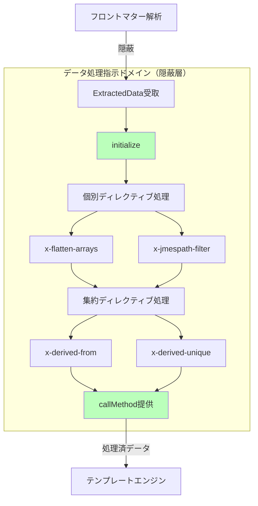

# データ処理指示ドメイン - アーキテクチャ設計

## 概要

本ドキュメントは、3ドメインアーキテクチャにおけるデータ処理指示ドメインの設計を定義する。このドメインはフロントマターデータの加工と提供を担い、フロントマター解析ドメインへの直接アクセスを隠蔽する。

## ドメインの責務と境界

### 中核責務

**データ処理指示ドメイン**は以下の責務を持つ：

1. フロントマター解析結果の受け取りと保持
2. x-ディレクティブによるデータ加工処理
3. Schema階層要求に応じた処理済みデータの提供
4. フロントマター解析構造への直接アクセスの隠蔽（隠蔽層）

### ドメイン境界

```typescript
// データ処理指示ドメインの境界
interface DataProcessingDomain {
  // 入力境界
  input: {
    extractedData: ExtractedData[]; // フロントマター解析結果
    directives: ProcessingDirective[]; // x-ディレクティブ群
  };

  // 出力境界
  output: {
    processedData: ProcessedData; // 処理済みデータ
  };

  // 中核機能（隠蔽層）
  functions: {
    initialize(data: ExtractedData[]): void;
    callMethod(schemaPath: string): ProcessedData;
    applyDirectives(directives: ProcessingDirective[]): void;
  };

  // 重要な制約
  constraint: "フロントマター解析構造への直接参照を隠蔽";
}
```

### データアクセスの隠蔽原則

flow.ja.mdの重要原則：

> 「1.フロントマター解析の構造」が直接参照されることはなく、「3.解析結果データの処理指示」によって隠蔽されている

## 値オブジェクト

### ProcessingDirective

```typescript
export type DirectiveType =
  | "x-flatten-arrays"
  | "x-jmespath-filter"
  | "x-derived-from"
  | "x-derived-unique";

export class ProcessingDirective {
  private constructor(
    private readonly type: DirectiveType,
    private readonly value: unknown,
    private readonly path: string,
    private readonly timing: "individual" | "aggregate",
  ) {}

  static create(
    type: string,
    value: unknown,
    path: string,
  ): Result<ProcessingDirective, ValidationError> {
    if (!this.isValidDirectiveType(type)) {
      return {
        ok: false,
        error: {
          kind: "InvalidDirective",
          directive: type,
          message: `Unknown processing directive: ${type}`,
        },
      };
    }

    const timing = this.getDirectiveTiming(type as DirectiveType);

    return {
      ok: true,
      data: new ProcessingDirective(type as DirectiveType, value, path, timing),
    };
  }

  private static isValidDirectiveType(type: string): boolean {
    return [
      "x-flatten-arrays",
      "x-jmespath-filter",
      "x-derived-from",
      "x-derived-unique",
    ].includes(type);
  }

  private static getDirectiveTiming(
    type: DirectiveType,
  ): "individual" | "aggregate" {
    switch (type) {
      case "x-flatten-arrays":
      case "x-jmespath-filter":
        return "individual"; // 個別ファイル処理時
      case "x-derived-from":
      case "x-derived-unique":
        return "aggregate"; // 全ファイル処理完了後
    }
  }

  getType(): DirectiveType {
    return this.type;
  }

  getValue(): unknown {
    return this.value;
  }

  getPath(): string {
    return this.path;
  }

  getTiming(): "individual" | "aggregate" {
    return this.timing;
  }
}
```

### AggregationRule

```typescript
export class AggregationRule {
  private constructor(
    private readonly targetField: string,
    private readonly sourceExpression: string,
    private readonly unique: boolean,
  ) {}

  static create(
    targetField: string,
    sourceExpression: string,
    unique: boolean = false,
  ): Result<AggregationRule, ValidationError> {
    if (!targetField || targetField.trim().length === 0) {
      return {
        ok: false,
        error: { kind: "EmptyInput", message: "Target field cannot be empty" },
      };
    }

    if (!sourceExpression || sourceExpression.trim().length === 0) {
      return {
        ok: false,
        error: {
          kind: "EmptyInput",
          message: "Source expression cannot be empty",
        },
      };
    }

    // JSONPath式の基本検証
    if (!this.isValidJSONPath(sourceExpression)) {
      return {
        ok: false,
        error: {
          kind: "InvalidExpression",
          expression: sourceExpression,
          message: "Source expression must be a valid JSONPath",
        },
      };
    }

    return {
      ok: true,
      data: new AggregationRule(targetField, sourceExpression, unique),
    };
  }

  private static isValidJSONPath(expression: string): boolean {
    // 配列展開記法 [] を含むか、ドット記法を含むか
    return expression.includes("[]") || expression.includes(".");
  }

  getTargetField(): string {
    return this.targetField;
  }

  getSourceExpression(): string {
    return this.sourceExpression;
  }

  isUnique(): boolean {
    return this.unique;
  }
}
```

## エンティティ

### ProcessedData

```typescript
export type ProcessedDataState =
  | { kind: "Uninitialized" }
  | { kind: "Initialized"; data: ExtractedData[] }
  | {
    kind: "Processing";
    data: ExtractedData[];
    directives: ProcessingDirective[];
  }
  | { kind: "Processed"; data: unknown; metadata: ProcessingMetadata }
  | { kind: "Failed"; error: ProcessingError };

export class ProcessedData {
  private state: ProcessedDataState;
  private cache: Map<string, unknown> = new Map();

  private constructor() {
    this.state = { kind: "Uninitialized" };
  }

  static create(): ProcessedData {
    return new ProcessedData();
  }

  // 初期化（フロントマター解析結果を受け取る）
  initialize(extractedData: ExtractedData[]): Result<void, ProcessingError> {
    if (this.state.kind !== "Uninitialized") {
      return {
        ok: false,
        error: {
          kind: "InvalidStateTransition",
          from: this.state.kind,
          to: "Initialized",
        },
      };
    }

    this.state = {
      kind: "Initialized",
      data: extractedData,
    };

    return { ok: true, data: undefined };
  }

  // ディレクティブ適用開始
  startProcessing(
    directives: ProcessingDirective[],
  ): Result<void, ProcessingError> {
    if (this.state.kind !== "Initialized") {
      return {
        ok: false,
        error: {
          kind: "InvalidStateTransition",
          from: this.state.kind,
          to: "Processing",
        },
      };
    }

    this.state = {
      kind: "Processing",
      data: this.state.data,
      directives,
    };

    return { ok: true, data: undefined };
  }

  // 処理完了
  complete(
    processedData: unknown,
    metadata: ProcessingMetadata,
  ): Result<void, ProcessingError> {
    if (this.state.kind !== "Processing") {
      return {
        ok: false,
        error: {
          kind: "InvalidStateTransition",
          from: this.state.kind,
          to: "Processed",
        },
      };
    }

    this.state = {
      kind: "Processed",
      data: processedData,
      metadata,
    };

    return { ok: true, data: undefined };
  }

  // Schema階層要求に応じたデータ取得（隠蔽層の中核機能）
  callMethod(schemaPath: string): Result<unknown, ProcessingError> {
    if (this.state.kind !== "Processed") {
      return {
        ok: false,
        error: {
          kind: "NotProcessed",
          state: this.state.kind,
        },
      };
    }

    // キャッシュチェック
    if (this.cache.has(schemaPath)) {
      return { ok: true, data: this.cache.get(schemaPath) };
    }

    // パスに基づくデータ解決
    const resolved = this.resolvePath(this.state.data, schemaPath);
    if (resolved.ok) {
      this.cache.set(schemaPath, resolved.data);
    }

    return resolved;
  }

  private resolvePath(
    data: unknown,
    path: string,
  ): Result<unknown, ProcessingError> {
    // items階層の省略を考慮したパス解決
    // "commands[].c1" -> commands配列の各要素のc1プロパティ
    const normalizedPath = path.replace(/\[\]/g, "");
    const parts = normalizedPath.split(".");

    let current: any = data;
    for (const part of parts) {
      if (current == null) {
        return {
          ok: false,
          error: {
            kind: "PathNotFound",
            path,
            message: `Path not found: ${path}`,
          },
        };
      }

      if (Array.isArray(current)) {
        // 配列の場合は各要素から値を抽出
        current = current.map((item) => item[part]).filter((v) =>
          v !== undefined
        );
      } else {
        current = current[part];
      }
    }

    return { ok: true, data: current };
  }

  fail(error: ProcessingError): void {
    this.state = { kind: "Failed", error };
  }

  getState(): ProcessedDataState {
    return this.state;
  }

  isProcessed(): boolean {
    return this.state.kind === "Processed";
  }
}
```

## ドメインサービス

### DataProcessor（隠蔽層の実装）

```typescript
export class DataProcessor {
  private processedData: ProcessedData;

  constructor() {
    this.processedData = ProcessedData.create();
  }

  // フロントマター解析結果を受け取る
  initialize(extractedData: ExtractedData[]): Result<void, ProcessingError> {
    return this.processedData.initialize(extractedData);
  }

  // x-ディレクティブを適用
  async applyDirectives(
    directives: ProcessingDirective[],
  ): Promise<Result<void, ProcessingError>> {
    // 個別処理と集約処理を分離
    const individualDirectives = directives.filter((d) =>
      d.getTiming() === "individual"
    );
    const aggregateDirectives = directives.filter((d) =>
      d.getTiming() === "aggregate"
    );

    // 1. 個別ファイル処理時のディレクティブ
    const individualResult = await this.applyIndividualDirectives(
      individualDirectives,
    );
    if (!individualResult.ok) {
      return individualResult;
    }

    // 2. 全ファイル処理完了後のディレクティブ
    const aggregateResult = await this.applyAggregateDirectives(
      aggregateDirectives,
    );
    if (!aggregateResult.ok) {
      return aggregateResult;
    }

    return { ok: true, data: undefined };
  }

  private async applyIndividualDirectives(
    directives: ProcessingDirective[],
  ): Promise<Result<void, ProcessingError>> {
    for (const directive of directives) {
      const result = await this.applyIndividualDirective(directive);
      if (!result.ok) {
        return result;
      }
    }
    return { ok: true, data: undefined };
  }

  private async applyIndividualDirective(
    directive: ProcessingDirective,
  ): Promise<Result<void, ProcessingError>> {
    switch (directive.getType()) {
      case "x-flatten-arrays":
        return this.applyFlattenArrays(directive);
      case "x-jmespath-filter":
        return this.applyJMESPathFilter(directive);
      default:
        return {
          ok: false,
          error: {
            kind: "InvalidDirective",
            directive: directive.getType(),
            message: `Unexpected individual directive: ${directive.getType()}`,
          },
        };
    }
  }

  private async applyAggregateDirectives(
    directives: ProcessingDirective[],
  ): Promise<Result<void, ProcessingError>> {
    for (const directive of directives) {
      const result = await this.applyAggregateDirective(directive);
      if (!result.ok) {
        return result;
      }
    }
    return { ok: true, data: undefined };
  }

  private async applyAggregateDirective(
    directive: ProcessingDirective,
  ): Promise<Result<void, ProcessingError>> {
    switch (directive.getType()) {
      case "x-derived-from":
        return this.applyDerivedFrom(directive);
      case "x-derived-unique":
        return this.applyDerivedUnique(directive);
      default:
        return {
          ok: false,
          error: {
            kind: "InvalidDirective",
            directive: directive.getType(),
            message: `Unexpected aggregate directive: ${directive.getType()}`,
          },
        };
    }
  }

  // Schema階層要求に応じたデータ取得（隠蔽層の中核機能）
  callMethod(schemaPath: string): Result<unknown, ProcessingError> {
    return this.processedData.callMethod(schemaPath);
  }

  // x-flatten-arrays処理
  private applyFlattenArrays(
    directive: ProcessingDirective,
  ): Result<void, ProcessingError> {
    // 実装はインフラ層で提供
    throw new Error("Must be implemented by infrastructure");
  }

  // x-jmespath-filter処理
  private applyJMESPathFilter(
    directive: ProcessingDirective,
  ): Result<void, ProcessingError> {
    // 実装はインフラ層で提供
    throw new Error("Must be implemented by infrastructure");
  }

  // x-derived-from処理
  private applyDerivedFrom(
    directive: ProcessingDirective,
  ): Result<void, ProcessingError> {
    // 実装はインフラ層で提供
    throw new Error("Must be implemented by infrastructure");
  }

  // x-derived-unique処理
  private applyDerivedUnique(
    directive: ProcessingDirective,
  ): Result<void, ProcessingError> {
    // 実装はインフラ層で提供
    throw new Error("Must be implemented by infrastructure");
  }
}
```

## リポジトリインターフェース

```typescript
export interface ProcessedDataRepository {
  save(data: ProcessedData): Promise<Result<void, ProcessingError>>;
  load(id: string): Promise<Result<ProcessedData | null, ProcessingError>>;
}
```

## エラー型定義

```typescript
export type ProcessingError =
  | DirectiveError
  | DataError
  | StateError;

export type DirectiveError =
  | { kind: "InvalidDirective"; directive: string; message: string }
  | { kind: "DirectiveFailed"; directive: string; error: string };

export type DataError =
  | { kind: "PathNotFound"; path: string; message: string }
  | { kind: "InvalidData"; data: unknown; message: string }
  | { kind: "ProcessingFailed"; reason: string; message: string };

export type StateError =
  | { kind: "InvalidStateTransition"; from: string; to: string }
  | { kind: "NotProcessed"; state: string }
  | { kind: "NotInitialized"; message: string };

export interface ProcessingMetadata {
  appliedDirectives: string[];
  processingTime: number;
  derivedFields?: string[];
  filteredCount?: number;
}
```

## 処理フロー



## 重要な設計原則

### 1. 隠蔽層としての役割

- フロントマター解析構造への直接アクセスを防ぐ
- `initialize`と`callMethod`によるインターフェース提供
- 外部からはフロントマター構造が見えない

### 2. ディレクティブ処理のタイミング

- **個別ファイル処理時**: x-flatten-arrays, x-jmespath-filter
- **全ファイル処理完了後**: x-derived-from, x-derived-unique

### 3. items階層の省略

- `commands[].c1`のような記法をサポート
- `commands.items[].c1`は誤り

## まとめ

データ処理指示ドメインは、フロントマター解析結果を受け取り、x-ディレクティブによる加工を行い、Schema階層要求に応じて処理済みデータを提供する。最も重要な役割は、フロントマター解析構造への直接アクセスを隠蔽することである。
