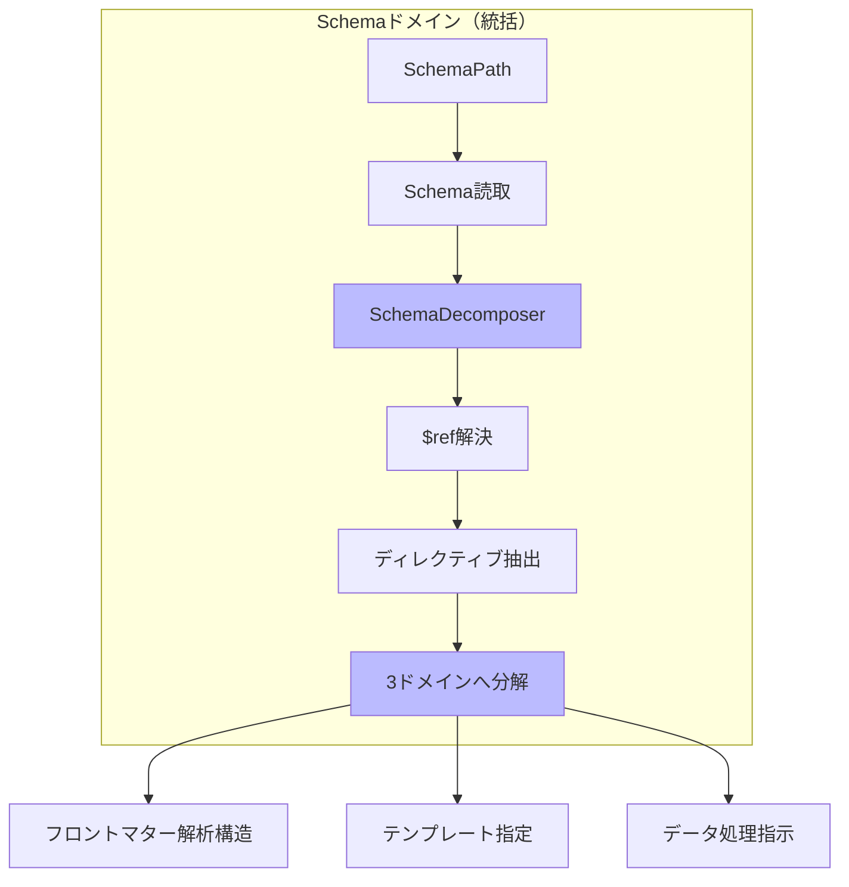

# Schemaドメイン（統括） - アーキテクチャ設計

## 概要

本ドキュメントは、3ドメインアーキテクチャにおけるSchemaドメイン（統括）の設計を定義する。このドメインはSchema構造を3つのサブドメインに分解し、それらを統括する責務を持つ。

## ドメインの責務と境界

### 中核責務

**Schemaドメイン**は以下の責務を持つ：

1. JSON Schemaファイルの読み込みと解析
2. 3つのサブドメインへの構造分解
3. $ref参照の解決（スキーマ構造のみ）
4. サブドメイン間の調整

### 3つのサブドメインへの分解

flow.ja.mdに基づく分解：

```typescript
interface SchemaDecomposition {
  // 1. フロントマター解析構造
  frontmatterStructure: {
    rootPath: string; // x-frontmatter-part指定階層
    schemaDefinition: object; // JSON Schema構造
    hasExtractFromPart: boolean;
  };

  // 2. テンプレート指定
  templateSpecification: {
    mainTemplate?: string; // x-template
    itemsTemplate?: string; // x-template-items
    outputFormat?: string; // x-template-format
  };

  // 3. データ処理指示
  processingInstructions: {
    directives: ProcessingDirective[];
    // フロントマターデータへのアクセスを隠蔽
    initialize(frontmatterData: unknown): void;
    callMethod(schemaPath: string): ProcessedData;
  };
}
```

## 値オブジェクト

### SchemaPath

```typescript
export class SchemaPath {
  private constructor(private readonly value: string) {}

  static create(path: string): Result<SchemaPath, SchemaPathError> {
    if (!path || path.trim().length === 0) {
      return {
        ok: false,
        error: { kind: "EmptyPath", message: "Schema path cannot be empty" },
      };
    }

    if (!path.endsWith(".json")) {
      return {
        ok: false,
        error: {
          kind: "InvalidExtension",
          path,
          message: `Schema file must be .json`,
        },
      };
    }

    const normalized = path.replace(/\\/g, "/").replace(/\/+/g, "/");
    return { ok: true, data: new SchemaPath(normalized) };
  }

  toString(): string {
    return this.value;
  }

  getDirectory(): string {
    const lastSlash = this.value.lastIndexOf("/");
    return lastSlash === -1 ? "." : this.value.substring(0, lastSlash);
  }
}
```

### SchemaDirective

```typescript
export type DirectiveType =
  | "x-frontmatter-part"
  | "x-template"
  | "x-template-items"
  | "x-template-format"
  | "x-flatten-arrays"
  | "x-jmespath-filter"
  | "x-derived-from"
  | "x-derived-unique";

export class SchemaDirective {
  private constructor(
    private readonly type: DirectiveType,
    private readonly value: unknown,
    private readonly path: string,
  ) {}

  static create(
    type: string,
    value: unknown,
    path: string,
  ): Result<SchemaDirective, ValidationError> {
    if (!this.isValidDirectiveType(type)) {
      return {
        ok: false,
        error: {
          kind: "InvalidDirective",
          directive: type,
          message: `Unknown directive: ${type}`,
        },
      };
    }

    return {
      ok: true,
      data: new SchemaDirective(type as DirectiveType, value, path),
    };
  }

  private static isValidDirectiveType(type: string): boolean {
    return type.startsWith("x-") && [
      "x-frontmatter-part",
      "x-template",
      "x-template-items",
      "x-template-format",
      "x-flatten-arrays",
      "x-jmespath-filter",
      "x-derived-from",
      "x-derived-unique",
    ].includes(type);
  }

  getType(): DirectiveType {
    return this.type;
  }

  getValue(): unknown {
    return this.value;
  }

  getPath(): string {
    return this.path;
  }

  // ドメイン分類
  getDomain(): "frontmatter" | "template" | "processing" {
    switch (this.type) {
      case "x-frontmatter-part":
        return "frontmatter";
      case "x-template":
      case "x-template-items":
      case "x-template-format":
        return "template";
      case "x-flatten-arrays":
      case "x-jmespath-filter":
      case "x-derived-from":
      case "x-derived-unique":
        return "processing";
    }
  }
}
```

## エンティティ

### Schema（統括）

```typescript
export type SchemaState =
  | { kind: "Unloaded"; path: SchemaPath }
  | { kind: "Loading"; path: SchemaPath }
  | { kind: "Loaded"; path: SchemaPath; raw: RawSchema }
  | { kind: "Decomposed"; path: SchemaPath; decomposition: SchemaDecomposition }
  | { kind: "Failed"; path: SchemaPath; error: SchemaError };

export class Schema {
  private state: SchemaState;

  private constructor(
    private readonly id: SchemaId,
    initialPath: SchemaPath,
  ) {
    this.state = { kind: "Unloaded", path: initialPath };
  }

  static create(id: SchemaId, path: SchemaPath): Schema {
    return new Schema(id, path);
  }

  // 状態遷移メソッド
  load(raw: RawSchema): Result<void, SchemaError> {
    if (this.state.kind !== "Unloaded" && this.state.kind !== "Failed") {
      return {
        ok: false,
        error: {
          kind: "InvalidStateTransition",
          from: this.state.kind,
          to: "Loaded",
        },
      };
    }

    this.state = {
      kind: "Loaded",
      path: this.state.path,
      raw,
    };

    return { ok: true, data: undefined };
  }

  decompose(decomposition: SchemaDecomposition): Result<void, SchemaError> {
    if (this.state.kind !== "Loaded") {
      return {
        ok: false,
        error: {
          kind: "InvalidStateTransition",
          from: this.state.kind,
          to: "Decomposed",
        },
      };
    }

    this.state = {
      kind: "Decomposed",
      path: this.state.path,
      decomposition,
    };

    return { ok: true, data: undefined };
  }

  fail(error: SchemaError): void {
    this.state = {
      kind: "Failed",
      path: this.getPath(),
      error,
    };
  }

  // クエリメソッド
  getId(): SchemaId {
    return this.id;
  }

  getPath(): SchemaPath {
    return this.state.path;
  }

  getState(): SchemaState {
    return this.state;
  }

  isDecomposed(): boolean {
    return this.state.kind === "Decomposed";
  }

  getDecomposition(): Result<SchemaDecomposition, SchemaError> {
    if (this.state.kind !== "Decomposed") {
      return {
        ok: false,
        error: {
          kind: "NotDecomposed",
          state: this.state.kind,
        },
      };
    }

    return { ok: true, data: this.state.decomposition };
  }
}
```

## ドメインサービス

### SchemaDecomposer

```typescript
export class SchemaDecomposer {
  constructor(
    private readonly referenceResolver: SchemaReferenceResolver,
  ) {}

  async decompose(
    raw: RawSchema,
    path: SchemaPath,
  ): Promise<Result<SchemaDecomposition, SchemaError>> {
    // 1. $ref解決（スキーマ構造のみ）
    const resolved = await this.referenceResolver.resolve(
      raw,
      path.getDirectory(),
    );
    if (!resolved.ok) {
      return resolved;
    }

    // 2. ディレクティブ抽出
    const directives = this.extractDirectives(resolved.data);

    // 3. 3つのサブドメインに分解
    const frontmatter = this.extractFrontmatterStructure(
      resolved.data,
      directives,
    );
    const template = this.extractTemplateSpecification(directives);
    const processing = this.extractProcessingInstructions(directives);

    return {
      ok: true,
      data: {
        frontmatterStructure: frontmatter,
        templateSpecification: template,
        processingInstructions: processing,
      },
    };
  }

  private extractDirectives(schema: any, path: string = ""): SchemaDirective[] {
    const directives: SchemaDirective[] = [];

    const traverse = (obj: any, currentPath: string) => {
      if (!obj || typeof obj !== "object") return;

      for (const [key, value] of Object.entries(obj)) {
        if (key.startsWith("x-")) {
          const directive = SchemaDirective.create(key, value, currentPath);
          if (directive.ok) {
            directives.push(directive.data);
          }
        }

        if (key === "properties" && typeof value === "object") {
          for (const [propKey, propValue] of Object.entries(value)) {
            traverse(propValue, `${currentPath}.${propKey}`);
          }
        } else if (key === "items") {
          traverse(value, `${currentPath}[]`);
        }
      }
    };

    traverse(schema, path);
    return directives;
  }

  private extractFrontmatterStructure(
    schema: any,
    directives: SchemaDirective[],
  ): FrontmatterStructure {
    const frontmatterPart = directives.find(
      (d) => d.getType() === "x-frontmatter-part",
    );

    // x-ディレクティブを除いた純粋なスキーマ構造
    const cleanSchema = this.removeDirectives(schema);

    return {
      rootPath: frontmatterPart?.getPath() || "",
      schemaDefinition: cleanSchema,
      hasExtractFromPart: !!frontmatterPart,
    };
  }

  private extractTemplateSpecification(
    directives: SchemaDirective[],
  ): TemplateSpecification {
    const mainTemplate = directives.find((d) => d.getType() === "x-template");
    const itemsTemplate = directives.find((d) =>
      d.getType() === "x-template-items"
    );
    const format = directives.find((d) => d.getType() === "x-template-format");

    return {
      mainTemplate: mainTemplate?.getValue() as string | undefined,
      itemsTemplate: itemsTemplate?.getValue() as string | undefined,
      outputFormat: format?.getValue() as string | undefined,
    };
  }

  private extractProcessingInstructions(
    directives: SchemaDirective[],
  ): ProcessingInstructions {
    const processingDirectives = directives.filter(
      (d) => d.getDomain() === "processing",
    );

    return {
      directives: processingDirectives.map((d) => ({
        type: d.getType(),
        value: d.getValue(),
        path: d.getPath(),
      })),
      initialize(frontmatterData: unknown): void {
        // データ処理指示ドメインで実装
      },
      callMethod(schemaPath: string): ProcessedData {
        // データ処理指示ドメインで実装
        throw new Error("Must be implemented by DataProcessingDomain");
      },
    };
  }

  private removeDirectives(obj: any): any {
    if (!obj || typeof obj !== "object") return obj;

    const cleaned: any = Array.isArray(obj) ? [] : {};

    for (const [key, value] of Object.entries(obj)) {
      if (!key.startsWith("x-")) {
        cleaned[key] = this.removeDirectives(value);
      }
    }

    return cleaned;
  }
}
```

### SchemaReferenceResolver

```typescript
export class SchemaReferenceResolver {
  private cache = new Map<string, ResolvedSchema>();

  async resolve(
    schema: RawSchema,
    basePath: string,
  ): Promise<Result<ResolvedSchema, SchemaError>> {
    const visited = new Set<string>();

    const resolveRecursive = async (
      obj: any,
      currentPath: string,
      depth: number = 0,
    ): Promise<Result<any, SchemaError>> => {
      // 深さ制限
      if (depth > 100) {
        return {
          ok: false,
          error: {
            kind: "MaxDepthExceeded",
            depth,
            message: "Maximum reference resolution depth exceeded",
          },
        };
      }

      // $ref処理（スキーマ構造のみ、テンプレート処理とは独立）
      if (obj && typeof obj === "object" && "$ref" in obj) {
        const refPath = obj["$ref"] as string;

        // 循環参照チェック
        if (visited.has(refPath)) {
          return {
            ok: false,
            error: {
              kind: "CircularReference",
              refs: Array.from(visited).concat(refPath),
              message: `Circular reference detected: ${refPath}`,
            },
          };
        }

        visited.add(refPath);

        // キャッシュチェック
        if (this.cache.has(refPath)) {
          const cached = this.cache.get(refPath);
          visited.delete(refPath);
          return { ok: true, data: cached };
        }

        // 参照先を読み込み
        const loadResult = await this.loadReference(refPath, currentPath);
        if (!loadResult.ok) {
          visited.delete(refPath);
          return loadResult;
        }

        // 再帰的に解決
        const resolvedResult = await resolveRecursive(
          loadResult.data,
          this.getReferencePath(refPath, currentPath),
          depth + 1,
        );

        visited.delete(refPath);

        if (resolvedResult.ok) {
          this.cache.set(refPath, resolvedResult.data);
        }

        return resolvedResult;
      }

      // 配列の処理
      if (Array.isArray(obj)) {
        const results: any[] = [];
        for (const item of obj) {
          const result = await resolveRecursive(item, currentPath, depth);
          if (!result.ok) return result;
          results.push(result.data);
        }
        return { ok: true, data: results };
      }

      // オブジェクトの処理
      if (obj && typeof obj === "object") {
        const resolved: any = {};
        for (const [key, value] of Object.entries(obj)) {
          const result = await resolveRecursive(value, currentPath, depth);
          if (!result.ok) return result;
          resolved[key] = result.data;
        }
        return { ok: true, data: resolved };
      }

      // プリミティブ値はそのまま返す
      return { ok: true, data: obj };
    };

    return resolveRecursive(schema, basePath, 0);
  }

  private async loadReference(
    refPath: string,
    basePath: string,
  ): Promise<Result<any, SchemaError>> {
    // インフラ層で実装
    throw new Error("Must be implemented by infrastructure layer");
  }

  private getReferencePath(refPath: string, basePath: string): string {
    if (refPath.startsWith("/")) {
      return refPath;
    }
    return `${basePath}/${refPath}`.replace(/\/+/g, "/");
  }

  clearCache(): void {
    this.cache.clear();
  }
}
```

## リポジトリインターフェース

```typescript
export interface SchemaRepository {
  load(path: SchemaPath): Promise<Result<Schema, SchemaError>>;
  save(schema: Schema): Promise<Result<void, SchemaError>>;
  findById(id: SchemaId): Promise<Result<Schema | null, SchemaError>>;
  exists(path: SchemaPath): Promise<Result<boolean, SchemaError>>;
}
```

## エラー型定義

```typescript
export type SchemaError =
  | SchemaPathError
  | SchemaLoadError
  | SchemaResolutionError
  | SchemaDecompositionError;

export type SchemaPathError =
  | { kind: "EmptyPath"; message: string }
  | { kind: "InvalidExtension"; path: string; message: string }
  | { kind: "FileNotFound"; path: string; message: string };

export type SchemaLoadError =
  | { kind: "InvalidJSON"; path: string; error: string }
  | { kind: "ReadError"; path: string; error: string };

export type SchemaResolutionError =
  | { kind: "CircularReference"; refs: string[]; message: string }
  | { kind: "MaxDepthExceeded"; depth: number; message: string }
  | { kind: "RefResolutionFailed"; ref: string; error: string };

export type SchemaDecompositionError =
  | { kind: "InvalidStateTransition"; from: string; to: string }
  | { kind: "NotDecomposed"; state: string }
  | { kind: "InvalidDirective"; directive: string; message: string };
```

## 処理フロー



## 重要な設計原則

### 1. $refの独立性

- `$ref`はJSON Schemaの標準機能として、スキーマ構造の再利用にのみ使用
- テンプレート処理から完全に独立
- 循環参照の検出と防止

### 2. 3ドメインへの分解

- フロントマター解析構造
- テンプレート指定の把握
- 解析結果データの処理指示

これらは独立しており、後で統合される。

### 3. items階層の省略

flow.ja.mdの原則：

- 正しい: `commands[].c1`
- 誤り: `commands.items[].c1`

## まとめ

Schemaドメインは、JSON
Schemaファイルを読み込み、3つの独立したサブドメインに分解する統括責務を持つ。$ref解決はスキーマ構造のみに適用され、テンプレート処理とは完全に独立している。
