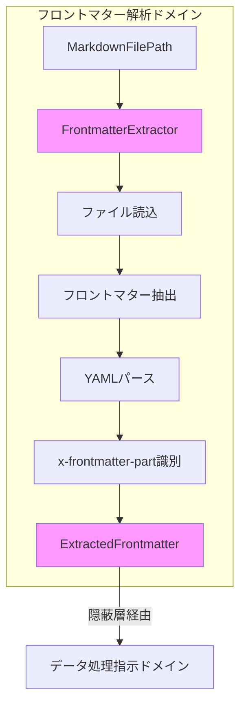

# フロントマター解析ドメイン - アーキテクチャ設計

## 概要

本ドキュメントは、3ドメインアーキテクチャにおけるフロントマター解析ドメインの設計を定義する。このドメインはMarkdownファイルからフロントマターデータを抽出する責務を持つ。

## ドメインの責務と境界

### 中核責務

**フロントマター解析ドメイン**は以下の責務を持つ：

1. Markdownファイルの読み込み
2. フロントマター部分の抽出
3. YAMLパース処理
4. x-frontmatter-part指定階層の識別
5. 構造化データとしての保持

### ドメイン境界

```typescript
// ドメイン境界の定義
interface FrontmatterDomain {
  // 入力境界
  input: {
    markdownFiles: string[]; // Markdownファイルパス群
    schemaStructure: { // Schemaから抽出された構造
      frontmatterPart?: string; // x-frontmatter-part指定
      properties: object; // スキーマ構造定義
    };
  };

  // 出力境界
  output: {
    extractedData: ExtractedData[]; // 抽出された構造化データ
  };

  // 重要な制約
  constraint: "外部からの直接アクセスは禁止";
}
```

### データアクセスの隠蔽原則

flow.ja.mdの重要原則：

> 「1.フロントマター解析の構造」が直接参照されることはなく、「3.解析結果データの処理指示」によって隠蔽されている

## 値オブジェクト

### MarkdownFilePath

```typescript
export class MarkdownFilePath {
  private constructor(private readonly value: string) {}

  static create(path: string): Result<MarkdownFilePath, MarkdownPathError> {
    // パス検証ロジック
    if (!path || path.trim().length === 0) {
      return {
        ok: false,
        error: { kind: "EmptyPath", message: "Path cannot be empty" },
      };
    }

    // Markdown拡張子チェック
    const validExtensions = [".md", ".markdown"];
    const hasValidExt = validExtensions.some((ext) =>
      path.toLowerCase().endsWith(ext)
    );

    if (!hasValidExt) {
      return {
        ok: false,
        error: {
          kind: "InvalidExtension",
          path,
          message: `Must be markdown file`,
        },
      };
    }

    return { ok: true, data: new MarkdownFilePath(path) };
  }

  toString(): string {
    return this.value;
  }
}
```

### ExtractedFrontmatter

```typescript
export class ExtractedFrontmatter {
  private constructor(
    private readonly data: Record<string, unknown>,
    private readonly sourcePath: MarkdownFilePath,
    private readonly frontmatterPart?: string,
  ) {}

  static create(
    data: unknown,
    sourcePath: MarkdownFilePath,
    frontmatterPart?: string,
  ): Result<ExtractedFrontmatter, ParseError> {
    if (!data || typeof data !== "object") {
      return {
        ok: false,
        error: {
          kind: "InvalidDataType",
          message: "Frontmatter must be an object",
        },
      };
    }

    return {
      ok: true,
      data: new ExtractedFrontmatter(
        data as Record<string, unknown>,
        sourcePath,
        frontmatterPart,
      ),
    };
  }

  getData(): Record<string, unknown> {
    return { ...this.data };
  }

  getSourcePath(): MarkdownFilePath {
    return this.sourcePath;
  }

  getFrontmatterPart(): string | undefined {
    return this.frontmatterPart;
  }

  // x-frontmatter-part指定階層のデータ取得
  getPartData(): unknown {
    if (!this.frontmatterPart) {
      return this.data;
    }

    const parts = this.frontmatterPart.split(".");
    let current: any = this.data;

    for (const part of parts) {
      if (!current || typeof current !== "object") {
        return undefined;
      }
      current = current[part];
    }

    return current;
  }
}
```

## エンティティ

### FrontmatterDocument

```typescript
export type FrontmatterDocumentState =
  | { kind: "Unprocessed"; path: MarkdownFilePath }
  | { kind: "Loading"; path: MarkdownFilePath }
  | { kind: "Loaded"; path: MarkdownFilePath; content: string }
  | {
    kind: "Extracted";
    path: MarkdownFilePath;
    frontmatter: ExtractedFrontmatter;
  }
  | { kind: "Failed"; path: MarkdownFilePath; error: FrontmatterError };

export class FrontmatterDocument {
  private state: FrontmatterDocumentState;

  private constructor(
    private readonly id: DocumentId,
    initialPath: MarkdownFilePath,
  ) {
    this.state = { kind: "Unprocessed", path: initialPath };
  }

  static create(id: DocumentId, path: MarkdownFilePath): FrontmatterDocument {
    return new FrontmatterDocument(id, path);
  }

  // 状態遷移メソッド
  load(content: string): Result<void, FrontmatterError> {
    if (this.state.kind !== "Unprocessed" && this.state.kind !== "Failed") {
      return {
        ok: false,
        error: {
          kind: "InvalidStateTransition",
          from: this.state.kind,
          to: "Loaded",
        },
      };
    }

    this.state = {
      kind: "Loaded",
      path: this.state.path,
      content,
    };

    return { ok: true, data: undefined };
  }

  setExtracted(
    frontmatter: ExtractedFrontmatter,
  ): Result<void, FrontmatterError> {
    if (this.state.kind !== "Loaded") {
      return {
        ok: false,
        error: {
          kind: "InvalidStateTransition",
          from: this.state.kind,
          to: "Extracted",
        },
      };
    }

    this.state = {
      kind: "Extracted",
      path: this.state.path,
      frontmatter,
    };

    return { ok: true, data: undefined };
  }

  fail(error: FrontmatterError): void {
    this.state = {
      kind: "Failed",
      path: this.getPath(),
      error,
    };
  }

  // クエリメソッド
  getId(): DocumentId {
    return this.id;
  }

  getPath(): MarkdownFilePath {
    return this.state.path;
  }

  getState(): FrontmatterDocumentState {
    return this.state;
  }

  isExtracted(): boolean {
    return this.state.kind === "Extracted";
  }

  getExtractedData(): Result<ExtractedFrontmatter, FrontmatterError> {
    if (this.state.kind !== "Extracted") {
      return {
        ok: false,
        error: {
          kind: "NotExtracted",
          state: this.state.kind,
        },
      };
    }

    return { ok: true, data: this.state.frontmatter };
  }
}
```

## ドメインサービス

### FrontmatterExtractor

```typescript
export class FrontmatterExtractor {
  constructor(
    private readonly parser: FrontmatterParser,
    private readonly schemaStructure: SchemaStructure,
  ) {}

  // 集約ルートメソッド
  async extract(
    files: MarkdownFilePath[],
  ): Promise<Result<ExtractedData[], ExtractError>> {
    const results: ExtractedData[] = [];
    const errors: ExtractError[] = [];

    for (const file of files) {
      const result = await this.extractSingle(file);

      if (result.ok) {
        results.push(result.data);
      } else {
        errors.push(result.error);
      }
    }

    if (errors.length > 0) {
      return {
        ok: false,
        error: {
          kind: "ExtractionFailed",
          files: errors.length,
          errors,
        },
      };
    }

    return { ok: true, data: results };
  }

  private async extractSingle(
    file: MarkdownFilePath,
  ): Promise<Result<ExtractedData, ExtractError>> {
    // 1. ファイル読み込み
    const content = await this.readFile(file);

    // 2. フロントマター抽出
    const frontmatterResult = this.extractFrontmatter(content);
    if (!frontmatterResult.ok) {
      return frontmatterResult;
    }

    // 3. YAMLパース
    const parsed = await this.parser.parse(frontmatterResult.data);
    if (!parsed.ok) {
      return parsed;
    }

    // 4. x-frontmatter-part指定階層の識別
    const frontmatterPart = this.schemaStructure.getFrontmatterPart();

    // 5. ExtractedFrontmatter作成
    return ExtractedFrontmatter.create(
      parsed.data,
      file,
      frontmatterPart,
    );
  }

  private extractFrontmatter(content: string): Result<string, ExtractError> {
    const lines = content.split("\n");

    if (lines[0] !== "---") {
      return {
        ok: false,
        error: {
          kind: "NoFrontmatter",
          message: "No frontmatter found",
        },
      };
    }

    let endIndex = -1;
    for (let i = 1; i < lines.length; i++) {
      if (lines[i] === "---") {
        endIndex = i;
        break;
      }
    }

    if (endIndex === -1) {
      return {
        ok: false,
        error: {
          kind: "InvalidFrontmatter",
          message: "Frontmatter not properly closed",
        },
      };
    }

    const frontmatter = lines.slice(1, endIndex).join("\n");
    return { ok: true, data: frontmatter };
  }

  private async readFile(path: MarkdownFilePath): Promise<string> {
    // インフラ層で実装
    throw new Error("File reading must be implemented in infrastructure");
  }
}
```

### FrontmatterParser

```typescript
export class FrontmatterParser {
  async parse(content: string): Promise<Result<unknown, ParseError>> {
    try {
      // YAML parsing (インフラ層で実装)
      const parsed = await this.parseYAML(content);
      return { ok: true, data: parsed };
    } catch (error) {
      return {
        ok: false,
        error: {
          kind: "ParseFailed",
          error: error instanceof Error ? error.message : String(error),
        },
      };
    }
  }

  private async parseYAML(content: string): Promise<unknown> {
    // インフラ層で実装
    throw new Error("YAML parser must be provided by infrastructure");
  }
}
```

## リポジトリインターフェース

```typescript
export interface FrontmatterDocumentRepository {
  load(
    path: MarkdownFilePath,
  ): Promise<Result<FrontmatterDocument, FrontmatterError>>;
  save(document: FrontmatterDocument): Promise<Result<void, FrontmatterError>>;
  findById(
    id: DocumentId,
  ): Promise<Result<FrontmatterDocument | null, FrontmatterError>>;
  findByPattern(
    pattern: string,
  ): Promise<Result<FrontmatterDocument[], FrontmatterError>>;
}
```

## エラー型定義

```typescript
export type FrontmatterError =
  | ExtractError
  | ParseError
  | StateError;

export type ExtractError =
  | { kind: "NoFrontmatter"; message: string }
  | { kind: "InvalidFrontmatter"; message: string }
  | { kind: "ExtractionFailed"; files: number; errors: ExtractError[] };

export type ParseError =
  | { kind: "ParseFailed"; error: string }
  | { kind: "InvalidDataType"; message: string };

export type StateError =
  | { kind: "InvalidStateTransition"; from: string; to: string }
  | { kind: "NotExtracted"; state: string };
```

## 処理フロー



## 重要な設計原則

### 1. 外部アクセスの禁止

このドメインの出力（ExtractedFrontmatter）は直接外部から参照されない。すべてのアクセスはデータ処理指示ドメインを経由する。

### 2. x-frontmatter-partの役割

- フロントマター処理の起点を指定
- 配列プロパティにのみ適用可能
- 各Markdownファイルの処理単位を定義

### 3. 構造の保持

抽出されたデータは元の構造を保持し、加工や変換は行わない。データの加工はデータ処理指示ドメインの責務である。

## まとめ

フロントマター解析ドメインは、Markdownファイルからフロントマターデータを抽出する単一の責務を持つ。外部からの直接アクセスは禁止され、データ処理指示ドメインによって隠蔽される。これにより、フロントマター構造の変更が他のドメインに影響を与えることを防ぐ。
