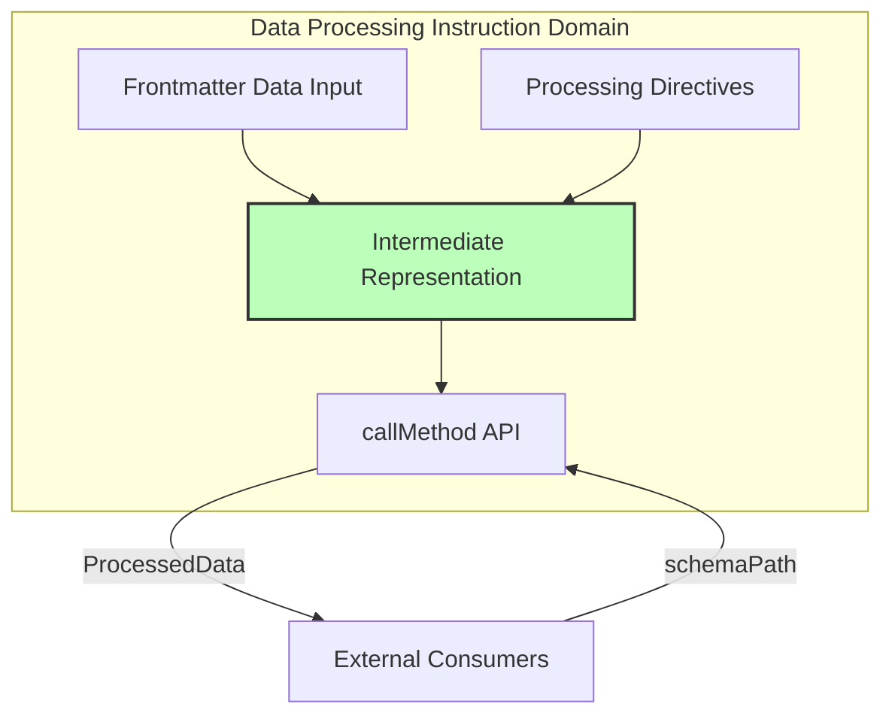

# Data Processing Instruction Domain - Intermediate Representation

## Overview

The Intermediate Representation (IR) is an internal data structure within the
Data Processing Instruction Domain. It serves as the implementation mechanism
for hiding direct access to frontmatter data and providing processed data to
consumers.

## Role in the 3-Domain Architecture

The IR operates within the Data Processing Instruction Domain to:

1. **Hide Frontmatter Data**: Acts as the abstraction layer preventing direct
   access to frontmatter extraction results
2. **Apply Processing Directives**: Implements x-directive transformations
   (x-flatten-arrays, x-derived-from, etc.)
3. **Provide Processed Data**: Returns transformed data when requested via
   `callMethod(schemaPath)`

## Domain Context



## Core Implementation

### 1. IR as Hiding Layer

```typescript
/**
 * Internal data structure for the Data Processing Instruction Domain
 * This is NOT exposed outside the domain
 */
class IntermediateRepresentation {
  private constructor(
    private readonly frontmatterData: ExtractedData[],
    private readonly processedNodes: Map<string, ProcessedNode>,
  ) {}

  /**
   * Initialize from frontmatter extraction results
   * This is the ONLY way frontmatter data enters the system
   */
  static fromExtractedData(
    data: ExtractedData[],
  ): IntermediateRepresentation {
    const nodes = new Map<string, ProcessedNode>();

    // Build internal representation
    for (const extracted of data) {
      this.buildNodes(extracted, nodes);
    }

    return new IntermediateRepresentation(data, nodes);
  }

  /**
   * Apply x-directive processing
   */
  applyDirectives(directives: ProcessingDirective[]): void {
    for (const directive of directives) {
      switch (directive.kind) {
        case "x-flatten-arrays":
          this.applyFlattenArrays(directive);
          break;
        case "x-derived-from":
          this.applyDerivedFrom(directive);
          break;
        case "x-derived-unique":
          this.applyDerivedUnique(directive);
          break;
        case "x-jmespath-filter":
          this.applyJmespathFilter(directive);
          break;
      }
    }
  }

  /**
   * Get processed data for a schema path
   * This is the ONLY way to access data from outside
   */
  getProcessedData(schemaPath: string): ProcessedData {
    const node = this.processedNodes.get(schemaPath);
    if (!node) {
      return { value: null, source: "not-found" };
    }

    return {
      value: node.value,
      source: node.source,
      transformations: node.appliedDirectives,
    };
  }

  private static buildNodes(
    data: ExtractedData,
    nodes: Map<string, ProcessedNode>,
  ): void {
    // Build internal node structure
    // Implementation details hidden from external consumers
  }

  private applyFlattenArrays(directive: FlattenArraysDirective): void {
    // Implementation of x-flatten-arrays
  }

  private applyDerivedFrom(directive: DerivedFromDirective): void {
    // Implementation of x-derived-from
  }

  private applyDerivedUnique(directive: DerivedUniqueDirective): void {
    // Implementation of x-derived-unique
  }

  private applyJmespathFilter(directive: JmespathFilterDirective): void {
    // Implementation of x-jmespath-filter
  }
}
```

### 2. Processing Node Structure

```typescript
/**
 * Internal node structure for processed data
 * NOT exposed outside the domain
 */
interface ProcessedNode {
  path: string;
  value: unknown;
  source: "frontmatter" | "derived" | "transformed";
  appliedDirectives: string[];
  metadata: {
    originalPath?: string;
    transformationChain?: TransformationStep[];
  };
}

/**
 * Transformation tracking
 */
interface TransformationStep {
  directive: string;
  timestamp: Date;
  before: unknown;
  after: unknown;
}
```

### 3. Data Processing Service Implementation

```typescript
/**
 * Main service of the Data Processing Instruction Domain
 */
export class DataProcessingService {
  private ir: IntermediateRepresentation | null = null;
  private directives: ProcessingDirective[] = [];

  /**
   * Initialize with frontmatter data
   * This hides the frontmatter structure from external access
   */
  initialize(extractedData: ExtractedData[]): void {
    this.ir = IntermediateRepresentation.fromExtractedData(extractedData);

    // Apply any pending directives
    if (this.directives.length > 0) {
      this.ir.applyDirectives(this.directives);
    }
  }

  /**
   * Set processing directives from schema
   */
  setDirectives(directives: ProcessingDirective[]): void {
    this.directives = directives;

    // Apply immediately if IR is ready
    if (this.ir) {
      this.ir.applyDirectives(directives);
    }
  }

  /**
   * Public API for data access
   * This is the ONLY way external consumers can get data
   */
  callMethod(schemaPath: string): ProcessedData {
    if (!this.ir) {
      throw new Error("Not initialized. Call initialize() first.");
    }

    return this.ir.getProcessedData(schemaPath);
  }
}
```

## Processing Directives Implementation

### 1. x-flatten-arrays

```typescript
class FlattenArraysProcessor {
  process(
    targetPath: string,
    data: Map<string, ProcessedNode>,
  ): void {
    const node = data.get(targetPath);
    if (!node || !Array.isArray(node.value)) {
      return;
    }

    // Recursively flatten nested arrays
    const flattened = this.flattenRecursive(node.value);

    data.set(targetPath, {
      ...node,
      value: flattened,
      source: "transformed",
      appliedDirectives: [...node.appliedDirectives, "x-flatten-arrays"],
    });
  }

  private flattenRecursive(arr: unknown[]): unknown[] {
    return arr.reduce((flat, item) => {
      return flat.concat(
        Array.isArray(item) ? this.flattenRecursive(item) : item,
      );
    }, []);
  }
}
```

### 2. x-derived-from

```typescript
class DerivedFromProcessor {
  process(
    targetPath: string,
    sourcePath: string,
    data: Map<string, ProcessedNode>,
  ): void {
    // Collect values from source path
    const values = this.collectValues(sourcePath, data);

    // Create derived node
    data.set(targetPath, {
      path: targetPath,
      value: values,
      source: "derived",
      appliedDirectives: ["x-derived-from"],
      metadata: {
        originalPath: sourcePath,
      },
    });
  }

  private collectValues(
    path: string,
    data: Map<string, ProcessedNode>,
  ): unknown[] {
    // Implementation of path-based value collection
    // Supports patterns like "commands[].c1"
    return [];
  }
}
```

### 3. x-derived-unique

```typescript
class DerivedUniqueProcessor {
  process(
    targetPath: string,
    data: Map<string, ProcessedNode>,
  ): void {
    const node = data.get(targetPath);
    if (!node || !Array.isArray(node.value)) {
      return;
    }

    // Remove duplicates
    const unique = Array.from(new Set(node.value));

    data.set(targetPath, {
      ...node,
      value: unique,
      appliedDirectives: [...node.appliedDirectives, "x-derived-unique"],
    });
  }
}
```

### 4. x-jmespath-filter

```typescript
class JmespathFilterProcessor {
  process(
    targetPath: string,
    expression: string,
    data: Map<string, ProcessedNode>,
  ): void {
    const node = data.get(targetPath);
    if (!node) {
      return;
    }

    // Apply JMESPath expression
    const filtered = this.applyJmespath(node.value, expression);

    data.set(targetPath, {
      ...node,
      value: filtered,
      source: "transformed",
      appliedDirectives: [...node.appliedDirectives, "x-jmespath-filter"],
    });
  }

  private applyJmespath(data: unknown, expression: string): unknown {
    // JMESPath implementation
    // Delegated to infrastructure layer
    throw new Error("JMESPath engine must be provided by infrastructure");
  }
}
```

## Interface to Other Domains

### Public Interface (Domain Facade)

```typescript
/**
 * Public interface of the Data Processing Instruction Domain
 * This is the ONLY interface exposed to other domains
 */
export interface DataProcessingInstructionDomainFacade {
  /**
   * Initialize with frontmatter extraction results
   * Called once after frontmatter extraction is complete
   */
  initialize(extractedData: ExtractedData[]): void;

  /**
   * Set processing directives from schema
   * Can be called before or after initialization
   */
  setDirectives(directives: ProcessingDirective[]): void;

  /**
   * Get processed data for a schema path
   * This is the ONLY way to access data
   */
  callMethod(schemaPath: string): ProcessedData;
}

/**
 * Processed data returned to consumers
 */
export interface ProcessedData {
  value: unknown;
  source: "frontmatter" | "derived" | "transformed" | "not-found";
  transformations?: string[];
}

/**
 * Processing directive types
 */
export type ProcessingDirective =
  | FlattenArraysDirective
  | DerivedFromDirective
  | DerivedUniqueDirective
  | JmespathFilterDirective;

export interface FlattenArraysDirective {
  kind: "x-flatten-arrays";
  targetPath: string;
}

export interface DerivedFromDirective {
  kind: "x-derived-from";
  targetPath: string;
  sourcePath: string;
}

export interface DerivedUniqueDirective {
  kind: "x-derived-unique";
  targetPath: string;
}

export interface JmespathFilterDirective {
  kind: "x-jmespath-filter";
  targetPath: string;
  expression: string;
}
```

## Important Design Principles

### 1. Data Hiding

- The IR is completely internal to the Data Processing Instruction Domain
- External consumers cannot access frontmatter data directly
- All access goes through the `callMethod` API

### 2. Processing Order

- Directives are applied in a specific order:
  1. x-flatten-arrays (individual file processing)
  2. x-jmespath-filter (individual file processing)
  3. x-derived-from (after all files processed)
  4. x-derived-unique (after x-derived-from)

### 3. Immutability

- Internal nodes are immutable once created
- Transformations create new nodes rather than modifying existing ones
- This ensures data consistency and traceability

### 4. Traceability

- Each node tracks its source (frontmatter, derived, transformed)
- Applied directives are recorded for debugging
- Transformation chain is preserved in metadata

## Error Handling

```typescript
export type DataProcessingError =
  | { kind: "NotInitialized"; message: string }
  | { kind: "InvalidPath"; path: string; reason: string }
  | { kind: "DirectiveError"; directive: string; error: string }
  | { kind: "TransformationError"; details: string };
```

## Summary

The Intermediate Representation is the core implementation detail of the Data
Processing Instruction Domain. It:

1. **Hides Frontmatter Data**: Prevents direct access to extraction results
2. **Applies Transformations**: Implements x-directive processing
3. **Provides Controlled Access**: Only through `callMethod` API
4. **Maintains Independence**: Internal structure not exposed to other domains

This design ensures that the Data Processing Instruction Domain fulfills its
role as the hiding layer between frontmatter extraction and data consumption, as
specified in the 3-domain architecture.
