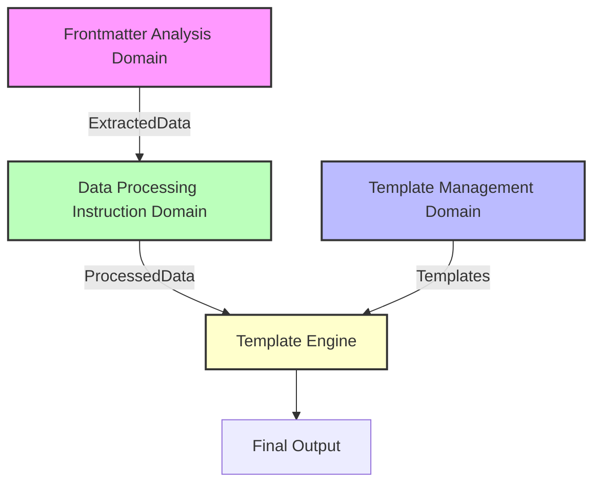

# Template Management Domain Architecture

## Overview

The Template Management Domain is responsible for managing and providing output
templates. This domain operates independently and does not perform variable
substitution - that responsibility belongs to the Template Engine in the
application layer.

## Domain Boundaries

### Responsibility

- Load template files (JSON/YAML/TOML/XML/Markdown)
- Identify `x-template` and `x-template-items` directives
- Provide templates to the Template Engine
- Manage template format specifications

### Independence

- Does not perform variable substitution
- Does not know about frontmatter data
- Does not know about data processing directives
- Only provides template content and metadata

## Core Models

### 1. Value Objects

```typescript
/**
 * Template directive specification
 */
export class TemplateDirective {
  private constructor(
    private readonly mainTemplate?: string, // x-template
    private readonly itemsTemplate?: string, // x-template-items
    private readonly format?: string, // x-template-format
  ) {}

  static create(
    directives: Record<string, unknown>,
  ): Result<TemplateDirective, TemplateError> {
    const mainTemplate = directives["x-template"] as string | undefined;
    const itemsTemplate = directives["x-template-items"] as string | undefined;
    const format = directives["x-template-format"] as string | undefined;

    if (!mainTemplate && !itemsTemplate) {
      return {
        ok: false,
        error: { kind: "NoTemplateSpecified" },
      };
    }

    if (format && !isValidFormat(format)) {
      return {
        ok: false,
        error: { kind: "InvalidFormat", format },
      };
    }

    return {
      ok: true,
      data: new TemplateDirective(mainTemplate, itemsTemplate, format),
    };
  }

  getMainTemplate(): string | undefined {
    return this.mainTemplate;
  }

  getItemsTemplate(): string | undefined {
    return this.itemsTemplate;
  }

  getFormat(): string | undefined {
    return this.format;
  }
}

/**
 * Template file reference
 */
export class TemplateFile {
  private constructor(
    private readonly path: string,
    private readonly type: "main" | "items",
    private readonly format: TemplateFormat,
  ) {}

  static create(
    path: string,
    type: "main" | "items",
  ): Result<TemplateFile, TemplateError> {
    if (!path || path.trim().length === 0) {
      return {
        ok: false,
        error: { kind: "EmptyPath" },
      };
    }

    const format = this.detectFormat(path);
    if (!format) {
      return {
        ok: false,
        error: { kind: "UnsupportedFormat", path },
      };
    }

    return {
      ok: true,
      data: new TemplateFile(path, type, format),
    };
  }

  private static detectFormat(path: string): TemplateFormat | null {
    const ext = path.split(".").pop()?.toLowerCase();
    switch (ext) {
      case "json":
        return "json";
      case "yaml":
      case "yml":
        return "yaml";
      case "toml":
        return "toml";
      case "xml":
        return "xml";
      case "md":
      case "markdown":
        return "markdown";
      default:
        return null;
    }
  }

  getPath(): string {
    return this.path;
  }

  getType(): "main" | "items" {
    return this.type;
  }

  getFormat(): TemplateFormat {
    return this.format;
  }
}

/**
 * Template format types
 */
export type TemplateFormat = "json" | "yaml" | "toml" | "xml" | "markdown";

/**
 * Template metadata
 */
export class TemplateMetadata {
  private constructor(
    private readonly format: TemplateFormat,
    private readonly variables: string[],
    private readonly hasItemsMarker: boolean,
  ) {}

  static analyze(content: string, format: TemplateFormat): TemplateMetadata {
    const variables = this.extractVariableNames(content);
    const hasItemsMarker = content.includes("{@items}");

    return new TemplateMetadata(format, variables, hasItemsMarker);
  }

  private static extractVariableNames(content: string): string[] {
    const pattern = /\{([^}]+)\}/g;
    const variables = new Set<string>();
    let match;

    while ((match = pattern.exec(content)) !== null) {
      const variable = match[1];
      if (variable !== "@items") {
        variables.add(variable);
      }
    }

    return Array.from(variables);
  }

  getFormat(): TemplateFormat {
    return this.format;
  }

  getVariables(): string[] {
    return [...this.variables];
  }

  hasItemsMarker(): boolean {
    return this.hasItemsMarker;
  }
}
```

### 2. Entities

```typescript
/**
 * Template loading state
 */
export type TemplateState =
  | { kind: "Unloaded"; file: TemplateFile }
  | { kind: "Loading"; file: TemplateFile }
  | {
    kind: "Loaded";
    file: TemplateFile;
    content: string;
    metadata: TemplateMetadata;
  }
  | { kind: "Failed"; file: TemplateFile; error: TemplateError };

/**
 * Template entity
 */
export class Template {
  private state: TemplateState;

  private constructor(
    private readonly id: TemplateId,
    initialFile: TemplateFile,
  ) {
    this.state = { kind: "Unloaded", file: initialFile };
  }

  static create(id: TemplateId, file: TemplateFile): Template {
    return new Template(id, file);
  }

  // State transitions
  startLoading(): Result<void, TemplateError> {
    if (this.state.kind !== "Unloaded" && this.state.kind !== "Failed") {
      return {
        ok: false,
        error: {
          kind: "InvalidStateTransition",
          from: this.state.kind,
          to: "Loading",
        },
      };
    }

    this.state = {
      kind: "Loading",
      file: this.state.file,
    };

    return { ok: true, data: undefined };
  }

  setLoaded(content: string): Result<void, TemplateError> {
    if (this.state.kind !== "Loading") {
      return {
        ok: false,
        error: {
          kind: "InvalidStateTransition",
          from: this.state.kind,
          to: "Loaded",
        },
      };
    }

    const metadata = TemplateMetadata.analyze(
      content,
      this.state.file.getFormat(),
    );

    this.state = {
      kind: "Loaded",
      file: this.state.file,
      content,
      metadata,
    };

    return { ok: true, data: undefined };
  }

  fail(error: TemplateError): void {
    this.state = {
      kind: "Failed",
      file: this.getFile(),
      error,
    };
  }

  // Query methods
  getId(): TemplateId {
    return this.id;
  }

  getFile(): TemplateFile {
    return this.state.file;
  }

  getState(): TemplateState {
    return this.state;
  }

  isLoaded(): boolean {
    return this.state.kind === "Loaded";
  }

  getContent(): Result<string, TemplateError> {
    if (this.state.kind !== "Loaded") {
      return {
        ok: false,
        error: {
          kind: "NotLoaded",
          state: this.state.kind,
        },
      };
    }

    return { ok: true, data: this.state.content };
  }

  getMetadata(): Result<TemplateMetadata, TemplateError> {
    if (this.state.kind !== "Loaded") {
      return {
        ok: false,
        error: {
          kind: "NotLoaded",
          state: this.state.kind,
        },
      };
    }

    return { ok: true, data: this.state.metadata };
  }
}

/**
 * Template ID
 */
export class TemplateId {
  private constructor(private readonly value: string) {}

  static create(value: string): Result<TemplateId, ValidationError> {
    if (!value || value.trim().length === 0) {
      return {
        ok: false,
        error: { kind: "EmptyInput", message: "Template ID cannot be empty" },
      };
    }

    return { ok: true, data: new TemplateId(value) };
  }

  static fromFile(file: TemplateFile): TemplateId {
    const id = `${file.getType()}_${file.getPath().replace(/[\/\\]/g, "_")}`;
    return new TemplateId(id);
  }

  equals(other: TemplateId): boolean {
    return this.value === other.value;
  }

  toString(): string {
    return this.value;
  }
}
```

### 3. Domain Services

```typescript
/**
 * Template loader service
 */
export class TemplateLoaderService {
  constructor(
    private readonly fileReader: TemplateFileReader,
  ) {}

  /**
   * Load template from file
   */
  async load(file: TemplateFile): Promise<Result<Template, TemplateError>> {
    const id = TemplateId.fromFile(file);
    const template = Template.create(id, file);

    // Start loading
    const startResult = template.startLoading();
    if (!startResult.ok) {
      return { ok: false, error: startResult.error };
    }

    // Read file content
    const content = await this.fileReader.read(file.getPath());
    if (!content.ok) {
      template.fail(content.error);
      return { ok: false, error: content.error };
    }

    // Set loaded state
    const loadedResult = template.setLoaded(content.data);
    if (!loadedResult.ok) {
      template.fail(loadedResult.error);
      return { ok: false, error: loadedResult.error };
    }

    return { ok: true, data: template };
  }
}

/**
 * Template file reader interface
 */
export interface TemplateFileReader {
  read(path: string): Promise<Result<string, TemplateError>>;
}

/**
 * Template manager service
 */
export class TemplateManagerService {
  private templates: Map<string, Template> = new Map();

  constructor(
    private readonly loader: TemplateLoaderService,
  ) {}

  /**
   * Load templates from directives
   */
  async loadFromDirectives(
    directive: TemplateDirective,
  ): Promise<Result<LoadedTemplates, TemplateError>> {
    const result: LoadedTemplates = {
      mainTemplate: null,
      itemsTemplate: null,
    };

    // Load main template
    const mainPath = directive.getMainTemplate();
    if (mainPath) {
      const mainFile = TemplateFile.create(mainPath, "main");
      if (!mainFile.ok) {
        return { ok: false, error: mainFile.error };
      }

      const mainTemplate = await this.loader.load(mainFile.data);
      if (!mainTemplate.ok) {
        return { ok: false, error: mainTemplate.error };
      }

      result.mainTemplate = mainTemplate.data;
      this.templates.set(mainPath, mainTemplate.data);
    }

    // Load items template
    const itemsPath = directive.getItemsTemplate();
    if (itemsPath) {
      const itemsFile = TemplateFile.create(itemsPath, "items");
      if (!itemsFile.ok) {
        return { ok: false, error: itemsFile.error };
      }

      const itemsTemplate = await this.loader.load(itemsFile.data);
      if (!itemsTemplate.ok) {
        return { ok: false, error: itemsTemplate.error };
      }

      result.itemsTemplate = itemsTemplate.data;
      this.templates.set(itemsPath, itemsTemplate.data);
    }

    return { ok: true, data: result };
  }

  /**
   * Get template by path
   */
  getTemplate(path: string): Template | null {
    return this.templates.get(path) || null;
  }

  /**
   * Get all loaded templates
   */
  getAllTemplates(): Template[] {
    return Array.from(this.templates.values());
  }
}

/**
 * Loaded templates result
 */
export interface LoadedTemplates {
  mainTemplate: Template | null;
  itemsTemplate: Template | null;
}
```

### 4. Aggregates

```typescript
/**
 * Template collection aggregate root
 */
export class TemplateCollectionAggregate {
  private mainTemplate: Template | null = null;
  private itemsTemplate: Template | null = null;
  private format: string | null = null;

  /**
   * Initialize from schema directives
   */
  async initializeFromSchema(
    schema: SchemaWithDirectives,
    manager: TemplateManagerService,
  ): Promise<Result<void, TemplateError>> {
    // Extract template directives
    const directiveResult = TemplateDirective.create(schema);
    if (!directiveResult.ok) {
      return { ok: false, error: directiveResult.error };
    }

    // Load templates
    const loadResult = await manager.loadFromDirectives(directiveResult.data);
    if (!loadResult.ok) {
      return { ok: false, error: loadResult.error };
    }

    this.mainTemplate = loadResult.data.mainTemplate;
    this.itemsTemplate = loadResult.data.itemsTemplate;
    this.format = directiveResult.data.getFormat() || null;

    return { ok: true, data: undefined };
  }

  /**
   * Get template for rendering
   */
  getTemplateFor(type: "main" | "items"): Result<Template, TemplateError> {
    const template = type === "main" ? this.mainTemplate : this.itemsTemplate;

    if (!template) {
      return {
        ok: false,
        error: {
          kind: "TemplateNotFound",
          type,
          message: `No ${type} template loaded`,
        },
      };
    }

    return { ok: true, data: template };
  }

  /**
   * Get output format
   */
  getOutputFormat(): string | null {
    if (this.format) {
      return this.format;
    }

    // Infer from main template format
    if (this.mainTemplate) {
      const file = this.mainTemplate.getFile();
      return file.getFormat();
    }

    return null;
  }

  /**
   * Validate templates are ready
   */
  validateReady(): Result<void, TemplateError> {
    if (!this.mainTemplate && !this.itemsTemplate) {
      return {
        ok: false,
        error: {
          kind: "NoTemplatesLoaded",
          message: "No templates have been loaded",
        },
      };
    }

    // Check if templates are in loaded state
    if (this.mainTemplate && !this.mainTemplate.isLoaded()) {
      return {
        ok: false,
        error: {
          kind: "TemplateNotReady",
          type: "main",
          state: this.mainTemplate.getState().kind,
        },
      };
    }

    if (this.itemsTemplate && !this.itemsTemplate.isLoaded()) {
      return {
        ok: false,
        error: {
          kind: "TemplateNotReady",
          type: "items",
          state: this.itemsTemplate.getState().kind,
        },
      };
    }

    return { ok: true, data: undefined };
  }
}
```

### 5. Repository Interface

```typescript
/**
 * Template repository
 */
export interface TemplateRepository {
  save(template: Template): Promise<Result<void, TemplateError>>;

  findById(
    id: TemplateId,
  ): Promise<Result<Template | null, TemplateError>>;

  findByPath(
    path: string,
  ): Promise<Result<Template | null, TemplateError>>;

  findByType(
    type: "main" | "items",
  ): Promise<Result<Template[], TemplateError>>;

  findAll(): Promise<Result<Template[], TemplateError>>;
}
```

### 6. Error Types

```typescript
export type TemplateError =
  | { kind: "NoTemplateSpecified" }
  | { kind: "InvalidFormat"; format: string }
  | { kind: "EmptyPath" }
  | { kind: "UnsupportedFormat"; path: string }
  | { kind: "InvalidStateTransition"; from: string; to: string }
  | { kind: "NotLoaded"; state: string }
  | { kind: "TemplateNotFound"; type: string; message: string }
  | { kind: "NoTemplatesLoaded"; message: string }
  | { kind: "TemplateNotReady"; type: string; state: string }
  | { kind: "FileReadError"; path: string; error: string }
  | { kind: "ParseError"; details: string };
```

## Domain Interface

This domain exposes only one interface to other domains:

```typescript
/**
 * Template domain facade
 * This is the ONLY interface exposed to other domains
 */
export interface TemplateDomainFacade {
  /**
   * Load templates specified in schema
   * Returns loaded templates for the Template Engine
   */
  loadTemplates(
    schema: SchemaWithDirectives,
  ): Promise<Result<TemplateCollection, TemplateError>>;

  /**
   * Get template content by type
   */
  getTemplate(
    type: "main" | "items",
  ): Result<TemplateContent, TemplateError>;
}

/**
 * Template collection returned to consumers
 */
export interface TemplateCollection {
  mainTemplate?: TemplateContent;
  itemsTemplate?: TemplateContent;
  outputFormat: string;
}

/**
 * Template content with metadata
 */
export interface TemplateContent {
  content: string;
  format: TemplateFormat;
  metadata: {
    variables: string[];
    hasItemsMarker: boolean;
  };
}
```

## Important Constraints

1. **No Variable Substitution**: This domain only manages templates, not
   variable replacement
2. **Template Provision Only**: Provides template content and metadata to the
   Template Engine
3. **Independence**: Does not know about frontmatter data or processing
   directives
4. **Single Responsibility**: Only responsible for loading and providing
   templates

## Relationship with Other Domains



The Template Management Domain provides templates to the Template Engine, which
combines them with processed data from the Data Processing Instruction Domain to
generate the final output.
