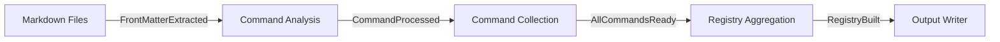

# Domain Boundary Update Proposal for Two-Stage Processing

## Current vs Required Architecture

### Current Single-Stage Flow

```
Markdown → FrontMatter → Schema Analysis → Template Mapping → Output
```

### Required Two-Stage Flow (from requirements.ja.md)

```
Stage 1: Markdown → FrontMatter → Command Schema → Command Template → Commands[]
Stage 2: Commands[] → Registry Schema → Registry Template → Registry Output
```

## Proposed Domain Updates

### 1. Split TypeScript Analysis Domain

#### Current

- **TypeScript解析ドメイン**: Single analysis process

#### Proposed

- **Command Analysis Domain**: Stage 1 - Individual document processing
- **Registry Aggregation Domain**: Stage 2 - Command aggregation and registry
  creation

### 2. New Domain Boundaries

#### CD1: FrontMatter Extraction Domain (No Change)

- Responsibility: Extract frontmatter from markdown
- Input: Markdown file
- Output: FrontMatter data with c1/c2/c3 fields

#### CD2: Command Analysis Domain (NEW - Stage 1)

- Responsibility: Transform frontmatter to command structure
- Input: FrontMatter + Command Schema
- Output: Command object with c1/c2/c3/options
- Key Operations:
  - Extract c1/c2/c3 from frontmatter
  - Apply command schema validation
  - Map to command template structure

#### CD3: Registry Aggregation Domain (NEW - Stage 2)

- Responsibility: Aggregate commands into registry
- Input: Command[] + Registry Schema
- Output: Registry with availableConfigs and commands
- Key Operations:
  - Extract unique c1 values for availableConfigs
  - Sort and organize commands
  - Apply registry schema validation
  - Map to registry template structure

#### CD4: Schema Management Domain (Updated)

- Add support for multi-stage schemas:
  - Command-level schemas (stage 1)
  - Registry-level schemas (stage 2)
  - Schema composition and inheritance

#### CD5: Template Management Domain (Updated)

- Add support for multi-stage templates:
  - Command templates with field substitution
  - Registry templates with aggregation rules
  - Placeholder resolution (`{c1}`, `{options.input}`)

### 3. New Aggregate Roots

```typescript
// Stage 1 Aggregate
class CommandProcessor {
  processDocument(
    frontMatter: FrontMatter,
    commandSchema: Schema,
    commandTemplate: Template,
  ): Result<Command>;
}

// Stage 2 Aggregate
class RegistryBuilder {
  buildRegistry(
    commands: Command[],
    registrySchema: Schema,
    registryTemplate: Template,
  ): Result<Registry>;

  extractAvailableConfigs(commands: Command[]): string[];
}
```

### 4. Event Flow Updates



### 5. Value Objects Updates

```typescript
// New value objects for two-stage processing
class CommandCategory {
  constructor(
    public readonly c1: string,
    public readonly c2: string,
    public readonly c3: string,
  ) {}
}

class AvailableConfigs {
  constructor(
    private readonly configs: string[],
  ) {}

  static fromCommands(commands: Command[]): AvailableConfigs {
    const unique = [...new Set(commands.map((cmd) => cmd.c1))];
    return new AvailableConfigs(unique.sort());
  }
}
```

### 6. Repository Interface Updates

```typescript
interface CommandRepository {
  saveIntermediate(commands: Command[]): Promise<Result<void>>;
  loadIntermediate(): Promise<Result<Command[]>>;
}

interface RegistryRepository {
  save(registry: Registry, path: OutputPath): Promise<Result<void>>;
}
```

## Implementation Priority

1. **Phase 1**: Fix c1/c2/c3 extraction in TypeScriptAnalyzer
2. **Phase 2**: Implement template placeholder substitution
3. **Phase 3**: Create two-stage processing pipeline
4. **Phase 4**: Add registry aggregation logic
5. **Phase 5**: Update domain documentation

## Backward Compatibility

- Maintain single-stage processing for non-registry use cases
- Add `--processing-mode` flag: `single-stage` | `two-stage`
- Default to single-stage for existing workflows

## Testing Strategy

### Unit Tests

- Command extraction with c1/c2/c3
- Template placeholder substitution
- Registry aggregation logic

### Integration Tests

- Two-stage pipeline end-to-end
- Schema validation at each stage
- Template mapping accuracy

### E2E Tests

```bash
# Test two-stage processing
./frontmatter-to-schema .agent/test-climpt/prompts \
  --mode=two-stage \
  --command-schema=registry_command_schema.json \
  --command-template=registry_command_template.json \
  --registry-schema=registry_schema.json \
  --registry-template=registry_template.json \
  --output=registry.json
```
