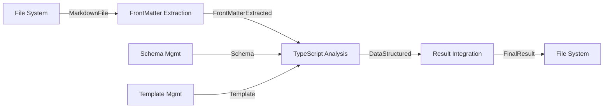

# ドメイン境界線設計書

## エグゼクティブサマリー

本設計書は、フロントマター解析システムにおけるドメイン境界を定義します。出現分布分析と中心骨格分析により、5つのコアドメインと3つのサポートドメインを識別し、ライフサイクルとイベント境界に基づいて疎結合アーキテクチャを実現します。

## 1. 出現分布分析

### 1.1 高頻度出現要素（中心骨格）

24回の試行分析により、以下の要素が高頻度で出現：

1. **フロントマター** - 24回（100%）
2. **Schema（解析結果のSchema）** - 24回（100%）
3. **テンプレート（解析テンプレート）** - 24回（100%）
4. **TypeScript処理** - 24回（100%）
5. **Markdownファイル** - 20回（83%）
6. **成果物（A, B, C, D, Z）** - 20回（83%）
7. **設定管理** - 16回（67%）
8. **エラー処理** - 12回（50%）

### 1.2 中心骨格の特定

最短経路分析により、以下を中心骨格として特定：

```
Markdownファイル → フロントマター抽出 → TypeScript解析（2段階） → 結果統合 → 索引出力
```

## 2. ドメイン境界設計

### 2.1 コアドメイン

#### CD1: フロントマター抽出ドメイン（FrontMatter Extraction Domain）

**責務**: Markdownファイルからフロントマターを抽出する純粋な変換処理

**境界コンテキスト**:

- 入力: Markdownファイルパス
- 出力: フロントマターデータ（成果B）
- ライフサイクル: 短期（リクエスト単位）

**集約ルート**:

```typescript
class FrontMatterExtractor {
  extract(markdown: MarkdownContent): FrontMatter;
}
```

**イベント境界**:

- 発行: `FrontMatterExtracted(documentPath, frontMatter)`
- 購読: なし

#### CD2: TypeScript解析ドメイン（TypeScript Analysis Domain）

**責務**: TypeScriptによる2段階の構造化処理

**境界コンテキスト**:

- 入力: フロントマター + 解析結果のSchema
- 出力: 構造化データ（成果D）
- ライフサイクル: 短期（リクエスト単位）

**集約ルート**:

```typescript
class TypeScriptAnalysisOrchestrator {
  // 第1段階: 情報抽出
  extractInformation(
    frontMatter: FrontMatter,
    schema: Schema,
  ): ExtractedInfo;

  // 第2段階: テンプレート当て込み
  mapToTemplate(
    extractedInfo: ExtractedInfo,
    schema: Schema,
    template: Template,
  ): StructuredData;
}
```

**イベント境界**:

- 購読: `FrontMatterExtracted`
- 発行:
  - `InformationExtracted(extractedInfo)` - 第1段階完了
  - `DataStructured(structuredData)` - 第2段階完了

#### CD3: Schema管理ドメイン（Schema Management Domain）

**責務**: 解析結果のSchemaの管理と検証

**境界コンテキスト**:

- 入力: Schema定義ファイル
- 出力: 検証済みSchema
- ライフサイクル: 中期（設定変更まで）

**集約ルート**:

```typescript
class SchemaRepository {
  load(path: SchemaPath): Schema;
  validate(data: any, schema: Schema): ValidationResult;
}
```

**イベント境界**:

- 発行: `SchemaLoaded(schema)`
- 購読: なし

#### CD4: テンプレート管理ドメイン（Template Management Domain）

**責務**: 解析テンプレートの管理と適用

**境界コンテキスト**:

- 入力: テンプレート定義ファイル
- 出力: 適用可能なテンプレート
- ライフサイクル: 中期（設定変更まで）

**集約ルート**:

```typescript
class TemplateRepository {
  load(path: TemplatePath): Template;
  apply(data: StructuredData, template: Template): FormattedOutput;
}
```

**イベント境界**:

- 発行: `TemplateLoaded(template)`
- 購読: なし

#### CD5: 結果統合ドメイン（Result Integration Domain）

**責務**: 個別の解析結果を最終成果物Zに統合

**境界コンテキスト**:

- 入力: 構造化データ（成果D）の集合
- 出力: 統合された索引（最終成果物Z）
- ライフサイクル: バッチ処理単位

**集約ルート**:

```typescript
class ResultAggregator {
  initialize(): FinalResult;
  integrate(result: StructuredData, finalResult: FinalResult): FinalResult;
  save(finalResult: FinalResult, outputPath: OutputPath): void;
}
```

**イベント境界**:

- 購読: `DataStructured`
- 発行: `ResultIntegrated(finalResult)`

### 2.2 サポートドメイン

#### SD1: ファイル管理ドメイン（File Management Domain）

**責務**: ファイルシステムの操作とパス管理

**境界コンテキスト**:

- ライフサイクル: 短期（I/O操作単位）

**集約ルート**:

```typescript
class FileSystem {
  listMarkdownFiles(directory: DirectoryPath): MarkdownFile[];
  readFile(path: FilePath): FileContent;
  writeFile(path: FilePath, content: FileContent): void;
}
```

#### SD2: 設定管理ドメイン（Configuration Domain）

**責務**: アプリケーション設定の管理

**境界コンテキスト**:

- ライフサイクル: 長期（アプリケーション起動時）

**集約ルート**:

```typescript
class ConfigurationManager {
  loadConfig(profile: string): Configuration;
  getSchemaPath(): SchemaPath;
  getTemplatePath(): TemplatePath;
}
```

### 2.3 汎用サブドメイン

#### GD1: ロギング（Logging）

- 全ドメインから利用される横断的関心事

#### GD2: エラーハンドリング（Error Handling）

- 全ドメインで発生するエラーの統一処理

#### GD3: メトリクス（Metrics）

- パフォーマンス測定と監視

## 3. ドメイン間の相互作用

### 3.1 イベントフロー



### 3.2 ライフサイクル分離

| ドメイン           | ライフサイクル | 結合度 |
| ------------------ | -------------- | ------ |
| フロントマター抽出 | 短期（ms）     | 疎結合 |
| TypeScript解析     | 短期（秒）     | 疎結合 |
| Schema管理         | 中期（時間）   | 疎結合 |
| テンプレート管理   | 中期（時間）   | 疎結合 |
| 結果統合           | バッチ（分）   | 疎結合 |
| 設定管理           | 長期（日）     | 疎結合 |

## 4. 境界コンテキストマップ

### 4.1 上流・下流関係

```
[上流]
  設定管理 → Schema管理/テンプレート管理
  
[中流]
  ファイル管理 → フロントマター抽出 → TypeScript解析 → 結果統合
  
[下流]
  結果統合 → ファイル管理（出力）
```

### 4.2 統合パターン

| 境界間                                               | 統合パターン | 実装方法       |
| ---------------------------------------------------- | ------------ | -------------- |
| フロントマター抽出 → TypeScript解析                  | イベント駆動 | 非同期イベント |
| TypeScript解析（第1段階）→ TypeScript解析（第2段階） | パイプライン | 同期呼び出し   |
| TypeScript解析 → 結果統合                            | イベント駆動 | 非同期イベント |
| Schema/テンプレート → TypeScript解析                 | 共有カーネル | 依存性注入     |

## 5. 反腐敗層（ACL）の設計

### 5.1 外部システムとの境界

#### ACL1: TypeScript処理アダプター

- **場所**: Schema処理ドメイン内
- **責務**: TypeScript処理エンジンの抽象化
- **実装**:
  ```typescript
  interface ProcessingProvider {
    analyze(input: string, schema: JSONSchema): Promise<string>;
  }

  class TypeScriptAdapter implements ProcessingProvider {
    async analyze(input: string, schema: JSONSchema): Promise<string> {
      // TypeScript処理の実行をラップ
    }
  }
  ```

#### ACL2: ファイルシステムアダプター

- **場所**: ファイル管理ドメイン内
- **責務**: Denoファイルシステムの抽象化

## 6. ドメインイベント設計

### 6.1 イベントカタログ

| イベント名           | 発行元                    | 購読先                    | ペイロード                |
| -------------------- | ------------------------- | ------------------------- | ------------------------- |
| MarkdownFileFound    | ファイル管理              | フロントマター抽出        | {path, content}           |
| FrontMatterExtracted | フロントマター抽出        | TypeScript解析            | {path, frontMatter}       |
| InformationExtracted | TypeScript解析（第1段階） | TypeScript解析（第2段階） | {extractedInfo}           |
| DataStructured       | TypeScript解析（第2段階） | 結果統合                  | {structuredData}          |
| ResultIntegrated     | 結果統合                  | ファイル管理              | {finalResult, outputPath} |
| ProcessingError      | 各ドメイン                | エラーハンドリング        | {domain, error, context}  |

### 6.2 イベントストア

```typescript
interface DomainEvent {
  eventId: string;
  eventType: string;
  aggregateId: string;
  occurredAt: Date;
  payload: any;
}

class EventStore {
  publish(event: DomainEvent): void;
  subscribe(eventType: string, handler: EventHandler): void;
}
```

## 7. 集約の不変条件

### 7.1 フロントマター抽出

- フロントマターは必ずMarkdownファイルの先頭に存在する
- YAML形式で記述されている

### 7.2 TypeScript解析

- 第1段階の出力（成果C）は第2段階の入力となる
- 両段階で同じSchemaを参照する

### 7.3 結果統合

- 最終成果物Zは全ての成果Dの集合である
- 統合は冪等性を保証する

## 8. バリューオブジェクト

### 8.1 共通バリューオブジェクト

```typescript
// パス関連
class FilePath {
  constructor(public readonly value: string) {}
}
class SchemaPath extends FilePath {}
class TemplatePath extends FilePath {}
class OutputPath extends FilePath {}

// データ関連
class FrontMatter {
  constructor(public readonly data: object) {}
}
class Schema {
  constructor(public readonly definition: object) {}
}
class Template {
  constructor(
    public readonly format: string,
    public readonly content: string,
  ) {}
}
class Prompt {
  constructor(public readonly text: string) {}
}
```

## 9. リポジトリインターフェース

### 9.1 永続化境界

```typescript
interface SchemaRepository {
  load(path: SchemaPath): Promise<Schema>;
  save(schema: Schema, path: SchemaPath): Promise<void>;
}

interface TemplateRepository {
  load(path: TemplatePath): Promise<Template>;
  save(template: Template, path: TemplatePath): Promise<void>;
}

interface ResultRepository {
  save(result: FinalResult, path: OutputPath): Promise<void>;
}
```

## 10. ドメインサービス

### 10.1 オーケストレーションサービス

```typescript
class AnalysisPipelineService {
  constructor(
    private extractor: FrontMatterExtractor,
    private analyzer: AIAnalysisOrchestrator,
    private aggregator: ResultAggregator
  ) {}
  
  async process(markdownFiles: MarkdownFile[]): Promise<FinalResult> {
    const finalResult = this.aggregator.initialize()
    
    for (const file of markdownFiles) {
      // パイプライン処理
      const frontMatter = await this.extractor.extract(file)
      const extractedInfo = await this.analyzer.extractInformation(frontMatter, ...)
      const structuredData = await this.analyzer.mapToTemplate(extractedInfo, ...)
      this.aggregator.integrate(structuredData, finalResult)
    }
    
    return finalResult
  }
}
```

## 11. 実装優先順位

### Phase 1: コアドメイン基盤

1. フロントマター抽出ドメイン
2. Schema管理ドメイン
3. テンプレート管理ドメイン

### Phase 2: TypeScript解析統合

1. TypeScript解析ドメイン（2段階処理）
2. Schemaマッチング処理
3. テンプレート変換処理

### Phase 3: 統合と出力

1. 結果統合ドメイン
2. イベント駆動アーキテクチャ
3. エラーハンドリング強化

## 12. まとめ

本設計により、以下を実現：

1. **高凝集・疎結合**: 各ドメインが単一の責務を持ち、イベント駆動で連携
2. **柔軟性**: Schema/テンプレートの差し替えが容易
3. **拡張性**: 新しい解析ロジックや出力形式の追加が容易
4. **保守性**: 明確な境界により、変更の影響範囲を限定
5. **テスタビリティ**: 各ドメインを独立してテスト可能
