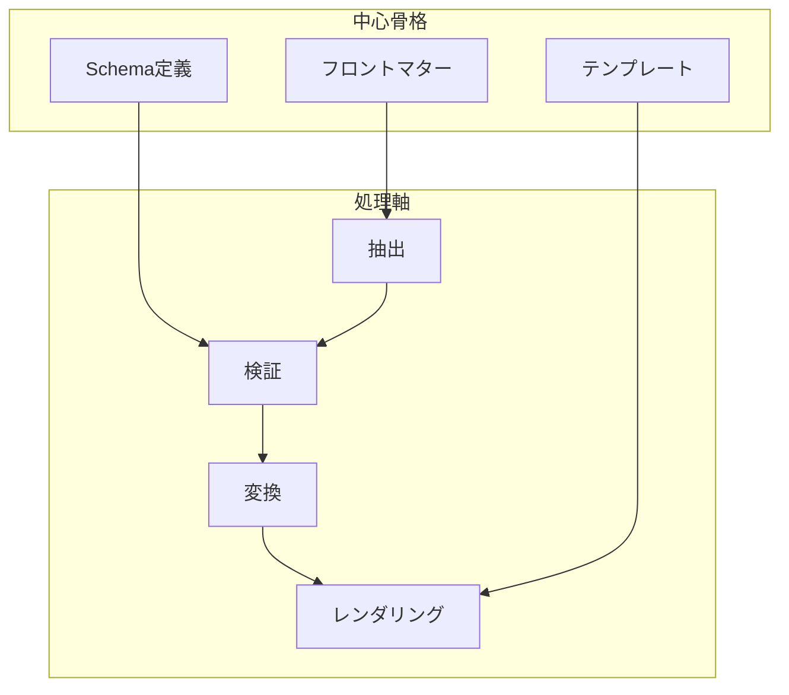
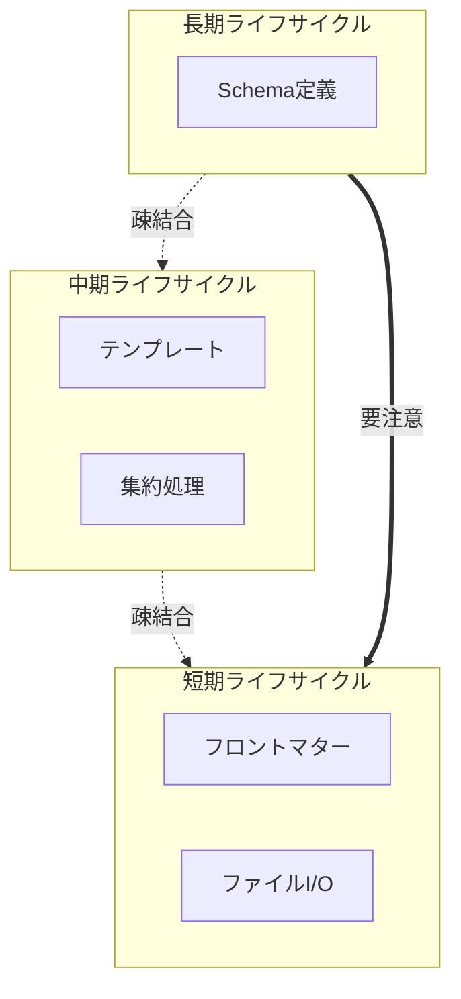

# ドメイン境界設計書

## 概要

本書は、Markdown
FrontMatterからSchemaベースでの構造化データ変換システムにおけるドメイン境界を定義する。
要求事項とアーキテクチャに基づき、DDD原則に従った境界づけられたコンテキストを明確化する。

## ドメイン分析結果

### 出現分布分析

システムの24パターンの試行から、以下の要素が高頻度で出現：

1. **Schema処理** (24/24回) - 全パターンで必須
2. **フロントマター抽出** (24/24回) - 全パターンで必須
3. **テンプレート適用** (24/24回) - 全パターンで必須
4. **ファイル探索** (24/24回) - 全パターンで必須
5. **集約処理** (18/24回) - 大規模処理で頻出
6. **$ref解決** (16/24回) - 複雑なSchemaで頻出
7. **並列処理** (12/24回) - パフォーマンス要求時

### 中心骨格の特定



## 境界づけられたコンテキスト

### 1. Schema管理コンテキスト

**責務**: Schema定義の管理、$ref解決、検証ルール提供、拡張ディレクティブの管理

```typescript
// 境界定義
interface SchemaContext {
  // 集約ルート
  class SchemaRepository {
    load(path: SchemaPath): Result<Schema, SchemaError>
    resolve(schema: Schema): Result<ResolvedSchema, ResolutionError>
    extractRules(schema: ResolvedSchema): ValidationRules
  }

  // エンティティ
  class Schema {
    getExtractFromDirectives(): Result<ExtractFromDirective[], SchemaError>
    hasExtractFromDirectives(): boolean
    getDerivedFromRules(): DerivedFromRule[]
    hasFrontmatterPart(path: string): boolean
  }

  // 値オブジェクト
  class SchemaPath { private constructor(value: string) }
  class ValidationRules { private constructor(rules: Rule[]) }
  class ExtractFromDirective {
    private constructor(
      targetPath: string,
      sourcePath: string,
      targetPropertyPath: PropertyPath,
      sourcePropertyPath: PropertyPath,
    )
    static create(props: ExtractFromDirectiveProps): Result<ExtractFromDirective, DomainError>
    hasSourceArrayExpansion(): boolean
    getSourceSegments(): readonly string[]
  }

  // ドメインサービス
  class RefResolver {
    resolveRecursive(schema: Schema): Result<ResolvedSchema, Error>
  }
  class DirectiveProcessor {
    processExtractFrom(data: any, directives: ExtractFromDirective[]): Result<any, ProcessingError>
  }
}
```

**ライフサイクル**: 長期（アプリケーション起動時に読込、キャッシュ保持）

**拡張ディレクティブの責務**:

- `x-extract-from`: ネストしたデータ構造からの値抽出（Stage 2で処理）
- `x-derived-from`: 集約処理での派生フィールド生成（Stage 4で処理）
- `x-frontmatter-part`: フロントマター配列処理の指定（Stage 1で処理）
- `x-template`: テンプレートファイルの指定

### 2. フロントマター処理コンテキスト

**責務**: Markdownファイルからのフロントマター抽出と解析

```typescript
// 境界定義
interface FrontmatterContext {
  // 集約ルート
  class FrontmatterProcessor {
    extract(markdown: string): Result<RawFrontmatter, ExtractError>
    parse(raw: RawFrontmatter): Result<ParsedData, ParseError>
  }
  
  // エンティティ
  class MarkdownDocument {
    readonly path: FilePath
    readonly content: string
    readonly frontmatter?: FrontmatterData
  }
  
  // 値オブジェクト
  class FrontmatterData {
    private constructor(readonly data: Record<string, unknown>)
  }
}
```

**ライフサイクル**: 短期（ファイル処理ごとに生成・破棄）

### 3. テンプレート管理コンテキスト

**責務**: テンプレート定義の管理と変数置換処理

```typescript
// 境界定義
interface TemplateContext {
  // 集約ルート
  class TemplateRepository {
    load(path: TemplatePath): Result<Template, TemplateError>
    resolveVariables(template: Template): VariableMap
  }
  
  // エンティティ
  class Template {
    readonly content: string
    readonly variables: Variable[]
    readonly format: OutputFormat
  }
  
  // ドメインサービス
  class TemplateRenderer {
    render(template: Template, data: ValidatedData): Result<Output, RenderError>
  }
}
```

**ライフサイクル**: 中期（Schema単位でキャッシュ）

### 4. ファイル管理コンテキスト

**責務**: ファイルシステムへのアクセスと入出力管理

```typescript
// 境界定義
interface FileContext {
  // 集約ルート
  class FileRepository {
    scan(pattern: InputPattern): Result<FilePath[], ScanError>
    read(path: FilePath): Result<FileContent, ReadError>
    write(path: OutputPath, content: string): Result<void, WriteError>
  }
  
  // 値オブジェクト
  class FilePath { private constructor(value: string) }
  class InputPattern { toGlob(): string }
  class OutputPath { getFormat(): OutputFormat }
}
```

**ライフサイクル**: 短期（I/O操作ごと）

### 5. 集約処理コンテキスト

**責務**: 複数の処理結果の集約と派生フィールド生成

```typescript
// 境界定義
interface AggregationContext {
  // 集約ルート
  class Aggregator {
    aggregate(items: ValidatedData[]): AggregatedResult
    deriveFields(data: AggregatedResult, rules: DerivationRule[]): EnrichedResult
  }
  
  // 値オブジェクト
  class DerivationRule {
    readonly sourceExpression: string  // "commands[].c1"
    readonly targetField: string
    readonly unique: boolean
  }
  
  // ドメインサービス
  class ExpressionEvaluator {
    evaluate(data: any, expression: string): any[]
  }
}
```

**ライフサイクル**: 中期（バッチ処理単位）

## コンテキストマップ

```mermaid
graph LR
    subgraph UI["UIレイヤー"]
        CLI[CLI Interface]
    end
    
    subgraph Application["アプリケーションレイヤー"]
        UC[Use Cases]
        Coord[Process Coordinator]
    end
    
    subgraph Domain["ドメインレイヤー"]
        SC[Schema Context]
        FC[Frontmatter Context]
        TC[Template Context]
        AC[Aggregation Context]
    end
    
    subgraph Infra["インフラレイヤー"]
        FS[File System Context]
    end
    
    CLI --> UC
    UC --> Coord
    
    Coord --> SC
    Coord --> FC
    Coord --> TC
    Coord --> AC
    
    SC --> FS
    FC --> FS
    TC --> FS
    
    SC -.->|ValidationRules| FC
    FC -.->|ValidatedData| TC
    FC -.->|ValidatedData[]| AC
    AC -.->|EnrichedResult| TC
```

## 境界間の相互作用

### 1. Schema → Frontmatter

**インターフェース**: ValidationRules **イベント**: SchemaLoadedEvent →
ValidationRulesAvailable

```typescript
interface SchemaToFrontmatter {
  // Schema Context が公開
  getValidationRules(schemaId: SchemaId): ValidationRules;

  // Frontmatter Context が使用
  validate(
    data: ParsedData,
    rules: ValidationRules,
  ): Result<ValidatedData, ValidationError>;
}
```

### 2. Frontmatter → Template

**インターフェース**: ValidatedData **イベント**: DataValidatedEvent →
ReadyForRendering

```typescript
interface FrontmatterToTemplate {
  // Frontmatter Context が公開
  getValidatedData(documentId: DocumentId): ValidatedData;

  // Template Context が使用
  applyTemplate(data: ValidatedData, template: Template): RenderedContent;
}
```

### 3. Frontmatter → Aggregation

**インターフェース**: ValidatedData[] **イベント**: AllDataProcessedEvent →
ReadyForAggregation

```typescript
interface FrontmatterToAggregation {
  // Frontmatter Context が公開
  getAllValidatedData(): ValidatedData[];

  // Aggregation Context が使用
  aggregateData(
    items: ValidatedData[],
    rules: AggregationRule[],
  ): AggregatedResult;
}
```

### 4. Aggregation → Template

**インターフェース**: EnrichedResult **イベント**: AggregationCompleteEvent →
FinalRenderingReady

```typescript
interface AggregationToTemplate {
  // Aggregation Context が公開
  getEnrichedResult(): EnrichedResult;

  // Template Context が使用
  renderFinal(result: EnrichedResult, template: Template): FinalOutput;
}
```

## 複雑性の管理

### 距離判定マトリックス

| コンテキスト    | Schema | Frontmatter | Template | File | Aggregation |
| --------------- | ------ | ----------- | -------- | ---- | ----------- |
| **Schema**      | 0      | 1           | 2        | 1    | 3           |
| **Frontmatter** | 1      | 0           | 1        | 1    | 2           |
| **Template**    | 2      | 1           | 0        | 2    | 1           |
| **File**        | 1      | 1           | 2        | 0    | 3           |
| **Aggregation** | 3      | 2           | 1        | 3    | 0           |

**距離の意味**:

- 0: 同一コンテキスト
- 1: 直接依存関係
- 2: 間接依存関係
- 3: 独立関係

### ライフサイクル整合性



## 境界設計の原則

### 1. 単一責任原則

各コンテキストは明確な単一の責務を持つ

### 2. 疎結合原則

ライフサイクルの異なるコンテキスト間は疎結合を保つ

### 3. イベント駆動原則

コンテキスト間の協調はイベントベースで行う

### 4. 不変性原則

境界を跨ぐデータは不変オブジェクトとして扱う

### 5. 全域性原則

各コンテキストのインターフェースはResult型で全域関数化

## 実装への影響

### ディレクトリ構造

```
src/
├── domain/
│   ├── schema/
│   │   ├── entities/
│   │   ├── repositories/
│   │   ├── services/
│   │   └── value-objects/
│   ├── frontmatter/
│   │   ├── entities/
│   │   ├── processors/
│   │   └── value-objects/
│   ├── template/
│   │   ├── entities/
│   │   ├── renderers/
│   │   └── value-objects/
│   ├── aggregation/
│   │   ├── aggregators/
│   │   ├── rules/
│   │   └── services/
│   └── shared/
│       ├── events/
│       └── types/
├── application/
│   ├── use-cases/
│   └── coordinators/
├── infrastructure/
│   ├── file-system/
│   └── adapters/
└── presentation/
    └── cli/
```

### インターフェース定義

```typescript
// 境界を跨ぐ共通インターフェース
interface BoundaryInterface<T, E> {
  execute(input: T): Result<E, DomainError>;
}

// イベント定義
interface DomainEvent {
  readonly aggregateId: string;
  readonly occurredAt: Date;
  readonly eventType: string;
  readonly payload: unknown;
}

// コンテキスト間通信
interface ContextPort<T> {
  publish(event: DomainEvent): void;
  subscribe(handler: (event: DomainEvent) => void): void;
  query(id: string): Result<T, QueryError>;
}
```

## まとめ

本設計により、以下を実現：

1. **明確な責務分離**: 各コンテキストが独立して進化可能
2. **複雑性の局所化**: 複雑な処理を適切なコンテキストに封じ込め
3. **テスタビリティ**: 各コンテキストを独立してテスト可能
4. **拡張性**: 新機能追加時の影響範囲を限定
5. **保守性**: 変更の波及を最小化

これらの境界設計により、要求事項を満たしつつ、将来の変更にも柔軟に対応できるシステムアーキテクチャを実現する。
