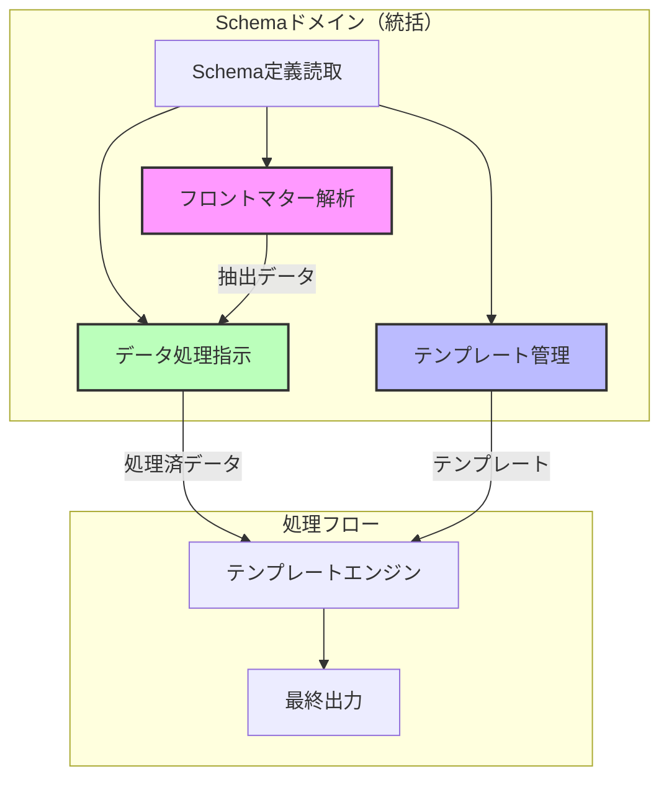

# ドメイン境界設計書

## 概要

本書は、多様なMarkdownファイルのフロントマターから統一的な索引を生成するシステムのドメイン境界を定義する。
requirements.ja.mdおよびflow.ja.mdに基づき、3つの独立したドメインとその責務を明確化する。

## 基本原則

### ドメイン分離の原則

1. **独立性**: 各ドメインは他のドメインの実装詳細に依存しない
2. **隠蔽性**: フロントマター解析結果への直接アクセスは禁止
3. **宣言性**: すべての処理は宣言的なディレクティブで制御

## 境界づけられたコンテキスト

### 1. フロントマター解析ドメイン

**責務**: Markdownファイルからフロントマターデータを抽出する

**境界定義**:

```typescript
interface FrontmatterDomain {
  // 集約ルート
  class FrontmatterExtractor {
    // ファイル一覧を受け取り処理
    extractFromFiles(files: MarkdownFile[]): Result<ExtractedData[], ExtractError>
    // 個別ファイルの処理
    extractFromFile(file: MarkdownFile): Result<ExtractedData, ExtractError>
  }

  // エンティティ
  class ExtractedData {
    readonly filePath: string
    readonly rawData: Record<string, unknown>
    readonly metadata: ExtractionMetadata

    // x-frontmatter-part指定階層の取得
    getFrontmatterPart(path: string): unknown
    hasFrontmatterPart(path: string): boolean
  }

  // 値オブジェクト
  class MarkdownFile {
    private constructor(
      readonly path: string,
      readonly content: string
    )
  }

  class ExtractionMetadata {
    readonly extractedAt: Date
    readonly hasErrors: boolean
    readonly warnings: string[]
  }
}
```

**重要な特性**:

- Markdownファイル処理は、このドメインのみの責務
- `x-frontmatter-part`指定階層の処理起点を管理
- 外部からの直接アクセスは許可しない
- データ処理指示ドメインへのみデータを提供

### 2. テンプレート管理ドメイン

**責務**: 出力テンプレートの管理と提供

**境界定義**:

```typescript
interface TemplateDomain {
  // 集約ルート
  class TemplateManager {
    // テンプレートファイルの管理
    loadTemplate(directive: TemplateDirective): Result<Template, TemplateError>
    // テンプレート情報の提供
    getTemplateInfo(): TemplateInfo
  }

  // エンティティ
  class Template {
    readonly content: string
    readonly format: OutputFormat
    readonly variables: TemplateVariable[]

    // テンプレート変数の解析
    extractVariables(): TemplateVariable[]
    hasItemsPlaceholder(): boolean
  }

  // 値オブジェクト
  class TemplateDirective {
    readonly mainTemplate?: string      // x-template
    readonly itemsTemplate?: string     // x-template-items
    readonly format?: string            // x-template-format
  }

  class TemplateVariable {
    readonly path: string               // e.g., "id.full"
    readonly isArray: boolean          // {@items} の場合
  }

  // ドメインサービス
  class TemplateResolver {
    // 変数パスの解決（起点の判定）
    resolveVariableOrigin(
      variable: TemplateVariable,
      isItemsContext: boolean
    ): VariableOrigin
  }
}
```

**重要な特性**:

- テンプレートファイルの管理のみを責務とする
- 変数の置換処理は行わない（テンプレートエンジンの責務）
- `x-template`、`x-template-items`、`x-template-format`を管理

### 3. データ処理指示ドメイン

**責務**: フロントマターデータの加工と提供

**境界定義**:

```typescript
interface DataProcessingDomain {
  // 集約ルート
  class DataProcessor {
    // フロントマター解析結果を受け取る
    initialize(extractedData: ExtractedData[]): void

    // x-ディレクティブに基づく処理済みデータの提供
    processWithDirectives(
      path: string,
      directives: ProcessingDirective[]
    ): Result<ProcessedData, ProcessingError>

    // Schema階層の要求に応じたデータ返却
    getDataForPath(schemaPath: string): Result<unknown, DataError>
  }

  // エンティティ
  class ProcessedData {
    readonly originalPath: string
    readonly processedValue: unknown
    readonly appliedDirectives: string[]
  }

  // 値オブジェクト
  class ProcessingDirective {
    readonly type: DirectiveType
    readonly parameters: DirectiveParameters
  }

  enum DirectiveType {
    FLATTEN_ARRAYS = 'x-flatten-arrays',
    DERIVED_FROM = 'x-derived-from',
    DERIVED_UNIQUE = 'x-derived-unique',
    JMESPATH_FILTER = 'x-jmespath-filter'
  }

  // ドメインサービス
  class DirectiveProcessor {
    // 配列フラット化
    processFlattenArrays(
      data: unknown,
      targetProperty: string
    ): Result<unknown[], ProcessingError>

    // 値の集約
    processDerivedFrom(
      data: unknown[],
      sourcePath: string
    ): Result<unknown[], ProcessingError>

    // 重複除去
    processDerivedUnique(
      data: unknown[]
    ): Result<unknown[], ProcessingError>

    // JMESPathフィルタリング
    processJmespathFilter(
      data: unknown,
      expression: string
    ): Result<unknown, ProcessingError>
  }
}
```

**重要な特性**:

- フロントマター解析ドメインへの直接アクセスを隠蔽
- すべてのデータアクセスを仲介
- x-ディレクティブ処理済みデータのみを提供
- call_method(schema_entity)パターンでデータを返却

## コンテキストマップ



## ドメイン間の相互作用

### データフローの原則

1. **単方向フロー**: フロントマター解析 → データ処理指示 → テンプレートエンジン
2. **隠蔽アクセス**: データ処理指示ドメインがすべてのデータアクセスを仲介
3. **遅延評価**: `{@items}`は全ファイル処理完了後に確定

### インターフェース定義

```typescript
// フロントマター解析 → データ処理指示
interface FrontmatterToDataProcessing {
  // フロントマター解析ドメインが提供
  getExtractedData(): ExtractedData[];

  // データ処理指示ドメインが利用
  receiveExtractedData(data: ExtractedData[]): void;
}

// データ処理指示 → テンプレートエンジン
interface DataProcessingToTemplate {
  // データ処理指示ドメインが提供
  getProcessedData(path: string): Result<unknown, DataError>;

  // テンプレートエンジンが利用
  resolveVariable(variablePath: string): Result<unknown, ResolutionError>;
}

// テンプレート管理 → テンプレートエンジン
interface TemplateToEngine {
  // テンプレート管理ドメインが提供
  getTemplate(type: "main" | "items"): Result<Template, TemplateError>;

  // テンプレートエンジンが利用
  renderTemplate(
    template: Template,
    data: unknown,
  ): Result<string, RenderError>;
}
```

## 処理タイミングと責務

### フェーズ1: 個別ファイル処理

**責務ドメイン**: フロントマター解析ドメイン

1. 各Markdownファイルからフロントマター抽出
2. デフォルトで構造を保持
3. `x-frontmatter-part`指定階層の識別

### フェーズ2: 統合処理

**責務ドメイン**: データ処理指示ドメイン

1. 全ファイル処理完了後の統合
2. `x-flatten-arrays`による配列フラット化（指定時のみ）
3. `x-derived-from`による値の集約
4. `x-derived-unique`による重複除去
5. `x-jmespath-filter`によるフィルタリング

### フェーズ3: テンプレート展開

**責務ドメイン**: テンプレートエンジン（アプリケーション層）

1. テンプレート管理ドメインからテンプレート取得
2. データ処理指示ドメインから処理済みデータ取得
3. `{@items}`の展開
4. 変数の置換
5. 最終出力の生成

## 実装への影響

### ディレクトリ構造

```
src/
├── domain/
│   ├── frontmatter/           # フロントマター解析ドメイン
│   │   ├── extractors/
│   │   ├── entities/
│   │   └── value-objects/
│   ├── template/              # テンプレート管理ドメイン
│   │   ├── managers/
│   │   ├── entities/
│   │   └── value-objects/
│   ├── data-processing/       # データ処理指示ドメイン
│   │   ├── processors/
│   │   ├── directives/
│   │   └── services/
│   └── shared/
│       ├── types/
│       └── errors/
├── application/
│   ├── template-engine/      # テンプレートエンジン
│   ├── coordinators/
│   └── use-cases/
└── infrastructure/
    ├── file-system/
    └── adapters/
```

## 設計の利点

1. **明確な責務分離**: 各ドメインが独立して進化可能
2. **データアクセスの制御**: 隠蔽原則により一貫性を保証
3. **宣言的な処理**: x-ディレクティブによる処理の自動化
4. **テスタビリティ**: 各ドメインを独立してテスト可能
5. **拡張性**: 新しいディレクティブの追加が容易

## まとめ

本設計により、requirements.ja.mdとflow.ja.mdで定義された要求を満たす、明確に分離された3つのドメインを実現する。
各ドメインは独立性を保ちながら、データ処理指示ドメインを中心とした制御されたデータフローを構築する。
これにより、多様なフロントマター構造に対応しつつ、統一的な索引生成を可能にする。
