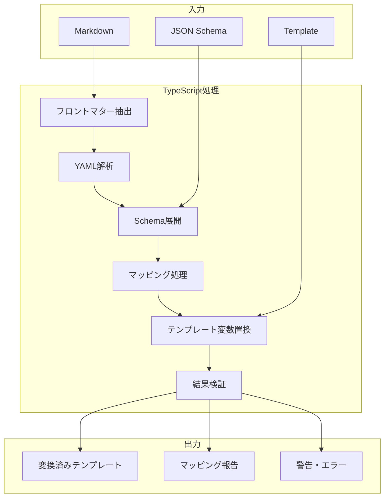

# TypeScriptによるテンプレート変数埋め込み

TypeScriptで段階的にテンプレート変換処理を行う。確実で予測可能な変換処理を実装する。

## TypeScript処理の利点

- 決定論的な結果
- ステップバイステップのデバッグ可能性
- 型安全性によるエラー防止
- 高速な処理

# TypeScriptでのテンプレート変換フロー

```typescript
// 1. フロントマター解析
const frontMatter = extractFrontMatter(markdown);
const parsedData = parseYAML(frontMatter);

// 2. Schema展開とマッピング
const schemaMapping = mapToSchema(parsedData, jsonSchema);

// 3. テンプレート変数置換
const result = applyTemplate(template, schemaMapping);
```

## 段階的処理による確実性



変換結果は検証済みで、統合処理にそのまま利用可能。
