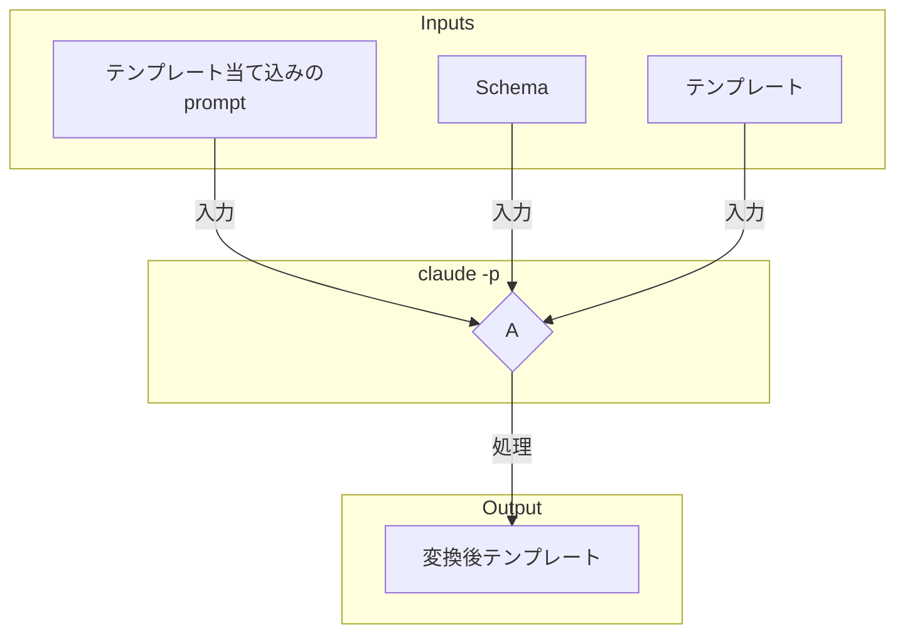

# テンプレートへの変数埋め込み

TypeScriptでテンプレートを解析する必要はない。 `Claude Code SDK`
へ、テンプレート当て込みプロンプトと一緒に、テンプレートを渡し、返却結果を受け取るだけである。

NG：TypeScriptでの当て込み OK： `Claude Code SDK` での変換結果を受け取るだけ

# テンプレートへの当て込みのプロンプト

プロンプトは、「Schemaで解釈されたデータ」と「テンプレート」を使い、テンプレートへ値を埋め込む指示を行う。
指示が的確になるように、「Schema」「Schemaで解釈されたデータ」「テンプレート」を使う。

# テンプレートからの変換フロー

変換後テンプレートは、統合にそのまま利用する。
