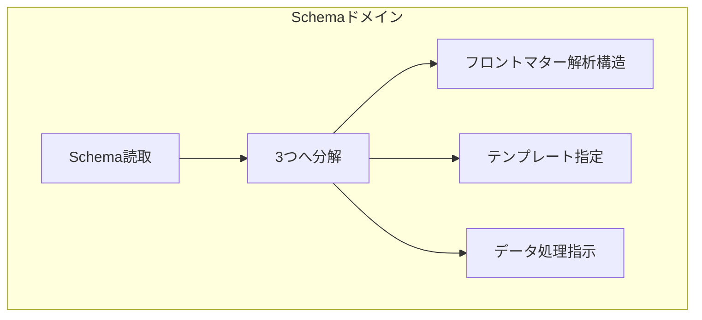

# Schemaドメイン設計

## 概要

Schemaドメインは、requirements.ja.mdとflow.ja.mdで定義された3つのサブドメインを統括し、Schema構造の読み取りと分解を行う。

## ドメインの構成



## Schema拡張ディレクティブ (x-*)

本システムは、標準JSON Schemaに加えて、以下の拡張ディレクティブを提供する。

### テンプレート制御ディレクティブ

#### x-template

**責務**: メインコンテナのテンプレートファイルを指定 **処理ドメイン**:
テンプレート管理ドメイン

```json
{
  "$schema": "http://json-schema.org/draft-07/schema#",
  "type": "object",
  "x-template": "registry_template.json",
  "properties": {}
}
```

#### x-template-items

**責務**: 配列要素展開時のテンプレートファイルを指定 **処理ドメイン**:
テンプレート管理ドメイン

```json
{
  "x-template-items": "registry_command_template.json"
}
```

#### x-template-format

**責務**: 出力形式を指定（json, yaml, md, xml） **処理ドメイン**:
テンプレート管理ドメイン

### データ抽出ディレクティブ

#### x-frontmatter-part

**責務**: フロントマター処理の起点となる配列を指定 **処理ドメイン**:
フロントマター解析ドメイン

```json
{
  "commands": {
    "type": "array",
    "x-frontmatter-part": true,
    "items": { "$ref": "registry_command_schema.json" }
  }
}
```

**重要な特性**:

- このディレクティブが設定された階層が各Markdownファイル処理の起点となる
- フロントマター解析ドメインのみがこの情報を使用
- 配列要素はファイル単位で処理される

### データ変換ディレクティブ

#### x-flatten-arrays

**責務**: 配列構造のフラット化を指定（オプション） **処理ドメイン**:
データ処理指示ドメイン **処理タイミング**: 個別ファイル処理時（指定時のみ）

```json
{
  "items": {
    "type": "array",
    "x-frontmatter-part": true,
    "x-flatten-arrays": "traceability",
    "x-template-items": "item_template.json"
  }
}
```

**動作原理**:

- デフォルトではフロントマター構造をそのまま保持
- 指定時のみネストした配列をフラット化
- 単一要素も配列として扱う

#### x-derived-from

**責務**: 他のプロパティから値を集約 **処理ドメイン**: データ処理指示ドメイン
**処理タイミング**: 全ファイル処理完了後

```json
{
  "availableConfigs": {
    "type": "array",
    "x-derived-from": "commands[].c1",
    "x-derived-unique": true,
    "items": { "type": "string" }
  }
}
```

**パス記法**:

- ドット記法: `id.full`
- 配列展開: `items[]`
- 組み合わせ: `traceability[].id.full`

#### x-derived-unique

**責務**: 配列の重複要素を除去 **処理ドメイン**: データ処理指示ドメイン
**処理タイミング**: x-derived-fromの後

#### x-jmespath-filter

**責務**: JMESPath式によるフィルタリング **処理ドメイン**:
データ処理指示ドメイン **処理タイミング**: 個別ファイル処理時

```json
{
  "filteredCommands": {
    "x-jmespath-filter": "commands[?c1 == 'git']"
  }
}
```

## 処理順序と依存関係

### フェーズ1: 個別ファイル処理

1. フロントマター抽出（フロントマター解析ドメイン）
2. x-flatten-arrays（データ処理指示ドメイン - 指定時のみ）
3. x-jmespath-filter（データ処理指示ドメイン）

### フェーズ2: 全体統合（全ファイル完了後）

1. x-frontmatter-part配列の統合
2. x-derived-from（データ処理指示ドメイン）
3. x-derived-unique（データ処理指示ドメイン）
4. {@items}配列の確定

### フェーズ3: テンプレート展開

1. x-template適用（テンプレート管理ドメイン）
2. x-template-items適用（テンプレート管理ドメイン）
3. 変数置換（テンプレートエンジン）

## ドメインオブジェクト

### 値オブジェクト

```typescript
// Schemaファイルのパス
export class SchemaPath {
  private constructor(private readonly value: string) {}

  static create(path: string): Result<SchemaPath, SchemaPathError> {
    if (!path.endsWith(".json")) {
      return { ok: false, error: { kind: "InvalidExtension", path } };
    }
    return { ok: true, data: new SchemaPath(path) };
  }
}

// 処理ディレクティブ
export class ProcessingDirective {
  constructor(
    readonly type: DirectiveType,
    readonly parameters: Map<string, unknown>,
  ) {}

  isTemplateDirective(): boolean {
    return this.type.startsWith("x-template");
  }

  isDataDirective(): boolean {
    return [
      "x-derived-from",
      "x-derived-unique",
      "x-flatten-arrays",
      "x-jmespath-filter",
    ]
      .includes(this.type);
  }
}
```

### エンティティ

```typescript
// Schema状態管理
export type SchemaState =
  | { kind: "Unloaded"; path: SchemaPath }
  | { kind: "Loading"; path: SchemaPath }
  | { kind: "Parsed"; path: SchemaPath; directives: DirectiveMap }
  | { kind: "Failed"; path: SchemaPath; error: SchemaError };

export class Schema {
  private state: SchemaState;

  // ディレクティブの分類と取得
  getTemplateDirectives(): ProcessingDirective[] {
    // x-template, x-template-items, x-template-formatを返す
  }

  getDataDirectives(): ProcessingDirective[] {
    // x-derived-from, x-flatten-arrays等を返す
  }

  getFrontmatterPartPath(): string | undefined {
    // x-frontmatter-part: trueが設定された階層を返す
  }
}
```

### ドメインサービス

```typescript
// Schema分解サービス
export class SchemaDecomposer {
  // Schemaを3つのドメインに分解
  decompose(schema: Schema): SchemaDecomposition {
    return {
      frontmatterStructure: this.extractFrontmatterStructure(schema),
      templateSpecification: this.extractTemplateSpec(schema),
      dataProcessingRules: this.extractDataRules(schema),
    };
  }

  private extractFrontmatterStructure(schema: Schema): FrontmatterStructure {
    // x-frontmatter-part指定階層の抽出
  }

  private extractTemplateSpec(schema: Schema): TemplateSpecification {
    // x-template系ディレクティブの抽出
  }

  private extractDataRules(schema: Schema): DataProcessingRules {
    // x-derived-from等のデータ処理ディレクティブの抽出
  }
}
```

## $refの扱い

`$ref`は**JSON Schemaの標準機能**として、スキーマ構造の再利用にのみ使用される：

- テンプレート処理とは完全に独立
- Schema解析時に解決
- 再帰的な参照をサポート
- 循環参照の検出と防止

```json
{
  "commands": {
    "type": "array",
    "items": { "$ref": "command_schema.json" } // 構造の再利用
  }
}
```

## 設計原則

1. **責務の明確化**: 各ディレクティブは単一の責務を持つ
2. **ドメインの独立性**: 各ディレクティブは特定のドメインでのみ処理される
3. **宣言的な定義**: すべてのディレクティブは宣言的で、処理順序は自動決定
4. **標準準拠**: JSON Schema Draft-07に準拠し、拡張は`x-`プレフィックスを使用

## まとめ

Schemaドメインは、システムの設定を読み取り、3つの独立したドメインへ分解する責務を持つ。
各x-ディレクティブは明確に定義されたドメインで処理され、データの流れは一方向である。
これにより、複雑な変換処理を段階的かつ宣言的に記述できる。
