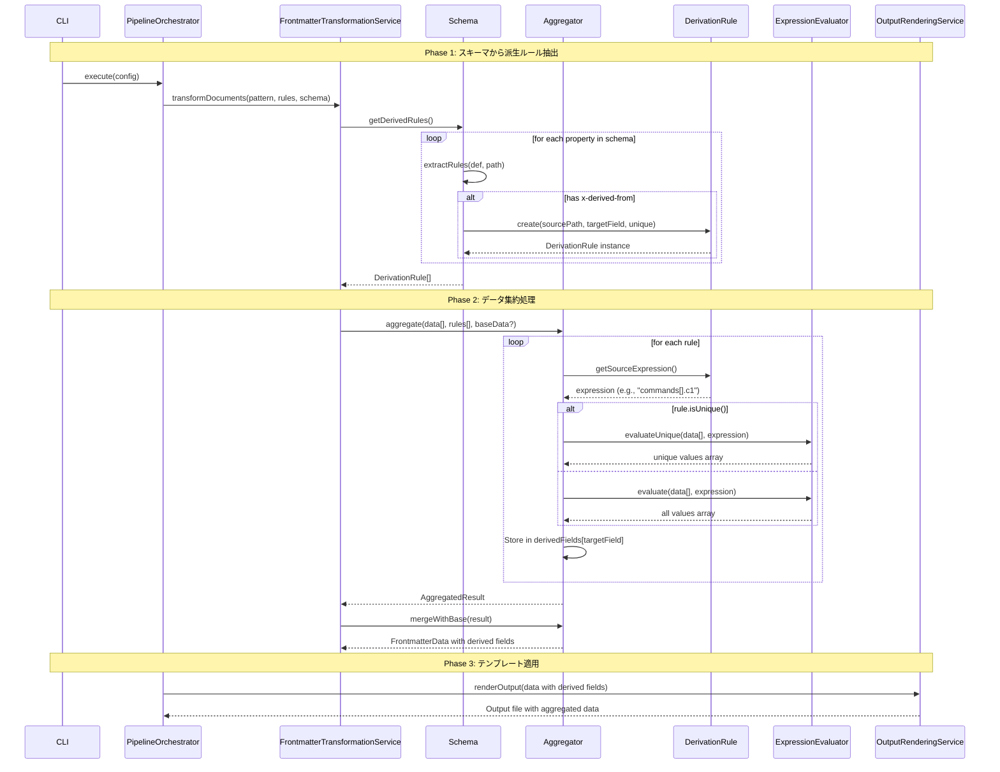

# Data Derivation Processing Flow

## x-derived-from と x-derived-unique の実装詳細

> **実装ドキュメント**:
> このファイルはx-derived-from/x-derived-uniqueディレクティブの処理フローと実装詳細を表現しています。

## 概要

x-derived-*
ディレクティブは、複数のMarkdownファイルから抽出されたデータを集約し、新しいフィールドを生成する機能を提供します。

### ディレクティブの定義

- **x-derived-from**:
  配列要素から特定のプロパティを抽出して新しいフィールドを生成
- **x-derived-unique**: 抽出した値を一意化（重複除去）するかのフラグ

## 処理フロー



## 実装クラスの詳細

### 1. Schema Entity (`src/domain/schema/entities/schema.ts`)

```typescript
getDerivedRules(): Array<{
  sourcePath: string;
  targetField: string;
  unique: boolean;
}> {
  const rules = [];
  const extractRules = (def: SchemaDefinition, path: string = "") => {
    const derivedFromResult = def.getDerivedFrom();
    if (derivedFromResult.ok) {
      rules.push({
        sourcePath: derivedFromResult.data,
        targetField: path,
        unique: def.isDerivedUnique(),
      });
    }
    // Recursive extraction for nested properties
  };
  extractRules(this.schemaDefinition);
  return rules;
}
```

### 2. DerivationRule (`src/domain/aggregation/value-objects/derivation-rule.ts`)

値オブジェクトとして派生ルールをモデル化：

- `sourceExpression`: データ抽出元のパス式（例: "commands[].c1"）
- `targetField`: 生成されるフィールド名（例: "availableConfigs"）
- `unique`: 重複除去フラグ

### 3. Aggregator (`src/domain/aggregation/aggregators/aggregator.ts`)

実際のデータ集約処理を実行：

```typescript
aggregate(
  data: FrontmatterData[],
  rules: DerivationRule[],
  baseData?: FrontmatterData
): Result<AggregatedResult, AggregationError>
```

### 4. ExpressionEvaluator (`src/domain/aggregation/services/expression-evaluator.ts`)

パス式を評価してデータを抽出：

- `evaluate()`: 全ての値を抽出
- `evaluateUnique()`: 重複を除去した値を抽出

## 使用例

### スキーマ定義

```json
{
  "properties": {
    "tools": {
      "type": "object",
      "properties": {
        "availableConfigs": {
          "type": "array",
          "x-derived-from": "commands[].c1",
          "x-derived-unique": true,
          "items": { "type": "string" }
        },
        "allC2Actions": {
          "type": "array",
          "x-derived-from": "commands[].c2",
          "x-derived-unique": true,
          "items": { "type": "string" }
        }
      }
    }
  }
}
```

### 入力データ（個別のMarkdownファイルから）

```yaml
# File 1
c1: meta
c2: resolve
c3: registered-commands

# File 2
c1: spec
c2: analyze
c3: quality-metrics

# File 3
c1: git
c2: commit
c3: changes
```

### 集約後の出力

```json
{
  "tools": {
    "availableConfigs": ["git", "meta", "spec"],
    "allC2Actions": ["analyze", "commit", "resolve"],
    "commands": [
      { "c1": "meta", "c2": "resolve", "c3": "registered-commands" },
      { "c1": "spec", "c2": "analyze", "c3": "quality-metrics" },
      { "c1": "git", "c2": "commit", "c3": "changes" }
    ]
  }
}
```

## エラーハンドリング

- 存在しないパスの参照: 空配列として処理
- 配列でないプロパティへの `[]` 適用: 空配列を返す
- 評価エラー: AggregationError として上位に伝播

## テスト

単体テストは以下で実装：

- `tests/unit/domain/aggregation/value-objects/derivation-rule_test.ts`
- `tests/unit/domain/aggregation/aggregators/aggregator_test.ts`
- `tests/unit/domain/aggregation/services/expression-evaluator_test.ts`

統合テストは以下で実装：

- `tests/unit/domain/frontmatter/services/frontmatter-transformation-service_test.ts`
- `tests/e2e/requirements_examples_test.ts`
