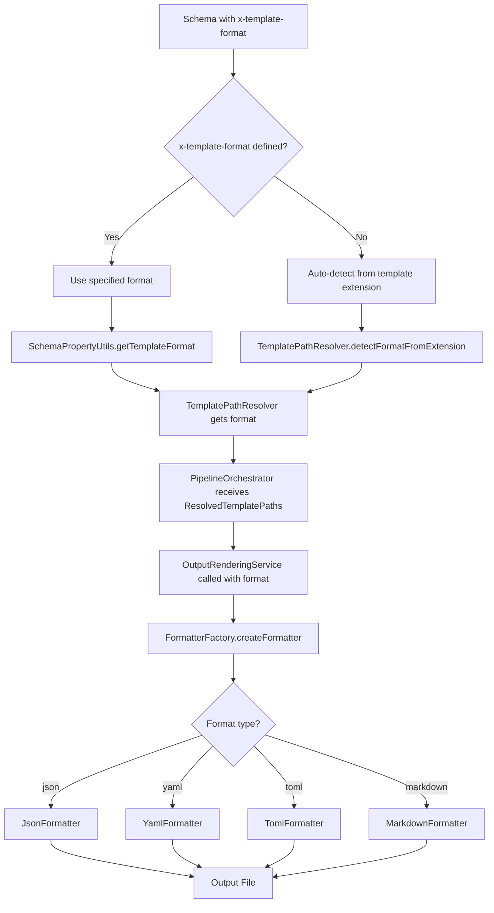

# Template Format Flow - Implementation Examples

## 実装における具体的なフォーマット指定フロー

> **実装ドキュメント**:
> このファイルは現在の実装でのx-template-format機能の具体的な使用例とデータフローを示しています。

### Case 1: スキーマで `x-template-format: "yaml"` を指定

#### Input Schema (schema.json)

```json
{
  "type": "object",
  "properties": {
    "title": { "type": "string" },
    "version": { "type": "string" }
  },
  "x-template": "./template.json",
  "x-template-format": "yaml"
}
```

#### Template File (template.json)

```json
{
  "name": "{{title}}",
  "release": "{{version}}",
  "active": true
}
```

#### Flow Trace:

1. **SchemaPropertyUtils.getTemplateFormat()**
   ```typescript
   templateFormat = schema.extensions?.["x-template-format"]; // "yaml"
   return { ok: true, data: "yaml" };
   ```

2. **TemplatePathResolver.resolveTemplatePaths()**
   ```typescript
   const outputFormatResult = schema.getTemplateFormat(); // Result.ok("yaml")
   outputFormat = outputFormatResult.data; // "yaml"
   return {
     templatePath: "./template.json",
     itemsTemplatePath: undefined,
     outputFormat: "yaml",
   };
   ```

3. **PipelineOrchestrator.execute()**
   ```typescript
   const outputFormat = resolvePathsResult.data.outputFormat; // "yaml"
   this.outputRenderingService.renderOutput(
     templatePath,
     itemsTemplatePath,
     mainData,
     itemsData,
     config.outputPath,
     "yaml", // ← YAMLフォーマットを指定
   );
   ```

4. **FormatterFactory.createFormatter()**
   ```typescript
   createFormatter("yaml"); // YamlFormatterを返す
   ```

5. **YamlFormatter.format()**
   ```typescript
   // Input data: { name: "My Project", release: "1.0.0", active: true }
   // Output:
   ```
   ```yaml
   name: My Project
   release: 1.0.0
   active: true
   ```

---

### Case 2: スキーマに `x-template-format` 未指定（自動検出）

#### Input Schema (schema.json)

```json
{
  "type": "object",
  "properties": {
    "title": { "type": "string" }
  },
  "x-template": "./template.toml"
}
```

#### Flow Trace:

1. **SchemaPropertyUtils.getTemplateFormat()**
   ```typescript
   templateFormat = schema.extensions?.["x-template-format"]; // undefined
   return {
     ok: false,
     error: { kind: "TemplateFormatNotDefined", message: "..." },
   };
   ```

2. **TemplatePathResolver.detectFormatFromExtension()**
   ```typescript
   detectFormatFromExtension("./template.toml");
   // "./template.toml".toLowerCase().endsWith(".toml") === true
   return "toml";
   ```

3. **TemplatePathResolver.resolveTemplatePaths()**
   ```typescript
   const outputFormatResult = schema.getTemplateFormat(); // Result.err
   if (!outputFormatResult.ok) {
     outputFormat = this.detectFormatFromExtension(templatePath); // "toml"
   }
   return {
     templatePath: "./template.toml",
     itemsTemplatePath: undefined,
     outputFormat: "toml", // ← 自動検出でTOML
   };
   ```

4. **最終的にTomlFormatterで出力**

---

### Case 3: デフォルト動作（JSONテンプレート）

#### Input Schema (schema.json)

```json
{
  "type": "object",
  "properties": {
    "title": { "type": "string" }
  },
  "x-template": "./template.json"
}
```

#### Flow Trace:

1. **x-template-format** 未定義
2. **detectFormatFromExtension("./template.json")** → `"json"`
3. **JsonFormatter** が選択される
4. **JSON形式で出力**

---

## フロー図での表現



## 責務マッピング

| 段階     | 責務者                | 処理内容                             | データ変換                                 |
| -------- | --------------------- | ------------------------------------ | ------------------------------------------ |
| **抽出** | SchemaPropertyUtils   | x-template-format読み取り・検証      | Schema → Result<OutputFormat>              |
| **解決** | TemplatePathResolver  | フォーマット決定（指定 or 自動検出） | Schema + Config → ResolvedTemplatePaths    |
| **統合** | PipelineOrchestrator  | フォーマット情報の受け渡し           | ResolvedTemplatePaths → OutputService call |
| **適用** | FormatterFactory      | 適切なフォーマッター生成             | OutputFormat → Formatter instance          |
| **変換** | Individual Formatters | データの実際のフォーマット変換       | Object → Formatted String                  |

この設計により、各コンポーネントが明確な責務を持ち、フォーマット指定から最終出力まで一貫したデータフローが実現されています。
