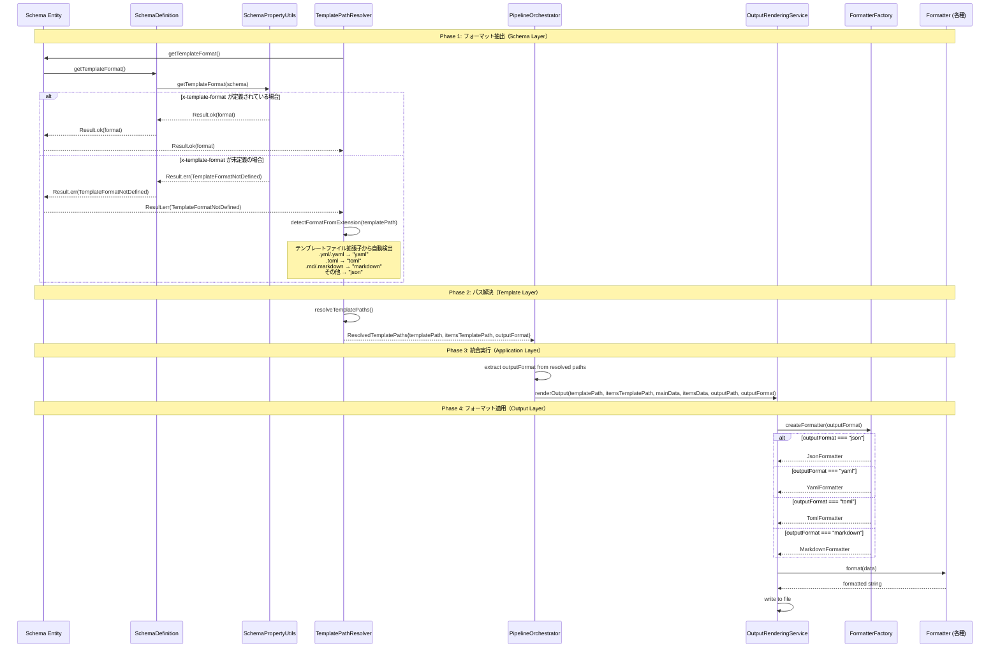

# Processing Flow - Implementation Sequence

## 全体処理フローと x-* ディレクティブの実装シーケンス

> **実装ドキュメント**:
> このファイルは現在の実装における全x-*ディレクティブ（x-template-format,
> x-derived-from/unique等）の処理フローと責務分離を表現しています。



## データフロー詳細

### 1. Schema Extensions → SchemaPropertyUtils

```typescript
// スキーマ内の拡張フィールドから抽出
const templateFormat = schema.extensions?.["x-template-format"];
```

### 2. TemplatePathResolver → Auto-detection

```typescript
// x-template-format未定義時の自動検出ロジック
private detectFormatFromExtension(templatePath: string): OutputFormat {
  const lowercasePath = templatePath.toLowerCase();

  if (lowercasePath.endsWith(".yml") || lowercasePath.endsWith(".yaml")) {
    return "yaml";
  }
  if (lowercasePath.endsWith(".toml")) {
    return "toml";
  }
  if (lowercasePath.endsWith(".md") || lowercasePath.endsWith(".markdown")) {
    return "markdown";
  }
  return "json"; // デフォルト
}
```

### 3. PipelineOrchestrator → Format Passing

```typescript
// 解決されたフォーマットの抽出と渡し
const outputFormat = resolvePathsResult.data.outputFormat || "json";

const renderResult = this.outputRenderingService.renderOutput(
  templatePath,
  itemsTemplatePath,
  mainData,
  itemsData,
  config.outputPath,
  outputFormat, // ← ここで指定されたフォーマットを渡す
);
```

### 4. FormatterFactory → Formatter Selection

```typescript
// フォーマットに応じた適切なフォーマッター生成
static createFormatter(format: OutputFormat): Result<OutputFormatter, DomainError> {
  const formatterFactory = this.formatters.get(format);
  if (!formatterFactory) {
    return err(createError({
      kind: "InvalidFormat",
      message: `Unsupported format: ${format}`,
    }));
  }
  return ok(formatterFactory());
}
```

## 責務の分離

### 1. Schema Layer (x-* ディレクティブ検出)

| Class               | 責務                                     | x-* Directives                                      |
| ------------------- | ---------------------------------------- | --------------------------------------------------- |
| SchemaPropertyUtils | 各種x-*拡張の抽出・検証                  | x-template-format, x-derived-from, x-derived-unique |
| SchemaDefinition    | スキーマ定義からのディレクティブ取得     | 全x-*ディレクティブ                                 |
| Schema              | エンティティレベルでのディレクティブ提供 | getDerivedRules(), getTemplateFormat()等            |

### 2. Aggregation Layer (x-derived-* 処理)

| Class               | 責務                     | 入力                     | 出力             |
| ------------------- | ------------------------ | ------------------------ | ---------------- |
| DerivationRule      | 派生ルールのモデル化     | sourcePath, targetField  | Rule Object      |
| Aggregator          | 派生ルールの適用と集約   | Data[], DerivationRule[] | AggregatedResult |
| ExpressionEvaluator | パス式の評価とデータ抽出 | Data[], Expression       | Extracted Values |

### 3. Transformation Layer

| Class                            | 責務                 | Key Processing                    |
| -------------------------------- | -------------------- | --------------------------------- |
| FrontmatterTransformationService | 全体のデータ変換統合 | x-derived-* rules適用、データ集約 |

### 4. Template & Application Layers

| Layer           | Class                | 責務                               | 入力           | 出力                  |
| --------------- | -------------------- | ---------------------------------- | -------------- | --------------------- |
| **Template**    | TemplatePathResolver | パス解決とフォーマット検出         | Schema, Config | ResolvedTemplatePaths |
| **Application** | PipelineOrchestrator | 全処理フローのオーケストレーション | Config         | 処理実行              |

### 5. Output Layer

| Class                  | 責務                   | 入力         | 出力         |
| ---------------------- | ---------------------- | ------------ | ------------ |
| OutputRenderingService | 最終出力生成           | Data, Format | ファイル出力 |
| FormatterFactory       | フォーマッター生成     | OutputFormat | Formatter    |
| Formatters             | 実際のフォーマット変換 | Data         | String       |

この設計により、x-derived-from/unique
を含む全x-*ディレクティブが統合的に処理され、各レイヤーが明確な責務を持って連携しています。
