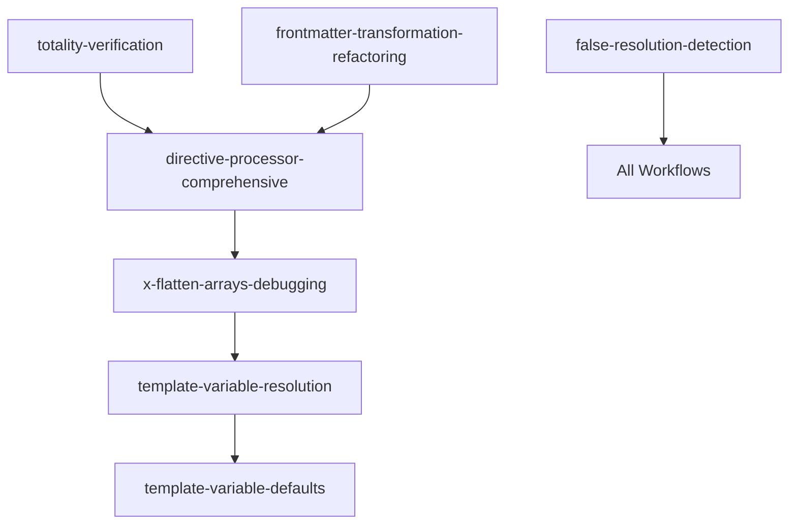

# Debug Workflows Index

This index organizes all debug workflows by category and their execution relationships.

## Workflow Categories

### 01. Quality Assurance
- `01-quality-assurance/01-false-resolution-detection.workflow.md` - False positive detection

### 02. Architecture
- `02-architecture/01-totality-verification.workflow.md` - Totality principle verification
- `02-architecture/02-frontmatter-transformation-refactoring.workflow.md` - Transformation refactoring
- `02-architecture/03-layered-architecture-dependency-analysis.workflow.md` - Dependency analysis

### 03. Features
- `03-features/01-directive-implementation.workflow.md` - Directive implementation testing

### Component Level
- `component/directive-processor-comprehensive.workflow.md` - DirectiveProcessor analysis
- `component/template-variable-defaults.workflow.md` - Default value handling
- `component/template-variable-resolution.workflow.md` - Variable resolution debugging

### Integration Level
- `integration/x-flatten-arrays-debugging.workflow.md` - x-flatten-arrays directive debugging

### Meta
- `meta/workflow-template.workflow.md` - Template for creating new workflows

## Workflow Execution Relationships

### Primary Processing Flow



### Dependency Matrix

| Workflow | Dependencies | Outputs To |
|----------|-------------|------------|
| directive-processor-comprehensive | totality-verification | x-flatten-arrays-debugging, template-variable-resolution |
| x-flatten-arrays-debugging | directive-processor-comprehensive | template-variable-resolution |
| template-variable-resolution | x-flatten-arrays-debugging, directive-processor | template-variable-defaults |
| template-variable-defaults | template-variable-resolution | - |
| frontmatter-transformation-refactoring | - | directive-processor-comprehensive |
| layered-architecture-dependency-analysis | - | All component workflows |
| totality-verification | - | All workflows |
| false-resolution-detection | - | Quality gates for all |

## Execution Order for Specific Issues

### Issue #1071: x-flatten-arrays data loss in template rendering
```bash
# Execute in order:
1. integration/x-flatten-arrays-debugging.workflow.md
2. component/template-variable-resolution.workflow.md
3. component/template-variable-defaults.workflow.md
```

### Template Variable Resolution Issues
```bash
# Execute in order:
1. component/template-variable-resolution.workflow.md
2. component/directive-processor-comprehensive.workflow.md
```

## Structure Overview

```
docs/tests/debugs/
├── README.md                               # This workflow relationship index
├── debugging-workflows.md                  # Master index and execution guide
├── 01-quality-assurance/                   # Process integrity workflows
├── 02-architecture/                        # Architecture compliance workflows
├── 03-features/                            # Feature implementation workflows
├── component/                              # Component-level debugging
├── integration/                            # Integration-level debugging
└── meta/                                   # Meta workflows and templates
```

## Quick Reference

### Most Common Workflows

#### False Resolution Detection

```bash
# Check if recent "fix" commits actually fix issues
scripts/detect-false-claims.sh
```

#### Architecture Compliance Check

```bash
# Verify Totality principle compliance
cd docs/tests/debugs/02-architecture
./01-totality-verification.workflow.md
```

#### Feature Implementation Status

```bash
# Check directive implementation completeness
cd docs/tests/debugs/03-features
./01-directive-implementation.workflow.md
```

### Emergency Diagnostics

#### System Health Check

```bash
# Quick system health verification
deno check **/*.ts && echo "✅ Types OK" || echo "❌ Type errors"
deno test --allow-all --no-check > /dev/null && echo "✅ Tests OK" || echo "❌ Test failures"
find . -name "*.ts" | xargs grep -l "throw new Error" | wc -l  # Architecture violations
```

#### Issue Verification

```bash
# Verify issue resolution claims
git log --oneline -3 | grep -E "(fix|complete|resolve)"
gh issue list --state open --label "high-priority" --json number | jq length
```

## Integration

### Pre-commit Hook

```bash
# Add to .git/hooks/pre-commit
#!/bin/bash
cd docs/tests/debugs
./01-quality-assurance/01-false-resolution-detection.workflow.md
```

### GitHub Actions

```yaml
name: Debugging Workflows
on: [push, pull_request]
jobs:
  quality-check:
    runs-on: ubuntu-latest
    steps:
      - uses: actions/checkout@v4
      - name: Quality Assurance
        run: |
          cd docs/tests/debugs/01-quality-assurance
          ./01-false-resolution-detection.workflow.md
```

### Development Workflow

1. **Before commit**: Run quality assurance workflows
2. **Before merge**: Run architecture compliance workflows
3. **Before release**: Run feature implementation workflows

## Output Locations

All workflow outputs are stored in `tmp/` directory:

- Reports: `tmp/*-report-{timestamp}.md`
- Data files: `tmp/*-{workflow}-{timestamp}.{ext}`
- Logs: `tmp/debug-{workflow}-{timestamp}.log`

## Troubleshooting

### Common Issues

#### Workflow Execution Fails

```bash
# Check dependencies
which deno gh jq
# Ensure tmp directory exists
mkdir -p tmp
# Check file permissions
chmod +x scripts/*.sh
```

#### Reports Not Generated

```bash
# Verify output directory
ls -la tmp/
# Check disk space
df -h .
```

#### False Positives in Detection

```bash
# Adjust thresholds in workflow files
# Review detection logic
# Update patterns for new code styles
```

## Contributing

### Adding New Workflows

1. Use `templates/workflow-template.md` as base
2. Follow naming convention: `{order}-{purpose}.workflow.md`
3. Update master index in `debugging-workflows.md`
4. Test workflow execution

### Modifying Existing Workflows

1. Maintain backward compatibility
2. Update documentation
3. Test with real project data
4. Update success criteria if needed

---

For detailed information, see [debugging-workflows.md](./debugging-workflows.md)
