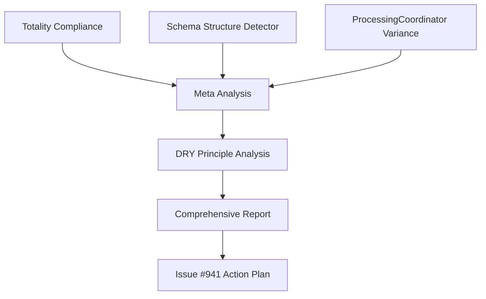

---
# XML変換メタデータ
workflow:
  id: "issue-941-comprehensive-investigation"
  type: "meta"
  scope: "project"
  version: "1.0"
  xml_convertible: true
dependencies:
  - breakdownlogger: "@tettuan/breakdownlogger@^1.0.0"
  - environment_vars: ["LOG_KEY", "LOG_LENGTH", "LOG_LEVEL"]
  - related_workflows: [
      "processing-coordinator-variance.workflow.md",
      "dry-principle-analysis.workflow.md",
      "totality-compliance.workflow.md",
      "schema-structure-detector.workflow.md"
    ]
outputs:
  - debug_logs: "tmp/debug-issue-941-investigation-{timestamp}.log"
  - evidence: "tmp/evidence-issue-941-comprehensive.json"
  - workflow_execution_report: "tmp/workflow-execution-summary.md"
---

# Issue #941 Comprehensive Investigation Meta-Workflow

## 目的

Issue #941「Refactor duplicate code patterns violating DRY
principle」の包括的調査を体系的に実行し、DRY原則違反、特殊解実装、設計品質問題の根本原因を特定する。4つのワークフローを協調実行し、リファクタリング戦略を確立する。

## 前提条件

- [ ] 条件1: Issue #941の内容と4フェーズ計画を理解済み
- [ ] 条件2: 関連する4つのワークフローファイルが存在
- [ ] 条件3: プロジェクト全体への読み書きアクセス権限
- [ ] 条件4: inspector-debug analyze-deep project-issuesの調査結果を理解

## 入力

- **対象**: プロジェクト全体のアーキテクチャ品質
- **症状**: DRY原則違反（300+重複）、特殊解実装（7メソッド重複）、設計品質低下
- **コンテキスト**: 機能は動作するが要求仕様の設計原則に違反

## メタワークフロー実行順序

### フェーズ1: 基盤調査（Component Level）

{xml:step id="phase1" type="investigation"}

1. **Totality Compliance Check**:
   - ワークフロー: `docs/tests/debugs/component/totality-compliance.workflow.md`
   - 目的: Result<T,E>パターンの一貫性確認
   - 実行コマンド: LOG_KEY=workflow-debug-totality-compliance ./run-workflow.sh
     totality-compliance.workflow.md

2. **Schema Structure Detector Analysis**:
   - ワークフロー:
     `docs/tests/debugs/component/schema-structure-detector.workflow.md`
   - 目的: ハードコーディングパターンの特定
   - 実行コマンド: LOG_KEY=workflow-debug-schema-structure-detector
     ./run-workflow.sh schema-structure-detector.workflow.md

3. **ProcessingCoordinator Variance Investigation**:
   - ワークフロー:
     `docs/tests/debugs/component/processing-coordinator-variance.workflow.md`
   - 目的: 高変動箇所の詳細分析とデバッグ出力検証
   - 実行コマンド: LOG_KEY=workflow-debug-processing-coordinator-variance
     ./run-workflow.sh processing-coordinator-variance.workflow.md {/xml:step}

### フェーズ2: 統合分析（Integration Level）

{xml:step id="phase2" type="analysis"}

1. **DRY Principle Violation Analysis**:
   - ワークフロー:
     `docs/tests/debugs/integration/dry-principle-analysis.workflow.md`
   - 目的: 重複パターンの定量化と影響範囲評価
   - 実行コマンド: LOG_KEY=workflow-analysis-dry-violations ./run-workflow.sh
     dry-principle-analysis.workflow.md

2. **相互関係分析**:
   - フェーズ1の結果を統合
   - ProcessingCoordinatorの振れ幅とDRY違反の因果関係確認
   - Totalityパターンと特殊解実装の関連性評価 {/xml:step}

### フェーズ3: 統合評価と戦略策定

{xml:step id="phase3" type="synthesis"}

1. **調査結果統合**:
   - 各ワークフローの証跡データ統合
   - 定量的指標の集約（重複箇所数、影響範囲、リスク評価）
   - 根本原因の特定（特殊解実装 → DRY違反 → 保守性低下）

2. **Issue #941 Phase 1-4計画の精査**:
   - Phase 1: ResultValidator utility class の妥当性
   - Phase 2: ProcessingCoordinator統合の実現可能性
   - Phase 3: Utility consolidation の影響範囲
   - Phase 4: Validation and testing の品質保証

3. **リファクタリング戦略確定**:
   - 優先度付けされたアクションプラン
   - リスク軽減策
   - 成功指標の設定 {/xml:step}

## ワークフロー間の依存関係



### 依存関係の詳細

1. **Totality Compliance** → **DRY Analysis**:
   Result<T,E>パターンの違反がDRY違反の一因
2. **Schema Structure Detector** → **ProcessingCoordinator**:
   ハードコーディングが特殊解実装の根拠
3. **ProcessingCoordinator Variance** → **DRY Analysis**:
   高変動箇所が重複パターンの震源地
4. **すべて** → **Meta Analysis**: 統合的根本原因分析

## 実行コマンド例

```bash
# 全ワークフロー順次実行
export LOG_LENGTH=L
export LOG_LEVEL=debug

# Phase 1: Component Level
LOG_KEY=workflow-debug-totality-compliance ./run-workflow.sh component/totality-compliance.workflow.md
LOG_KEY=workflow-debug-schema-structure-detector ./run-workflow.sh component/schema-structure-detector.workflow.md
LOG_KEY=workflow-debug-processing-coordinator-variance ./run-workflow.sh component/processing-coordinator-variance.workflow.md

# Phase 2: Integration Level
LOG_KEY=workflow-analysis-dry-violations ./run-workflow.sh integration/dry-principle-analysis.workflow.md

# Phase 3: Meta Analysis
LOG_KEY=workflow-meta-issue-941 ./run-workflow.sh meta/issue-941-investigation.workflow.md
```

## 出力

- **統合ログ**: `tmp/debug-issue-941-investigation-{timestamp}.log`
- **包括的証跡**: `tmp/evidence-issue-941-comprehensive.json`
- **実行レポート**: `tmp/workflow-execution-summary.md`
- **アクションプラン**: `tmp/issue-941-action-plan.md`

## 成功基準

- [ ] 4つの関連ワークフローが正常実行されている
- [ ] DRY原則違反が定量化されている（300+エラーハンドリング、15+FrontmatterData、50+ログ、20+Smart
      Constructor）
- [ ] ProcessingCoordinatorの3つの処理パス分岐が特定されている
- [ ] Totality原則違反が評価されている
- [ ] Issue #941のPhase 1-4実装計画が精査・更新されている
- [ ] 具体的リファクタリング戦略が確立されている

## 関連Issues

- **Primary**:
  [Issue #941](https://github.com/tettuan/frontmatter-to-schema/issues/941) -
  Refactor duplicate code patterns violating DRY principle
- **Related**: すべてのDDD/TDD/Totality原則関連Issues

## トラブルシューティング

### よくある問題

#### 問題1: ワークフロー間の依存関係エラー

- **症状**: 後続ワークフローが前段階の結果を参照できない
- **原因**: 出力ファイルのパスが一致しない
- **解決策**: `tmp/`ディレクトリ内の共通ファイル命名規則に従う

#### 問題2: 大量のログ出力により分析困難

- **症状**: 4つのワークフローからの出力が膨大
- **原因**: LOG_LENGTHとLOG_LEVELの設定が不適切
- **解決策**: `LOG_LENGTH=S LOG_LEVEL=info`で要約レベルに調整

#### 問題3: Issue #941との整合性確保

- **症状**: ワークフロー結果がIssueの実装計画と乖離
- **原因**: 各ワークフローの成功基準が統一されていない
- **解決策**: 本メタワークフローの成功基準に基づいて各ワークフローを調整
