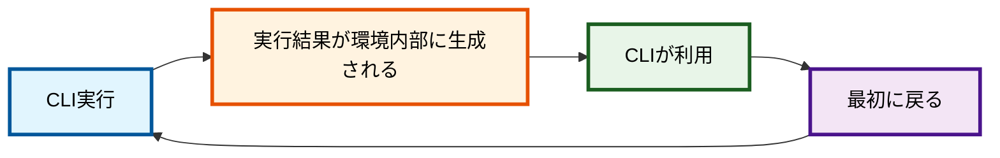

## あらすじ

- AI開発が進むと、要件整理までスコープに入るだろう
- 単純化した実行例: `echo "ユーザー登録機能の改善" | breakdown to issue`
- 意味を持たせたCLI呼び出し → 指示を動的生成 （ + Schemaで導く）

### はじめに

AIがコードを書く時代、私たちの仕事は「どう作るか」から「何を作るか」へと大きくシフトしています。かつては手を動かしていたコーディングも、今やAIが24時間365日、Claude
Code Company や GitHub Agentが自動実装してくれる時代です。


_図: CLI実行がプロンプトをつくり、他のClaude Codeへ指示を出す連鎖の例_

個人がAIの力で自分の時間を最大化し、まるでYouTuberが一人で動画を量産するように、アプリやサービスを生み出す。一方で、組織はAIを活用しつつ、複雑で高度なプロダクトをNetflixオリジナルのようにチームで作り上げる。どちらの型でも共通して重要になるのが、プロジェクトのゴールや改善要望、不具合といった"要求・要件"をいかに素早く、的確に整理できるかという点です。

もし、プロジェクトの目的や課題を瞬時に分解し、次にやるべきことを明確にできるツールがあったら——。そんな発想から生まれたのが、今回紹介する「Breakdownコマンド（自作,
100% AI
Coding）」です。各々が自作している可能性も高いので、この記事は「ツールを使ってもらう」ことではなく、「こういう考えでツールを作った」ことにフォーカスして記事を書いています。

[GitHub](https://github.com/tettuan/breakdown/) ｜
[JSR](https://jsr.io/@tettuan/breakdown)

### Breakdownコマンドの特徴

1. コマンドラインで実行するだけで、最適なプロンプトがすぐに表示される
2. プロンプトのテンプレートに変数を埋め込めば、パラメータや入力情報、前の処理結果を自動で差し込める
3. 使いたいプロンプトもパラメータで柔軟に選択可能
4. 収束させるために、標準Schemaを用意して、プロンプト実行結果を導く（予定）

#### こんな場面で活躍します

- プロジェクトのゴールから必要な要件を一気に洗い出したいとき
- エラーメッセージを分解して、次のアクションを明確にしたいとき
- Issueからサブタスクをまとめて生成したいとき
- 仕様変更リクエストの影響範囲を素早く把握したいとき
- バグレポートから再現手順や修正タスクを整理したいとき
- 顧客要望から実装・検証タスクを自動で作りたいとき

Breakdownコマンドは、「視点」を最大限に引き出し、「発散」するように要件を具体化し、AI時代の開発をもっとクリエイティブに、もっとスピーディーに変えていきます。
もちろん、発散した情報の「収束」にも使えます。

## いかに、AI開発を楽にするか

AI開発の最大の魅力は、その「楽さ」にあります。従来、要件をまとめてからエンジニア側へ依頼し、実装の進捗を逐一確認しながら調整する——そんな手間がかかっていました。これがAIの登場によって大きく変わりました。

しかし単にAIコーディングを自動化しても、思い通りになりません。
雑に続けると、コーディング速度向上の副作用で、ムダも増えます。仕様ズレや手戻り、AIが開発した出力品質の低下が「ムダな成果物」となって現れます。

これらはClaudeなどLLMの問題ではなく、単に性質によるものです。
LLMが内部的に数多くの思考経路を経るため、多少の揺れが幾度も重なると、揺れの増幅が起こります。AI開発では連続した処理を行うために、揺れがさらに増幅されていきます。スタート地点が同じでも、試行回数を増やすと、得られる結果がそれぞれ異なります。

この差異に個別対処することは、楽ではありません。
そこで、ある方向へ導くことが重要となります。

1. ゴールを明示する
2. 方向性を示す

1の「ゴールを明示する」は、テスト駆動型開発が担います。
この点では、Breakdownコマンドは、テストのための仕様書作成を容易にしようと考えています。

2の「方向性を示す」は、プロジェクトの目的やプロダクト自体の目指す姿の表現です。
この点では、Breakdownコマンドは、スキーマ定義を用いて導こうとしています。（まだ実装が完全ではありませんが、擬似的に実現できるようになりました）

なぜスキーマ定義を用いるのか？
要件化や仕様化には、法則性やフレームワークが存在します。これらを使い分けて思考を一定の幅へ収めるよう誘導します。AI開発ではLLMが幅のある判断を行い、幅の振れ方が「べき乗」で揺れていきます。これを中心へと戻す引力として、スキーマ定義を用いようとしています。
（近いうちに理論的な「定義のテンプレ界」が登場すると思いますので、独自にやるべきなのかは、悩んでいます。）

## まずは課題の整理

### 要件化の課題（実現すべきもの）

作るものを決めることは難しい課題です。
作るエンジニアサイドから見ると「何を作るか明確化していないのに作ることだけ求められても・・・」、依頼する側からすると「詳しいことが分からないのに作りたいものを明確化してと言われても・・・」という領域不可分の課題です。

この狭間に存在する課題が、要件化です。

何を求めているかの要求が概念的な場合、要求を明確にし、必要なものに落とし込んだ「要件」にする必要があります。この要件化では、単に抽象概念を具体的に記述するだけではなく、相互の依存関係を読み解く必要があります。
変数が多い場合、さらに難易度が高まります。たとえば、システムが入り組んでいる場合、未知の領域である場合、納期やリソース制約が多い場合などです。変数の乗数分に応じて難しい課題となり、「進めにくい」状況として現れます。

### トレードオフの課題（リソース投下）

作ることを難しくする要因には、やりたいことの量以外に、コストの制約があります。
時間、投入できるリソース量が要求に対し、十分ではないケースも数多く存在します。

経営視点では、リソースから得られる成果の最大化を目指すため、常にストレッチ目標を置くことになります。常にストレッチしているため、必ず何かを「落とす（諦める）」ことになります。

この「落とす」境界線にあるものを明確にすることが優先順位づけであり、得たものと失ったものがトレードオフとなります。

AI開発では高速な開発が可能になります。一方、全ての開発（競合を含む）が等しく高速になりますから、トレードオフの課題は残り続けます。

今現在は、AIを活用するかしないかで競争力が分かれていきます。
だからといって、何を優先し、どこまで作るのか？の判断が不要になるわけではありません。

### 要求の課題（市場ニーズ）

市場ニーズの把握をどうするか？は、システム開発外の課題です。しかし、これもAI開発時代には開発速度問題になるでしょう。

市場ニーズは、構築するだけでは分かりません。使ってもらい、フィードバックを得ることが要求内容を決めていきます。
もし、市場ニーズの把握を「システム開発外の課題」だと決めて放置すると、「要求」の速度が落ちてしまいます。開発は進むのに、やりたいことが決まらない状態になったり、AIで開発したものが市場ニーズと乖離していく速度も高まります。
そこで、要求を得ることや、要求の分析もAI開発に含めて考える必要があります。

### 市場規模の課題（収益性）

作るものが、どの程度スケールするのか？は、これまで課題でした。
これからAI開発が大きくコストを下げるなら、プロダクトが成り立つ最小規模は小さく済みます。
必要な投下資本も、日々のランニングも小さくできます。
となると、市場規模をどのように定義するかが、新たにこれからの課題として追加されるでしょう。

AIを使う部分が少ない場合は、引き続き最小市場規模は大きくなるでしょう。
例えばデータ収集・保存、ロボットなどの物理的実装、店頭などリアル販路、障害・訴訟などのリスク費用が考えられます。

AIを使う範囲を広げるほど、最小市場規模は小さくなる可能性が高くなります。
AIを制御する難しさとのトレードオフになりそうです。
ROI向上目指すならば、細分化された市場のなかで市場シェアを求めるという、これまでと異なった性質の競争もあり得ることになります。

## AI開発が進むと、要件整理の領域までたどり着く

課題整理した結果、AI開発はコーディング自動化にとどまらない影響を与えると考えました。
なかでも、コードの延長線上で解決できる「要件整理」は、必ず開発範囲に含まれていくでしょう。

AIが開発現場に深く浸透するにつれ、単なる実装の自動化だけでなく、「何を作るか」「なぜ作るか」といった要件整理の領域にもAIの力が及び始めます。

要件が曖昧なままでは、どれだけ優秀なAIでも期待通りの成果は出せません。逆に、要件が明確であればあるほど、AIはその力を最大限に発揮します。

仕様化や、タスク化も要件が定まれば行えます。
さらにいえば、テストは要件と仕様が決まれば定まるため、テスト駆動開発をゴリゴリ進めれば、実装品質を問わずにテストクリアさせることもできます。

結果、「要件を決める」ために、GitHubのIssue管理が進化し、Issueへアサインすると開発が進むという構図に移行していきます。その主体が
Claude Code Action や GitHub Copilot Agent といったエージェントになります。

コードを書き起こすだけではなく、Claude Code Action や GitHub Copilot Agent が
Issueを作成できる点が重要です。（今はIssueへのアサインがメインだが、遠くないうちにIssueもゴリゴリ切っていくでしょう）

---

### どこで要件化していくか

AI開発の恩恵は、エンジニアリング領域だけにとどまりません。PdMやOps、さらにはビジネスサイドのメンバーも、AIを活用することで業務の質とスピードを大きく向上させることができます。


_「AI活用の広がり（PdM/エンジニア/ビジネス/運用）」の図 by Gemini_

たとえば、顧客要望の整理や運用フローの最適化など、従来は人手に頼っていた領域にもAIの力が及び始めています。

GitHubにドキュメント管理システムを載せれば、社内のFAQもシステム仕様書も、操作マニュアルも自動でアップデートされます。しかもコードベースから取得するため、最新仕様を反映しています。

何より重要なのが、「現在のシステムを理解できる場所（つまりコードが取得できる場所）」で行うことでしょう。

---

## Breakdownツールの採用した方法

Breakdownツールの方法を見ていきます。冒頭でお伝えしたように、「このツールを使ってもらう」ことではなく、「こういう考えでツールを作った」点にフォーカスします。

### さまざまなAI開発においてプロンプトをCLIで仲介する

Breakdownツールは、AI開発の現場でプロンプトをCLIで仲介する役割を担います。

```bash
# 例: 
echo "ユーザー登録機能の改善" | breakdown to issue
```

実行結果は、次のようになります。技術的には、単にプロンプトをテンプレート化し、値で置き換えるだけです。

```Markdown
$ echo "ユーザー登録機能の改善" | ./.deno/bin/breakdown to issue                    
ストーリーからIssueへの変換プロンプト

# Input

ユーザー登録機能の改善

# Source

stdin

# Schema

{schema_file}

# Output

stdout
```

大切なのは、テンプレート選択に文脈を持たせるために、`breakdown to issue`
という意味を持たせた点です。この Deno
CLIツールは、別名で保存し、複数の設定を切り替えながら実行できるようになっています。パラメータの許可リストや、--
オプション変数の機能をつけました。

従って、たとえば `analyze error logs`, `optimize database queries` ,
`handle exception cases`
など、いくつかのコマンドを用意することが可能です。(`breakdown to` ではなく
`into` かな、なども変更できます)

この連鎖により、CLIを通じて簡単に最適なプロンプトを呼び出し、要件整理やタスク分解を自動化できます。


_整理するBreakdownロボットの図（by Gemini）_

#### (補足1)仲介の限界に至るまでは

このようにテンプレートを用いる考え方は、人間が理解できる範囲での運用に留まります。AIによって無限生成される世界では、利用されません。
したがって、今後AI自体がBreakdown CLIを置き換えてしまう事はあり得るでしょう。

しかし、もし人間が改善に携わるのであれば、何をどの程度の範囲で収めたいか、人間が理解できる必要もあります。この点で、同じ発想のツールが重宝される余地があるでしょう。少なくとも足元では、実現に向けて「自分が」方向を示したいと感じています。出来上がるものも「自分が想定したプロダクト」であって欲しいですし、なんなら「エラーも、こう解釈して欲しい」という要望があります。

いずれ人間が仲介する限界が来るにせよ、いまは「そっちじゃないんだよな」となるケースが多く発生します。しばらくは、手綱を引くように「こういう方向で進めて欲しい」とナビゲートしたい状況が続くでしょう。

---

#### (補足2) Claude Code のように、CLI化する波は絶えないだろう

Claude CodeのようなCLI化の波は、今後も続くと考えています。

CLIはシンプルで拡張性が高く、ローカル環境でもクラウドでも同じ操作感で使えるのが利点です。

さらに、他のツールから呼び出すことができるため、連続かつ再帰的な処理に向いています。
反復して実行することもできる上、実行結果が毎回同じであることも担保されています。

AIが生成した結果は揺れるのですが、その結果を受けて再実行するときに、CLI経由であればフィルターを通す役割を持たせられます。



<!-- CLI -> 実行結果が環境内部に生成される → CLIが利用 → 最初に戻ることでループする -->

### CLIで何を仲介するか

InputからOutputへの変換が求められるものが対象となります。

- 抽象度の高い要求をInputとして期待し、要件をOutputする
  - 自分たちの決めたレギュレーションに従う方法を使う
    - 抽象度、取り扱うサイズ、必要項目
- エラーメッセージや不具合情報をInputとし、修正タスクをOutputする
  - 種類に分ける、レベルに分ける、発生源に分ける、矛盾・整合に分ける

細分化したものを抽象化する作業も対象になります。

- 集められた要望リストをInputとし、解くべき課題に集約してOutputする
- 機能要望リストをInputとし、プロダクトバックログに載せる単位へ集約しOutputする

成功・失敗のトレース情報も、意図的に行うものは対象になります。

- Issueにアサインしたエージェントが失敗した
- 失敗に至るステップを段階的に分解し、Issueサイズを成功しやすい単位へ細分化する

### どうやって仲介するか

基本的な挙動は、CLIを通じた「プロンプトへの埋め込み」によって行います。
つまり、CLIで渡された情報をプロンプトへ埋め込み、プロンプトとして実行することを狙います。

1つのTerminalでは、「ユーザー指示」と「実行結果」は異なるため、出力だけでは指示になりません。主指示とする場合は、APIかコピペが必要になります。
しかしClaude Codeが
Tmuxで別paneへ指示するような方法であれば、再帰的な処理が可能になります。


_図: CLI実行がプロンプトをつくり、他のClaude Codeへ指示を出す連鎖の例_

単一画面で用いる場合、一時ファイルへ保存してから読み込ませるなどで、別指示扱いにすることはできます。あるいは、[Claude Code SDK](https://docs.anthropic.com/ja/docs/claude-code/sdk)で呼ぶ(`claude -p`,
TypeScript)ことにより、内部的に実行することもできます。

### 誰が使うか

AI開発ツールを用いて開発し、GitHubレポジトリへのアクセス権を持つ人を想定しています。

CLI単体は、Git管理せずとも使えるため、単なるプロンプトテンプレートの管理として使うならば、CLI操作できる人は誰でも使えます。
ただし、プロンプトを出し入れする便利ツールとして使うだけであれば、Breakdownツールに依存する必要性はありません。
AI開発ツールのプロンプト作成や、設計情報の作り込みにおいて、「コマンド1つでプロンプトを生成したい」ニーズに応えるものです。

### プロンプトのテンプレート事前用意は必要

プロンプトは、CLIコマンドのパラメータによって定ります。

```
$ breakdown to issue -f=project.md
```

の場合、to/issue に相当するプロンプトが呼び出されます。

```
$ breakdown to issue -f=project.md -a=detail
```

のように、adaption
オプションによって派生版を指定し、類似プロンプトを使い分けます。
「どの組み合わせが有効か」＝「そのパターンに応じたプロンプトがあるか」です。
あらかじめ、使えるパターンをリスト化しておく方法が望ましいでしょう。AIエージェントへ判断させ、CLI呼び出しさせることが可能です。

プロンプトの作成は、それぞれ練り込んだ重要な文面になりえるため、GitHub管理するかしないかを選ぶこともできます。除外すれば自分用になり、レポジトリ管理すればプロジェクト全体の資産となります。

#### プロンプトへの動的埋め込み

出力先や日付のような、テンプレート内部に埋め込みたい項目をパラメータで渡すことができます。

注意したいのは、パラメータとプロンプトテンプレートは、相互に独立している点です。
プロンプトが何の変数を持っているかは、CLI実行を担うBreakdownコマンドは関知しません。したがって、どのプロンプトが何を変数として期待しているかを、実行者が知っている必要があります。
ただこれは、事前にリストを持っておけば、さほど負荷にならないであろうと思います。

```
$ breakdown to issue -f=project.md -o=./tmp/issue-1234/ --uv-date=2025-06-08
```

### Schema 誘導

プロンプトに、Schemaを埋め込むことができます。
Schemaは独自定義でも、Schema.orgでも構いません。

これを「当てはめる」のか、「参考にする」のかは、プロンプトの書き方に依存します。
どのみち完全にSchema通り作ってくれることは期待できないため、参考にとどめるべきであろうと思います。

Schemaを使う目的は、中心線への回帰です。
AIが振れ幅のある生成結果を行うため、幅を明示する必要があります。
幅を持たせるためには、中心線が必要です。同じプロンプトでも、参照するSchema定義を変えると幅を変えることができるようになります。
（プロンプトとの相性が必要なので、よい着地を見つけていくことになります。）

例えば、プロンプトから要件化のフォーマットに沿って出力させたい場合に、Schemaを示しておくと、項目定義を外部化できます。
また、思考パターンをSchema定義しておくことで、思考パターンを切り替えながら実行することもできます。

具体的には、開発チケット管理において、開始・終了の期日管理なのか、ストーリーポイントなのか、の違いです。これを、与えるSchemaによって制御するイメージです。

なお、Schema定義の使い方には迷いがあるので、まだ実装が未成熟です。たとえばSchemaファイルを示してPATHを入れることはできますが、埋め込むことまでは実施していません。

---

## さいごに：CLIとプロンプトの連携が生み出す新しい開発スタイル

AI時代の開発では、コンテキストを維持することが不可欠です。プロンプトは、単体で機能するものではなく、一連の処理の一部として意味を持つものとなりました。
CLIは、人間を介さず処理するために、エディタ以上のポテンシャルを秘めた存在として見直されています。「`CLI`
x `プロンプト` x `前の処理結果` x `変数`」
の組み合わせは、状況や目的に応じて柔軟に変化させられるものになります。変数へは、MCPから値を受け取とって渡すこともできますし、CLI実行結果を用いることもできます。

これら4要素が連携することで、単なる自動化や効率化にとどまらず、変化の激しい現場でも創造的かつスピーディーに開発を進めることができます。こうした動的なプロンプト生成の連鎖は、従来の規約やルールの連鎖に代わり、AIと人間が協調しながら価値を生み出す新しい開発スタイルの中核となっていくのではないでしょうか。

今回、Breakdownは、シンプルなテンプレートを用意するパターンとして、実装を行いました。おそらく他にも、より高度で動的なプロンプト選定システムが生まれてくることでしょう。
簡単な仕組みであれば、それぞれ独自に実装もできるため、この考え方が1つの参考例になれば幸いです。
